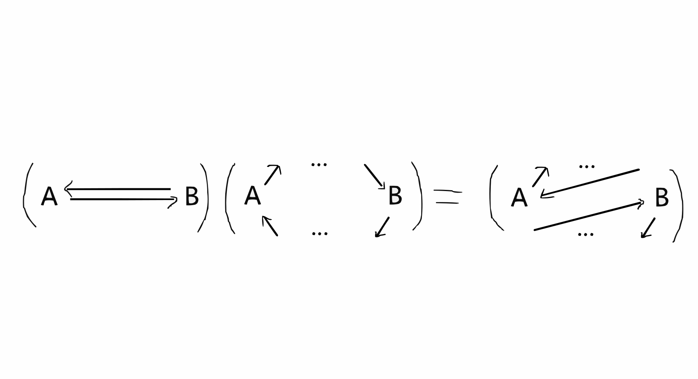
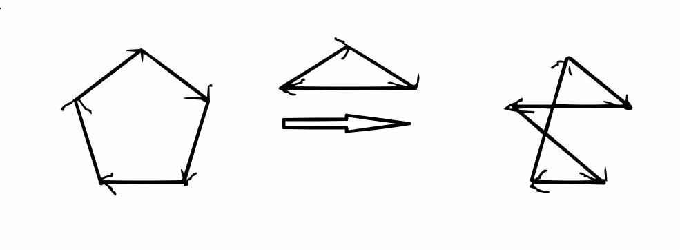
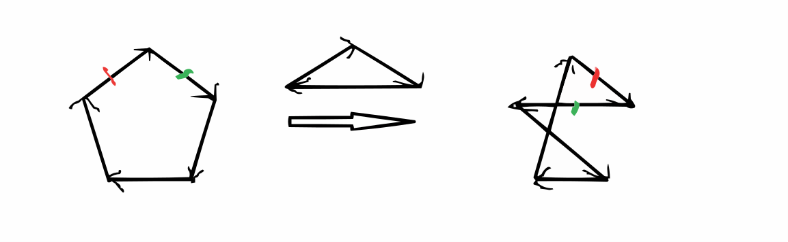
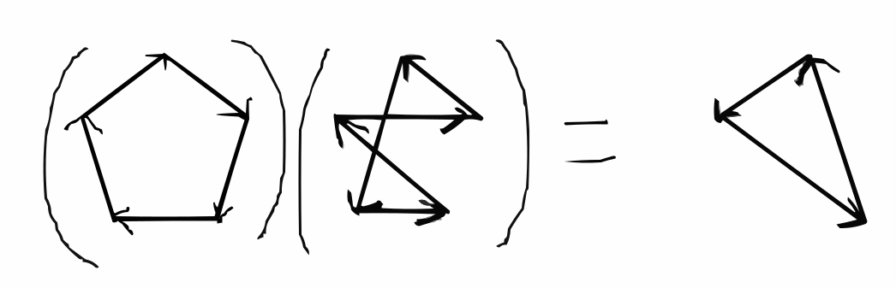

## 前言

> 2024.9.27 xzq告诉我这个无非循环表示法，发现确实如此

在试图更清楚地表示出置换群的群结构时（例如画出更好看的乘法表等），我发现一种将 ${\sf S}_n$ 中置换 $\sigma$ 表为一个 $n$ 点 $n$ 边的有向图的表示法，有时可以极大便利和直观许多关于置换的初等技术。

## 正文
考虑将 ${\sf S}_n$ 中置换 $\sigma$ 表为一个 $n$ 点 $n$ 边的有向图，$(x,\sigma x)$ 给出这 $n$ 条边，例如 $(1234)\in{\sf S}_4$ 将被表为更进一步的，置换乘法如 $(1234)(1243)=(132)$ 可以被表示为直观考虑的话，例如在1处放一个质点，被 $(1234)(1243)$ 作用可以看作沿 $(1243)$ 中 $1\to2$ 箭头被打出，再沿 $(1234)$ 中 $2\to3$ 箭头被打出，而得到 $1\to 3$ ，如此观察立即可得上图。有时更简洁地，无歧义时画图会不写数字，自环不会画出来或者有时会写作一个点。

$\bf{\rm 1.1.}$ 带着这种观点，不难注意到结果等同于 $(1243)$ 沿 $(1234)$ 的推出，也等同于 $(1243)$ 沿 $(1234)$ 的拉回。也就是说，置换 $f$ 左乘作用相当于沿 $f$ 的推出作用，右乘则对应拉回。

$\bf{\rm 1.2.}$ 许多熟知的置换恒等式可以变得更一目了然，例如对

$$(ab)(ac_1\cdots c_hbd_1\cdots d_k)=(ac_1\cdots c_h)(bd_1\cdots d_k)$$

只需注意到

$\bf{\rm 1.3.\ Proposition}$ *设 $g\in {\sf S}_n$ ，共轭 $\tau_g:f\mapsto gfg^{-1}$ 给出图同构 $g:f\cong \tau_gf$ ，从而 $f,g$ 交换即 $\tau_gf = f$ 当且仅当 $g$ 给出图 $f$ 的自同构* 

$\bf{\rm Proof.}$ 只需注意到 $gfg^{-1}$ 是 $f$ 沿 $g$ 推出而同时沿 $g^{-1}$ 拉回。直观来讲，$\tau_g$ 使 $f$ 中每个点带着边同时沿 $g$ 运动，也就是所谓

$$\tau(x_1,\cdots,x_n)\tau^{-1}=(\tau(x_1),\cdots,\tau(x_n))$$

 $\square$

$\bf{\rm 1.4.\ Theorem}$ *${\sf A}_5$ 是单群*

$\bf{\rm Proof.}$ 要证正规子群平凡相当于要证共轭作用和子群运算总能生成出三循环。现在设 $N\leqslant {\sf A}_5$ ，按循环分解分类讨论：

1. 如果 $N$ 中包含对换乘积，那么将 $(12)(34)$ 换为 $(12)(45)$ 再乘起来便能得到三循环（懒得画图）。
2. 如果 $N$ 中包含五循环，现在考虑下式里左图（即 $(12345)$ ，以最上为1，顺时针方向计数）被箭头上的置换（即 $(125)$）共轭作用至右图事实上这里只需注意到被标了彩色的“棚子”部分，被三循环的共轭作用，带着连着棚子的两条边整个翻倒了一下，便立即可得右图。进而将右图的逆乘在（左乘右乘均可）左图上，因为右图和左图有两条有向边完全相同，这一作用会抵消这两条边，得到的置换就会有两个不动点，是三循环。事实上

$\square$

