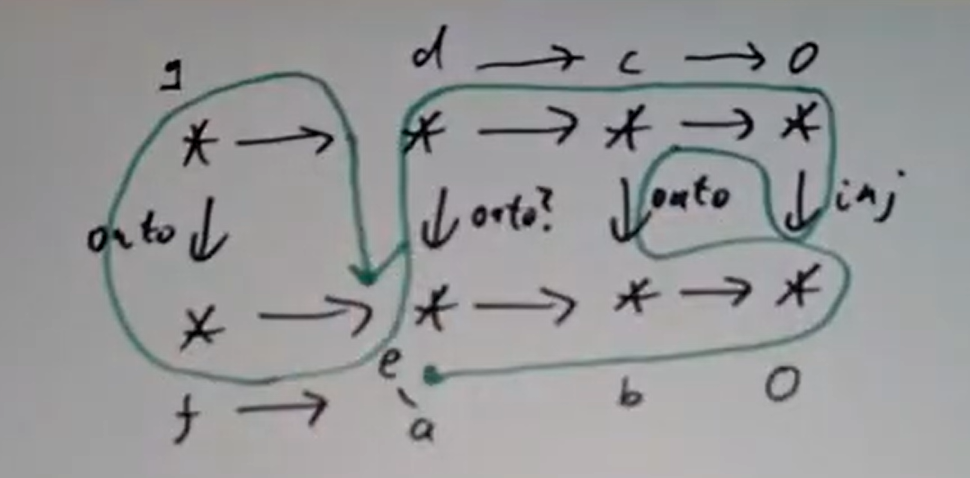

## 基本性质

直观上来讲，双线性和对应着“乘法”，例如 $(x,y)\mapsto xy$ 是 $k^2\to k$ 双线性映射，数乘是 $k\times V\to V$ 双线性映射，如果 $M$ 是向量场 $\sum f_i \frac{\partial }{\partial x_i}$ 的模，$N$ 是微分 $1$-形式 $\sum p_id{x_i}$ 的模，则他们的乘积 $\sum p_if_i$ 是 $M\times N$ 到函数环的模。

如果模 $M$ 和 $N$ 定义了取值于模 $L$ 的乘法，而 $\varphi:L\to L'$ 是线性映射，则 $\varphi(xy)$ 定义了取值于 $L'$ 的乘法（也就是 $M\times N\to L'$ 双线性映射）。这样的使如下图表交换的 $\varphi$ 称为从乘法 $B$ 到 $B'$ 的态射，由此模 $M$ 和 $N$ 的乘法定义了一个范畴 $\mathrm{Bil}(M,N;*)$。
```tikz
\usepackage{tikz-cd}
\begin{document}
\Large\begin{tikzcd}[row sep=tiny]
	{} & L \arrow[dd, "\varphi"] \\
	M \times N \arrow[ru, "B"] \arrow[rd, "B'"'] & \\
	& L'
\end{tikzcd}
\end{document}
```
模 $M$ 和 $N$ 的张量积则是“最基本的”乘法。

$\mathrm{1.1.\ Defination.\ }$ 环 $A$ 上模 $M$ 和 $N$ 的**张量积**是 $\mathrm{Bil}(M,N;*)$ 的始对象。具体来说，它是取值于模 $M\otimes _{A} N$ 的双线性映射 $\otimes :M\times N\to M\otimes _{A} N$ ，使得任意双线性映射 $M\times N\to L$ 可以被唯一分解为某个线性映射 $\varphi:M\otimes _{A} N\to L$ 复合张量积，也就是 $xy=\varphi(x\otimes y)$ 

$\mathrm{1.2.\ Theorem.\ }$ *对任意模 $M$ 和 $N$ ，存在同构意义下唯一的张量积*

唯一性由始对象的特质给出，也就是假设有两个张量积 $\otimes,\otimes^\prime$ ，则存在 $\otimes$ 到 $\otimes^\prime$ 的唯一态射 $\varphi$ ，和 $\otimes^\prime$ 到 $\otimes$ 的唯一态射 $\psi$ 。类似的，$\otimes$ 到 $\otimes$ 态射唯一，所以只能是 $\mathrm{id}_{\otimes}$ ，而 $\psi\circ \varphi$ 正是 $\otimes$ 到 $\otimes$ 态射，于是  $\psi\circ \varphi=\mathrm{id}_{\otimes}$，同样的可得 $\varphi\circ \psi=\mathrm{id}_{\otimes ^\prime}$  ，所以 $\varphi$ 是同构。

存在性考虑 $M\times N$ 作为集合生成的自由 $R$-模，商去

$$\begin{gathered}
(x+x^{\prime},y)-(x,y)-(x^{\prime},y) \\
(x,y+y^{\prime})-(x,y)-(x,y^{\prime}) \\
(ax,y)-a(x,y) \\
(x,ay)-a(x,y).
\end{gathered}$$

生成的子模，则得到满足张量积泛性质的模。$\square$

注：上面证明存在性处的具体构造除证明张量积存在以外毫无用处。

对一般非交换环情形，比如说对右 $R$-模 $M$ 和左 $R$-模 $N$ ，则应有约束 $(mr)\otimes n=m\otimes (rn)$ ，但在这种情况下只能得到一个Abel群结构，不大能得到一个合适的 $R$-模结构，所以非交换环情形一般处理双模，比如说 $M$ 是 $(R,R)$-双模时可以使 $M\otimes N$ 成为 $R$-左模，于是 $M,N$ 都是双模时就能得到双模。

$\mathrm{1.3.\ Theorem.\ }$ *（交换约束） 

$$M\otimes N\cong N\otimes M$$

*

映射

$$\begin{aligned}
M\times N&\to N\otimes M \\(m,n)&\mapsto n\otimes m
\end{aligned}$$

双线性，从而给出 $M\otimes N\to N\otimes M$ 态射，类似地可以构造 $N\otimes M\to M\otimes N$ 态射，由 $1.2$ 证明中同样的技术可知其为同构。$\square$

$\mathrm{1.4.\ Theorem.\ }$ (i) $(M\oplus N)\otimes_A P\cong (M\otimes_A P)\oplus(N\otimes_A P)$ (ii) $A\otimes _A M\cong M$

(i) 只需验证 $(M\otimes P)\oplus(N\otimes P)$ 满足 $(M\oplus N)\otimes P$ 的泛性质，而 $(M\oplus N)\times P$ 出发的双线性映射相当于一对 $M\times P$ 和 $N\times P$ 出发的双线性映射之和，从而用 $M\otimes P$ 和 $N\otimes P$ 泛性质得到一对线性映射加起来即可。

(ii) 同样的道理，注意到 $R\times M$ 出发的双线性映射和 $R$ 出发线性映射相同。$\square$

$\mathrm{Corollary.\ }$ *对域 $k$ 上有限维线性空间 $V_1, V_2$ ，如果 $(e_{i_1})$ 是 $V_1$ 一组基，$(e_{i_2})$ 是 $V_2$ 一组基，则 $e_{i_1}\cdot e_{i_2}$ 是 $W$ 一组基，且

$$\dim (V_1\otimes V_2)=\dim (V_1)\cdot \dim (V_2)$$

将 $e_i\otimes e_j$ 以字典序排列考虑矩阵则得到熟知的Kronecker积

$$\boldsymbol{A}\otimes\boldsymbol{B}:=
\begin{pmatrix}
a_{11}\boldsymbol{B} & \cdots & a_{1n}\boldsymbol{B} \\
\vdots & \ddots & \vdots \\
a_{n1}\boldsymbol{B} & \cdots & a_{nn}\boldsymbol{B}
\end{pmatrix}$$

*

考虑

$$V_1\otimes V_2=\left( \bigoplus \left< e_{i_1}\right> \right)\left( \bigoplus \left< e_{i_2}\right> \right)=\bigoplus \left< e_{i_1}\otimes e_{i_2}\right>  $$

 $\square$

注：$V\times W$ 作为线性空间是 $n+m$ 维，而 $V\otimes W$ 是 $nm$ 维。

$\mathrm{1.5.\ Example.\ }$ 考虑有限生成Abel群的张量积。有限生成Abel群可以写成一些 $\mathbb{Z}$ 和 $\mathbb{Z}/n\mathbb{Z}$ 的直和，从而我们只需要处理三类张量积：$\mathbb{Z}\otimes \mathbb{Z}$ ，$\mathbb{Z}\otimes (\mathbb{Z}/n\mathbb{Z})$ 和 $(\mathbb{Z}/n\mathbb{Z})\otimes (\mathbb{Z}/m\mathbb{Z})$ ，前两者是显然的，而对于第三个张量积，我们将证明它是 $\mathbb{Z}/(m,n)$ 。

由于 $1$ 是 $\mathbb{Z}/n$ 的生成元，所以 $(\mathbb{Z}/n)\otimes (\mathbb{Z}/m)$ 由 $1\otimes 1$ 生成。显然 $m(1\otimes 1)=(m1)\otimes 1=0$ ，类似地 $n(1\otimes 1)=0$ ，从而它至多有 $(m,n)$ 个元素（考虑 $(sn+tm)(1\otimes 1)=0$）。

而反过来，乘法给出双线性映射 $\mathbb{Z}/m  \times  \mathbb{Z}/n\to  \mathbb{Z}/(m,n)$ ，分解出 $(\mathbb{Z}/n)\otimes (\mathbb{Z}/m)$ 到 $\mathbb{Z}/(m,n)$ 的满射，从而 $(\mathbb{Z}/n)\otimes (\mathbb{Z}/m)$ 恰有 $(n,m)$ 个元素。其实直接证明这个映射单也不难，只需考虑到这里面 $\sum \bar{a_i}\otimes \bar{b_i}=(\sum a_ib_i)(1\otimes 1)$ ，如果它被打到 $0$ ，因为 $1\otimes 1$ 被打到 $1$ ，所以 $(m,n)\mid (\sum a_ib_i)$ 。

更一般的，用同样的手段我们可以证明 $(A/\mathfrak{a})\otimes (A/\mathfrak{b})\cong A/(\mathfrak{a},\mathfrak{b})$ 和

$\mathrm{1.6.\ Proposition.\ }$ $(A/\mathfrak{a})\otimes M\cong M/\mathfrak{a}M$

考虑乘法定义的映射 $(A/\mathfrak{a})\times M\to  M/\mathfrak{a}M$ ，它显然良定义且双线性，从而分解出 $(A/\mathfrak{a})\otimes M\to  M/\mathfrak{a}M$ 。一方面显然这是满射，一方面 $\mathfrak{a})\otimes M$ 中元素皆有 $x=\sum \bar{c}\otimes m=1\otimes (\sum cm)$ 形式，因而被打到 $0$ 当且仅当 $\sum cm\in \mathfrak{a}M$ ，从而 $x=0$ ，因而这是单射。$\square$

注：这个命题也可依靠张量积的右正合性证明，具体来说考虑

$$\mathfrak{a}\to A\to A/\mathfrak{a}\to 0$$

张量积上 $M$ ，而 $\mathfrak{a}\otimes M$ 自然同构于 $\mathfrak{a}M$ （只需验证 $\mathfrak{a}M$ 满足 $\mathfrak{a}\otimes M$ 泛性质即可）。

$\mathrm{1.7.\ Proposition.\ }$ *对 $A$-模线性映射 $f:M\to M'$ 和 $g:N\to N'$ ，存在唯一的线性映射 $f\otimes g:M\otimes N\to M'\otimes N'$ 使得

$$(f\otimes g)(m\otimes n)=f(m)\otimes g(n)$$

*

考虑双线性映射 $M\times N\to M'\otimes N'$ ， $(m,n)\mapsto f(m)\otimes g(n)$ 即可。$\square$

$\mathrm{1.8.\ Theorem.\ }$ *（结合约束） $A$-模 $M$ 和 $A,B$-双模 $N$ 的张量积 $N\otimes _{A}M$ 具有自然的 $B$ 模结构，假设 $P$ 是 $B$-模，则有 $A,B$-双模的同构

$$(M\otimes _{A}N)\otimes _{B}P\cong M\otimes _{A}(N\otimes _{B}P)$$

*

$M\otimes _{A}N$ 的 $B$-模结构直观上应该由 $b(m\otimes _{A}n)=m\otimes _{A}(bn)$ 给出，而事实上考虑双线性映射 $(m,n)\mapsto m\otimes _{A}(bn)$ ，唯一分解出 $A$-线性映射 $f_b:M\otimes _{A}N\to M\otimes _{A}N$ ，显然 $f_{b}\circ f_{b'}=f_{bb'}$ 且 $f_{b+b'}=f_{b}+f_{b'}$ ，于是 $M\otimes _{A}N$ 的确是 $B$-模，类似地道理知 $(M\otimes _{A}N)\otimes _{B} P$ 是 $A$-模。 

取某个 $z\in P$ ，则 $(x,y)\mapsto x\otimes _{A}(y\otimes _{B}z)$ 诱导出 $A$-线性映射 $\phi_z:M\otimes_{A}N\to M\otimes _{A}(N\otimes _{B} P)$ ，而 $\phi_z$ 关于 $z$ 和 $M\otimes_{A}N$ 皆 $B$-线性（后者只需考虑到 $\phi_z\circ f_b$ 与 $M\otimes _{A}(N\otimes _{B} P)$ 的数乘 $b$ 在泛性质图表里复合后一致即可），从而给出映射 $(M\otimes_{A}N)\otimes P\to M\otimes _{A}(N\otimes _{B} P)$ ，这便是我们所求的同构。$\square$

> Reading: Section 2.2
Exercises: 2.4

## 张量积与正合列

如果 $0\to A\to B\to C\to 0$ 正合，那么在 $A$ 是域时 $0\to A\otimes M\to B\otimes M\to C\otimes M\to 0$ 正合(这里是指 $[A\to B]\otimes \mathrm{id}$ )，然而一般来说并没有这种性质。张量积在这里失去正合性的问题在交换代数中有十分重要的地位，同调代数就以处理此问题为核心。

$\mathrm{2.1.\ Example.\ }$ 考虑 $0\to \mathbb{Z}\to \mathbb{Z}\to  \mathbb{Z}/2\to 0$ tensor上 $\mathbb{Z}/2$ ，其中 $\mathbb{Z}\to \mathbb{Z}$ 是乘 $2$ 映射，则得到 $0\to \mathbb{Z}/2\to \mathbb{Z}/2\to \mathbb{Z}/2\to 0$ ，第二个 $\mathbb{Z}/2\to \mathbb{Z}/2$ 是 $\mathrm{id}$ ，保持正合，第一个是 $0$ ，因而不正合（所以只能把最左边的 $0\to $ 删掉。

与tensor上 $\mathbb{Z}/2$ 类似的还有考虑函子 $\operatorname{Hom} (\mathbb{Z}/2,-)$ 作用于正合列，而在

$$0\to \operatorname{Hom} (\mathbb{Z}/2,\mathbb{Z})\to \operatorname{Hom} (\mathbb{Z}/2,\mathbb{Z})\to \operatorname{Hom} (\mathbb{Z}/2,\mathbb{Z}/2)\to  0$$

中，$\operatorname{Hom} (\mathbb{Z}/2,\mathbb{Z})=0$ ，因而前两项处都正合，然而 $\operatorname{Hom} (\mathbb{Z}/2,\mathbb{Z})\to \operatorname{Hom} (\mathbb{Z}/2,\mathbb{Z}/2)$ 并非满射（所以只能把最右边的 $\to 0$ 删掉）

对反过来的 $\operatorname{Hom} (-,\mathbb{Z}/2)$ 函子，类似地

$$0\leftarrow  \operatorname{Hom} (\mathbb{Z},\mathbb{Z}/2)\leftarrow  \operatorname{Hom} (\mathbb{Z},\mathbb{Z}/2)\leftarrow  \operatorname{Hom} (\mathbb{Z}/2,\mathbb{Z}/2)\leftarrow   0$$

中，$\operatorname{Hom} (\mathbb{Z},\mathbb{Z}/2)=\mathbb{Z}/2$ ，而 $\operatorname{Hom} (\mathbb{Z},\mathbb{Z}/2)\leftarrow  \operatorname{Hom} (\mathbb{Z},\mathbb{Z}/2)$ 是乘 $2$ 映射，并非满射。

$\mathrm{2.2.\ Theorem.\ }$ *$\operatorname{Hom} (M,-)$ 左正合，$\operatorname{Hom} (-,M)$ 右正合*

比如说对 $0\to A\overset{u}{\to}B\overset{v}{\to}C$ ，如果 $f\in \operatorname{Hom} (M,B)$ 且 $f$ 被推出到 $0$ ，那么 $\operatorname{Im} (f)\subset \operatorname{Ker} (v)=\operatorname{Im} (A)$ ，由于 $u$ 单，$A$ 视作 $B$ 的子模而 $f$ 则成为 $M\to A$ 线性映射，即 $f$ 是某个推出的像。

同样对 $A\overset{u}{\to}B\overset{v}{\to}C\to0$ ，如果 $f\in \operatorname{Hom} (B,M)$ ，如果 $f$ 被拉回到 $0$ ，也就是 $f$ 在 $\operatorname{Im} (A)$ 上消失，而 $C=B/\operatorname{Im} (A)$ ，于是 $f$ 的确成为 $C\to M$ 的映射。$\square$

注：事实上 $E:0\to A\overset{u}{\to}B\overset{v}{\to}C$ 正合当且仅当 $\operatorname{Hom} (M,E)$ 正合 ，类似地 $\operatorname{Hom} (-,M)$ 处的正合性也是充要的，见[Atiyah Prop. 2.9](https://deideidei.github.io/2024/12/27/Notes-on-Atiyah-s-Commutative-Algebra-2/)。

$\mathrm{2.3.\ Theorem.\ }$ *$-\otimes N$ 右正合*

从正合列

$$E:A\overset{u}{\to}B\overset{v}{\to}C\to0$$

可得到正合列 $\operatorname{Hom} (E,N)$ 和 $\operatorname{Hom} (M,\operatorname{Hom} (E,N))$ ，然而考虑双线性中固定某个分量，就得到自然同构

$$\operatorname{Hom} (M\otimes N,P)\cong \operatorname{Hom} (M,\operatorname{Hom} (N,P))$$

于是我们事实得到了正合列

$$\operatorname{Hom} (M\otimes A,N)\leftarrow \operatorname{Hom} (M\otimes B,N)\leftarrow \operatorname{Hom} (M\otimes C,N)\leftarrow 0$$

相当于说 $\operatorname{Hom} (M\otimes C,N)$ 中元素相当于 $\operatorname{Hom} (M\otimes B,N)$ 中在 $\operatorname{Im} (M\otimes A)$ 上消失的元素，从而 $M\otimes C$ 事实上就是 $(M\otimes B)/(M\otimes A)$ 。$\square$

注：上面证明中的自然同构告诉我们 $-\otimes N$ 是 $\operatorname{Hom} (N,-)$ 的左伴随，它和余极限交换，于是自然这个命题正确。

这种右正合性可以用于计算张量积，具体来说比如说对于 $M$ ，如果能找到它的有限展示

$$A^m\to A^n\to M\to 0$$

那么可以考虑同时tensor上 $N$ 。

## 张量积和余极限

与之类似的有用性质是张量积保持direct limit

$\mathrm{3.1.\ Defination.\ }$ 一个 $A$-模的direct system是某个direct set $I$（任何两元素集有上界的偏序集）到 $A$-$\mathsf{Mod}$ 的函子（也就是这个偏序集形状的交换图），也就是一族模 $M_i$ 配备映射 $\mu_{ij}:M_i\to M_j$ （$i\leqslant j$），满足 (i) $\mu_{ii}=\operatorname{id}_{M_i}$ (ii) $\mu_{jk}\circ \mu_{ij}=\mu_{ik}$ 对 $i\leqslant j\leqslant k$。定义它上的一个锥是模 $N$ 配备一系列映射 $\alpha_i:M_i\to N$，且使如下图表交换（这里 $M_i\to M_j$ 是 $\mu_{ij}$ ， $M_i\to N$ 是 $\alpha_i$）
```tikz
\usepackage{tikz-cd}
\usepackage{amsmath}
\begin{document}
\Large\begin{tikzcd}[column sep=1.2em, row sep=1.5em]
& N&\\
& &\\
&M_j  \arrow[rd] \arrow[uu]&\\
M_i \arrow[ruuu,bend left = 10] \arrow[ru] \arrow[rr] & &M_k \arrow[luuu, crossing over, bend right = 10] 
\end{tikzcd}
\end{document}
```
两个锥 $N,N'$ 间的同态是使两个锥的图表带上这个映射之后的大图表交换的线性映射，容易验证这样我们定义了一个范畴。它的direct limit $\varprojlim M_i$ 就是其上锥的始对象，具体泛性质如以下交换图
```tikz
\usepackage{tikz-cd}
\usepackage{amsmath}
\begin{document}
\Large\begin{tikzcd}[column sep=1.2em, row sep=1.5em]
& \varinjlim M_i\arrow[rr, "\exists !", bend left = 10]&&N\\
& & &\\
& & &\\
&M_j  \arrow[rd] \arrow[uuu] \arrow[rruuu, bend left = 5]& &\\
M_i \arrow[ruuuu,bend left = 10] \arrow[ru] \arrow[rr] \arrow[rrruuuu, bend left = 12, crossing over]& &M_k \arrow[luuuu, crossing over, bend right = 10] \arrow[ruuuu, bend right = 5]&
\end{tikzcd}
\end{document}
```
它可以被构造为诸 $X_i$ 的直和商去关系 $x_i=\mu_{ij}(x_i)$ ，这里 $\mu_{ij}$ 是 $X_i$ 到 $X_j$ 的映射，这些验证可以参见[Atiyah第二章习题14-19](https://deideidei.github.io/2024/12/27/Notes-on-Atiyah-s-Commutative-Algebra-2/)。direct limit就是模范畴上的余极限。

而关于张量积， $B(\varinjlim M_i , M;X)$ 就相当于 $\varinjlim B(M_i,M;X)$ ，从而张量积和余极限交换。

$\mathrm{3.2.\ Example.\ }$ $\mathbb{Q}$ 是 $\mathbb{Z}\overset{\times 2}{\to}\mathbb{Z}\overset{\times 3}{\to}\mathbb{Z}\to \cdots$ 的余极限，其中第一个 $\mathbb{Z}\to \mathbb{Z}$ 是乘 $2$ ，第二个是乘 $3$ ，第三个是乘 $4$ ，……直观来讲，第 $n$ 个 $\mathbb{Z}$  可以看作 $\frac 1{n!}\mathbb{Z}$ 。某种意义上这可能就是direct limit有时被称为归纳极限的原因。现在考虑计算 $\mathbb{Q}\otimes _{\mathbb{Z}}\mathbb{Q}$ ，则这相当于

$$\mathbb{Q}\overset{\times 2}{\to}\mathbb{Q}\overset{\times 3}{\to}\mathbb{Q}\overset{\times 4}{\to} \cdots$$

这里面每个箭头都是同构，从而它的余极限就是 $\mathbb{Q}$ 。不过这里有需要小心的问题，比如说类似地计算 $\mathbb{Q}\otimes _\mathbb{Z}\mathbb{Z}/2 \mathbb{Z}$ ，相当于要考虑一个direct system

$$\mathbb{Z}/2 \mathbb{Z}\to \mathbb{Z}/2 \mathbb{Z}\to \mathbb{Z}/2 \mathbb{Z}\to \cdots$$

的余极限，但这里第偶数个 $\mathbb{Z}/2 \mathbb{Z}\to \mathbb{Z}/2 \mathbb{Z}$ 都是 $0$ ，所以事实上这个余极限就是 $0$ 。

> Reading: Section 2.2
Exercise: 2.13
Calculate Hom(M,N) and the tensor products of M, N over the ring k[x] for all pairs M,N of modules each of which is isomorphic to k(x), k[x], or k[x]/(f^n) where f is an irreducible polynomial.

## 平坦模

平坦模的概念由Serre在20世纪50年代引入，此后被Grothendieck证明在代数几何中具有极其基本的地位。直观来讲，$M$ 平坦意味着 $M_{\mathfrak{p}}$ 具有极好的性质，某种意义上讲 $M$ 可以看作一族局部环上的模 $M_{\mathfrak{p}}$ ，而平坦则是在说它们具有很好的性质，譬如说不会突然跳变这样的（？）。我们将证明局部化环 $R[S^{-1}]$ 保持正合。

$\mathrm{4.1.\ Defination.\ }$ 称 $M$ 是**平坦模**如果 $-\otimes M$ 保持正合

$\mathrm{4.2.\ Example.\ }$ $\mathbb{Z}/2 \mathbb{Z}$ 不是平坦模，考虑 $A$-模上张量积时 $A$ 是平坦模

用构造局部化环完全相同的手段，我们可以定义局部化模 $M[S^{-1}]$ ，这里面的元素皆有 $m/s$ 形式，而且如果 $m/s=0$ 当且仅当 $ms_1=0$ 对某个 $s_1\in S$ 。自然地，对 $f:M\to N$ ，可以定义出对应的映射 $S^{-1}f:M[S^{-1}]\to N[S^{-1}]$ ，把 $m/s$ 打到 $f(m)/s$ 。

$\mathrm{4.3.\ Theorem.\ }$ *模的局部化保持正合（$A$-模正合列到 $A[S^{-1}]$-模）*

考虑正合列 $0\to A\to B\to C\to 0$ ，局部化之后得到

$$0\to A[S^{-1}]\to B[S^{-1}]\to C[S^{-1}]\to 0$$

如果 $b/s\in B[S^{-1}]$ 在 $C[S^{-1}]$ 中的像是 $0$ ，那么 $b/s$ 被打到某个 $c/s$ ，其中 $c$ 被某个 $s_1\in S$ 零化，从而 $bs_1$ 被 $B\to C$ 打到 $0$ ，从而 $bs_1\in \operatorname{Im} (A)$ ，除掉 $ss_1$ 便知 $b/s\in \operatorname{Im} (A[S^{-1}])$ 。$\square$

我们把 $M_{\mathfrak{p}}$ 定义为 $M[A-\mathfrak{p}]$ ，这里 $A_{\mathfrak{p}}$-模 $M_{\mathfrak{p}}$ 可以看作 $M$ 在 $\mathfrak{p}$ 处的stalk，$M$ 看作“函数环的层”上“模”的“层”。就像 $U(f)$ 对应 $A[f^{-1}]$ ，对模的情况 $\mathcal{O}(U(f))$ 就是 $M[f^{-1}]$ ，这里实际上定义了所谓拟凝聚层。

$\mathrm{4.4.\ Proposition.\ }$ *$M[S^{-1}]=M\otimes _A A[S^{-1}]$ ，作为推论，$A[S^{-1}]$ 是平坦 $A$-模*

我们可以定义映射 $a/s\mapsto a\otimes s^{-1}$ 和 $a\otimes (rs^{-1})\mapsto (ar)s^{-1}$ ，不难验证它们良定义而且互逆，因而为同构。$\square$

$\mathrm{4.5.\ Example.\ }$ 一般来说商不保持平坦，例如 $\mathbb{Z}/2\mathbb{Z}$ ，于是一般来讲

$$0\to A/IA\to B/IB\to C/IC\to 0$$

一般未必正合。

对一些比较好的情况我们可以探测到一些平坦模的结构。例如 $M$ 是平坦 $A$-模，如果 $A$ 是整环，考虑 $a\in A$ 和正合列

$$0\to A\overset{\times a}{\to}A\to A/aA\to 0$$

tensor上 $M$ 知道乘 $a$ 是单射，也就是 $M$ 是无挠模。反过来，对一切PID上的模（以及一些更广泛的情况），$M$ 如果无挠则平坦。

$\mathrm{4.5.\ Proposition.\ }$ *$M=0$ 当且仅当对一切极大理想 $\mathfrak{m}$ ，$M_{\mathfrak{m}}=0$*

对 $x\in M$ ，$M_{\mathfrak{m}}=0$ 意味着 $\operatorname{Ann}(x)\not\subset \mathfrak{m}$ ，这对一切极大理想成立，于是 $\operatorname{Ann}(x)=(1)$ 。$\square$

$\mathrm{4.6.\ Proposition.\ }$ *$0\to A\to B\to C\to 0$ 正合当且仅当 $0\to A_{\mathfrak{m}}\to B_{\mathfrak{m}}\to C_{\mathfrak{m}}\to 0$ 总正合*

因为局部化正合，所以只需证明 $\impliedby$ 即可。事实上由于 $R_{\mathfrak{m}}$ 平坦

$$(\operatorname{Ker} (B\to C)/\operatorname{Im} (A\to B))_{\mathfrak{m}}=\operatorname{Ker} (B\to C)_{\mathfrak{m}}/ \operatorname{Im} (A\to B)_{\mathfrak{m}}$$

于是 $\operatorname{Ker} (B\to C)/\operatorname{Im} (A\to B)=0$ 。$\square$

$\mathrm{4.7.\ Proposition.\ }$ *$M$ 平坦当且仅当一切 $M_{\mathfrak{m}}$ 是平坦 $R_{\mathfrak{m}}$-模*

想说明 $M$ 平坦，也就是保持

$$0\to A\otimes M\to B\otimes M\to C\otimes  M\to 0$$

正合，只需说明

$$0\to (A\otimes M)_{\mathfrak{m}}\to (B\otimes M)_{\mathfrak{m}}\to (C\otimes  M)_{\mathfrak{m}}\to 0$$

总正合，而 $(A\otimes M)_{\mathfrak{m}}=A_{\mathfrak{m}}\otimes _{R_{\mathfrak{m}}}M_{\mathfrak{m}}$ ，另外两项类似，于是由 $M_{\mathfrak{m}}$ 平坦即得证结论。$\square$

注：如果把 $M_{\mathfrak{m}}$ 看作平坦 $R$-模并不影响证明，事实上平坦 $R$-模可以推平坦 $R_{\mathfrak{m}}$ 模，因为 $R[S^{-1}]$ 是平坦 $A$-模。

> Reading: Section 2.2
Exercises: 2.20

## 平坦扩张

环同态 $R\to S$ 使 $S$ 成为 $R$-代数，对一个 $R$-模 $M$ ，可以得到一个 $S$-模 $S\otimes _RM$ ，它自然诱导出映射 $\operatorname{Hom} _R(M,N)\to \operatorname{Hom}_S (S\otimes _RM,S\otimes _RN)$ 。$S\otimes _R\operatorname{Hom} _R(M,N)$ 自然成为一个 $S$-模，并且有自然（显然它是自然变换）的 $S$-模同态 $S\otimes _R\operatorname{Hom} _R(M,N)\to \operatorname{Hom}_S (S\otimes _RM,S\otimes _RN)$ 。一般来讲它不是同构，例如考虑 $R=\mathbb{Z},S=\mathbb{Z}/2\mathbb{Z}$ 和 $M=\mathbb{Z}/2\mathbb{Z},N=\mathbb{Z}$ ，这里 $S\otimes _RM=S\otimes _RN=\mathbb{Z}/2\mathbb{Z}$ 。

不过如果 $S$ 是平坦 $R$-模而 $M$ 有有限展示（有正合列 $R^m\to R^n\to M\to 0$ ）时，可以证明它是同构。对诺特环来说有限生成则有限展示（关系的子模有限生成），于是 $R$ 是诺特环时只需要 $M$ 有限生成。证明这一结论需要：

$\mathrm{5.1.\ Lemma.\ }$ *（5引理）对交换图*
```tikz
\usepackage{tikz-cd}
\begin{document}
\Large\begin{tikzcd}
	M_0\arrow[d]\arrow[r]&M_1\arrow[d]\arrow[r]&M_2\arrow[d]\arrow[r]&M_3\arrow[d]\arrow[r]&M_4\arrow[d]\\
	N_0\arrow[r] & N_1\arrow[r] & N_2\arrow[r] & N_3\arrow[r] & N_4
\end{tikzcd}
\end{document}
```
*其中横行皆正合，有
(i) 若 $M_1\to N_1,M_3\to N_3$ 满，$M_4\to N_4$ 单，则 $M_2\to N_2$ 满 
(ii) $M_0\to N_0$ 满，$M_1\to N_1,M_3\to N_3$ 单，则 $M_2\to N_2$ 单*

(i) 考虑以如下路线追图
取 $a\in N_2$ ，$a$ 被 $N_2\to N_3$ 打到 $b\in N_3$ ，一方面来说 $b$ 在 $N_4$ 中的像是 $0$ ，另一方面 $M_3\to N_3$ 满，所以存在 $c\in M_3$ 打到 $b$，$c$ 被 $M_3\to M_4\to N_4$ 打到 $0$ ，而 $M_4\to N_4$ 单，所以 $c$ 在 $M_4$ 中的像是 $0$ ，从而存在 $d$ 被 $M_2\to M_3$ 打到 $c$ 。 $d$ 被 $M_2\to N_2$ 打到 $e$ ，$e$ 与 $a$ 在 $N_2\to N_3$ 中有相同的像，于是存在 $f$ 在 $N_1\to N_2$ 下的像是 $e-a$ ，由 $M_1\to N_1$ 满，取 $g\in M_1$ 的像是 $f$ ，由交换性 $g$ 的像是 $e-a$ ，于是 $d+g$ 的像是 $a$ 。

(ii) 的追图则更简单。假设 $a\in A_1$ 被 $M_2\to N_2$ 打到 $0$ ，那么 $a$ 被 $M_3\to M_4\to N_4$ 打到 $0$ ，由 $M_3\to N_3$ 单知 $a$ 在 $M_4$ 中的像被打到 $0$ ，于是由正合性存在 $b$ 被 $M_2\to M_3$ 打到 $a$ ，$b$ 在 $N_2$ 中的像是 $c$ ， $c$ 被打到 $0$ 于是存在某个原像 $d\in N_0$ ，由于 $M_0\to N_0$ 满所以有原像 $e$ ，$e$ 被 $M_0\to M_1\to N_1$ 打到 $c$ ，但 $M_1\to N_1$ 单，所以 $e$ 被打到 $b$ ，而 $b$ 被打到 $a$ ，于是 $a=0$ 。

$\mathrm{5.2.\ Theorem.\ }$ *假设 $S$ 是平坦 $R$-代数，$M$ 是有限展示 $R$-模，$N$ 是 $R$-模，则有 $S\otimes _R\operatorname{Hom} _R(M,N)\to \operatorname{Hom}_S (S\otimes _RM,S\otimes _RN)$ 是同构*

记 $S\otimes_RM=M_S$ 。对正合列

$$R^m\to R^n\to M\to 0$$

应用函子 $\operatorname{Hom} (-,N)$ 得到正合列

$$0\to \operatorname{Hom} _R(M,N)\to \operatorname{Hom} _R(R^n,N)\to \operatorname{Hom} (R^m,N)$$

从而由平坦性有正合列

$$0\to \operatorname{Hom} _R(M,N)_S\to \operatorname{Hom} _R(R^n,N)_S\to  \operatorname{Hom} (R^m,N)_S$$

类似地先应用 $S\otimes _R-$ 则得到

$$(R^m)_S\to (R^n)_S\to M_S\to 0$$

再应用 $\operatorname{Hom}_S (-,S\otimes _RN)$ 得到

$$0\to \operatorname{Hom} _S(M_S,N_S)\to \operatorname{Hom} _S((R^n)_S,N_S)\to \operatorname{Hom} _S((R^m)_S,N_S)$$

而对有限生成的自由模，显然 $\operatorname{Hom} _R(R,N)_S\cong \operatorname{Hom}_S (R_S,N_S)$，由于 $\operatorname{Hom} (-, N)$ 和 $S\otimes _R-$ 都保持有限直和，所以 $\operatorname{Hom} _S((R^n)_S,N_S)\cong\operatorname{Hom}_S ((R^n)_S,N_S)$ ，$R^m$ 同理。现在由5引理，$\operatorname{Hom} _S(M,N)_S\to \operatorname{Hom} _S(M_S,N_S)$ 是同构（考虑正合列 $0\to 0\to \operatorname{Hom} _R(M,N)_S\to \operatorname{Hom} _R(R^n,N)_S\to  \operatorname{Hom} (R^m,N)_S$ 和……）。$\square$

$\mathrm{5.4.\ Example.\ }$ 下面给出一个 $M$ 不有限展示时 $5.3$ 失效的例子。取 $R=\mathbb{Q}$ ，$S=\mathbb{Q}[x]$ ，$M=\bigoplus _0^\infty\mathbb{Q}$ ，$N=\mathbb{Q}$ ，则（由于 $\operatorname{Hom} (\oplus _{i\in I}M_i,N)=\prod_{i\in I} (M_i,N)$）

$$S\otimes _R\operatorname{Hom} _R(M,N)=\mathbb{Q}[x]\otimes \prod_{0}^{\infty} \mathbb{Q}$$

而

$$\operatorname{Hom} _S(S\otimes _RM,S\otimes _RN)=\prod_0^\infty \mathbb{Q}[x] $$

考虑到 $\mathbb{Q}[x]=\oplus x^i\mathbb{Q}$ ，$\mathbb{Q}[x]\otimes \prod \mathbb{Q}=\oplus (x^i\otimes \prod \mathbb{Q} )$ 形如 $(f_0,f_1,\cdots)$ ，诸 $f_i$ 的次数小于某个固定的上界（也就是 $\mathbb{Q}[[y]][x]$ ）。而 $\prod \mathbb{Q}[x]$ 形如 $(f_0,f_1,\cdots)$ ，诸 $f_i$ 任取（也就是 $\mathbb{Q}[x][[y]]$ ），显然这两者不能同构（事实上作为 $\mathbb{Q}[[y]]$-模一个可数维一个不可数维）。

> Reading: Section 2.2
Exercises: 2.12, A3.11 (page 641)

