关于环的可视化，大体有三种比较直接的方法：画出环中每个元素、画出环的一组基和画出环的素理想。

## 环元素作为点的可视化

这种可视化适用于加群可嵌入线性空间的环，所以它对代数数域的代数整数环，从而对代数数论很有用。这种可视化最简单的例子如下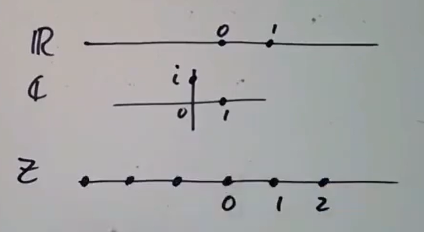此外有高斯整数 $\mathbb Z[i]$ 的可视化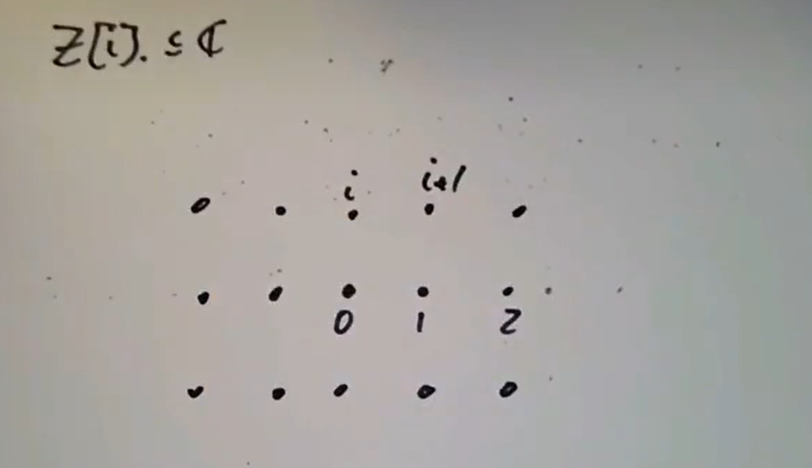这种可视化手段的一个直接应用是：

${\rm Theorem\ 1.1}$ *$\mathbb Z[i]$ 是欧几里得整环，从而是UFD*

取 $\mathbb Z[i]$ 上继承的复数绝对值，我们将证明它给出一个符合ED公理的尺度函数（这里ED定义我们要求尺度函数是 $R\backslash\{0\}$ 到某个良序集的映射）。也就是说，对 $a,b\in \mathbb Z[i]$ 且 $b\ne 0$ ，我们想证明存在 $q,r\in \mathbb Z[i]$ 满足$$a=qb+r, \quad |r|<|b|$$也即$$\frac ab=q+\frac rb,\quad \left|\frac rb\right|<1$$而我们只需考虑到如图所示，以某个 $ \mathbb Z[i]$ 中元素为圆心，半径为1的开圆盘覆盖了复平面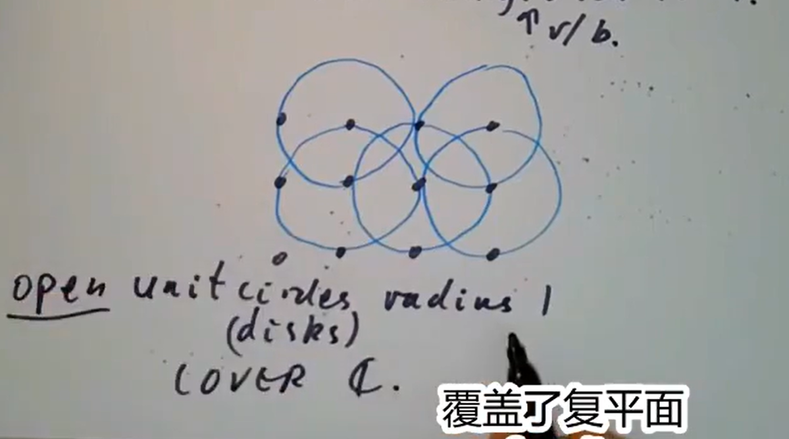则立即可知上述 $q,r$ 的存在性。$\square$

类似的方法可以毫无阻碍地推广到

${\rm Theorem\ 1.2}$ *$\mathbb Z[\sqrt{-2}]$ 是欧几里得整环，从而是UFD*

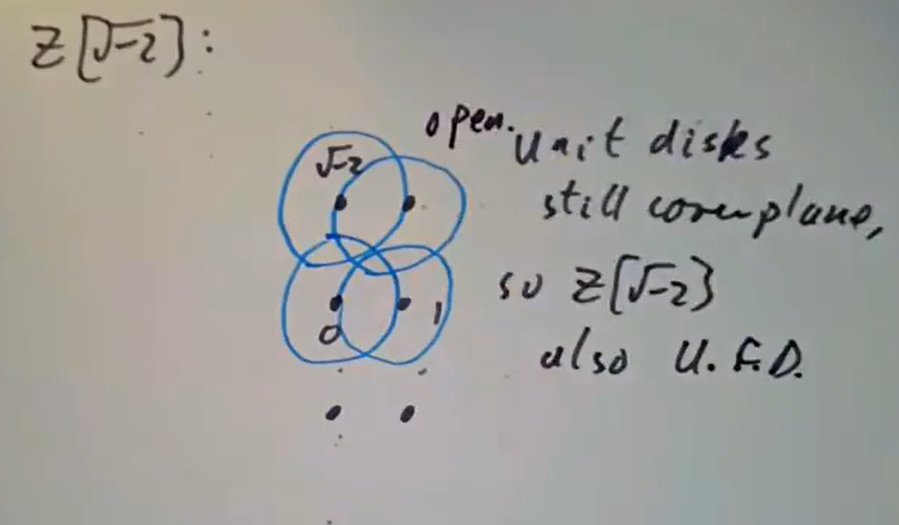画图立即可知。$\square$

${\rm Example\ 1.3}$ 不过绝对值并非总是尺度函数，例如对 $\mathbb Z[\sqrt{-3}]$ ，$\frac{1+\sqrt{-3}}2$ 距 $\mathbb Z[\sqrt{-3}]$ 中整点距离至少是 $1$ 。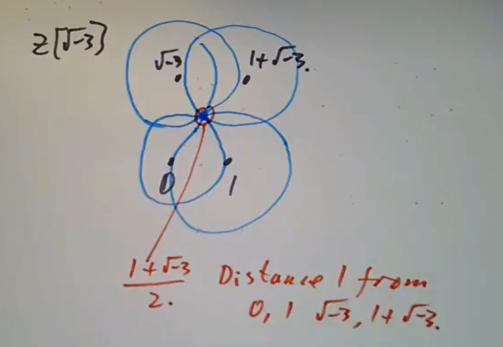非但如此，$\mathbb Z[\sqrt{-3}]$ 还可以证明一定不可能是ED，甚至不是UFD（只需注意到 $2^2=(1+\sqrt{-3})(1-\sqrt{-3})$ 给出不唯一的素因子分解）。也因此它有非主理想，事实上 $(2,1+\sqrt{-3})$ 就是一个例子，这一点的证明依然可以画图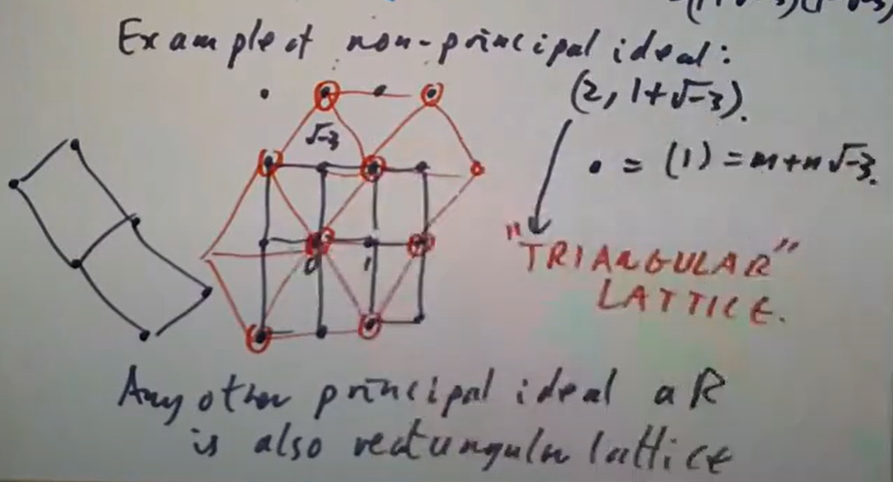这里 $(1)$ 是全部黑色格点（从而主理想都是这个矩阵格点旋转伸缩，所以也是矩阵形状的格点），而 $(2,1+\sqrt{-3})$ 是红色三角形格，并非矩形格点，因此不可能是主理想。

不过这个问题可以一定程度上“修复”。例如考虑 $
\mathbb Z\left[\frac{1+\sqrt{-3}}2\right]$。如图所示，这显然是ED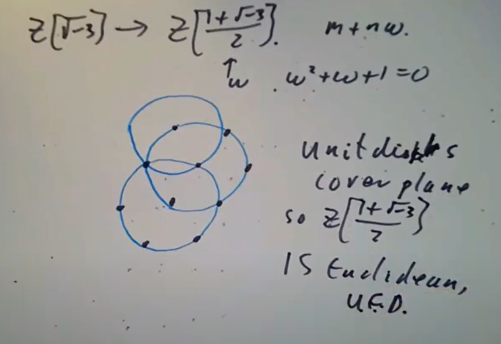

某种意义上ED是稀有的，即使在UFD中也是如此。例如考虑 $R$ 是UFD，则 $R[x]$ 也是UFD，但并不一定是PID（例如 $k[x,y]$ ，从而未必ED）。而实践中的PID大多是ED，例如 $\mathbb Z$、 $k[x]$、 离散赋值环、$\mathbb Z[i]$ 等，不过也有反例。

${\rm Example\ 1.4}$  $R=\mathbb Z\left[\frac{1+\sqrt{-19}}2\right]$ 是PID，但不是ED，这点可以作如下考虑：假若它是ED，那么取某个尺度函数最小的不可逆元 $a\ne 0$ ，则 $R/(a)$ 中元素都可以选取一个可逆或者是 $0$ 的代表元，但 $R$ 中可逆元只有 $\pm1$ ，所以 $R/(a)$ 至多只能有三个元素，但可以验证 $R/(a)$ 对任意 $a\in R$ 都至少有四个元素。

## 环一组基作为点的可视化

> Exercises: 1.18, 1.19

如果我们的环像 $k[x]$ 一样，是域 $k$ 上线性空间，那么就可以通过它的一组基来可视化这个环，例如：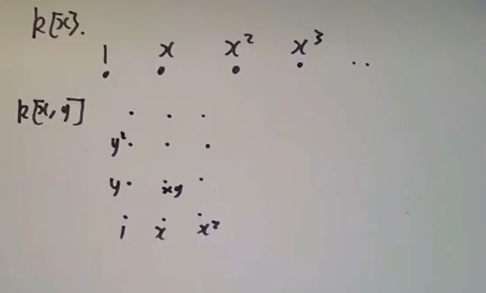

${\rm Example\ 2.1}$ 考虑 $k[x,y]/(x^3,x^2y^2,y^2)$ ，我们只需要考虑把商掉的理想画出来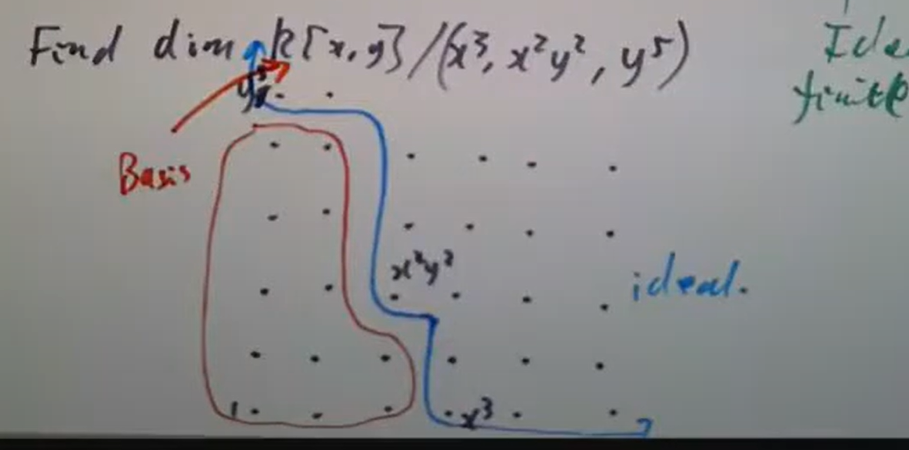红圈中的元素便给出商环的一组基，于是立即可知 $\dim_k k[x,y]/(x^3,x^2y^2,y^2)=12$ 。

${\rm Example\ 2.2}$ 考虑二阶群作用于 $k[x,y]$ ，把 $x$ 打到 $-x$ ，$y$ 打到 $-y$ ，则它的不变量是某个多项式环上的自由模。这里画图证明不变量 $k[x^2,y^2]$ 上的自由模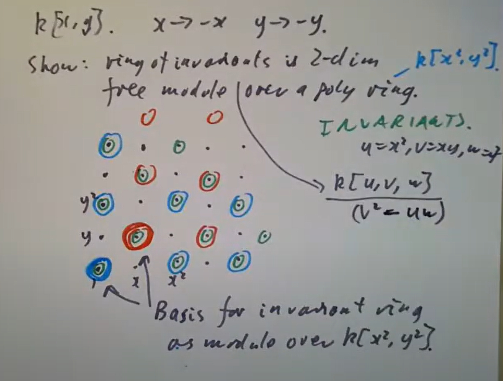注意到不变量环同构于 $k[u,v,w]/(uw-v^2)$ （其中 $u=x^2,w=y^2,v=xy$ ），于是我们也可以用上面的画图道理来研究例如圆锥 $uw-v^2$ 的结构等等。譬如说考虑 $k[x,y,z,w]$ 中$$\begin{pmatrix}x&y&z\\y&z&w\end{pmatrix}$$的子式生成的理想，也就是 $I=(yw-z^2,xw-yz,xz-y^2)$ ，注意到 $y^3=x^2w$ 而 $z^3=xw^2$ ，令 $x=a^3,w=b^3$ ，则立即可知这是 $k[a,b]$ 被 $(a,b)\to (\omega a,\omega b)$ 作用的不变量（$\omega$ 是三次单位根），从而知 $R=k[x,y,z,w]/I$ 是 $S=k[x,w]$ 上自由模，且是整环，从而 $I$ 是素理想。类似地通过画图我们也能知道 $R$ 不是 $k[x,y]$ 上有限生成模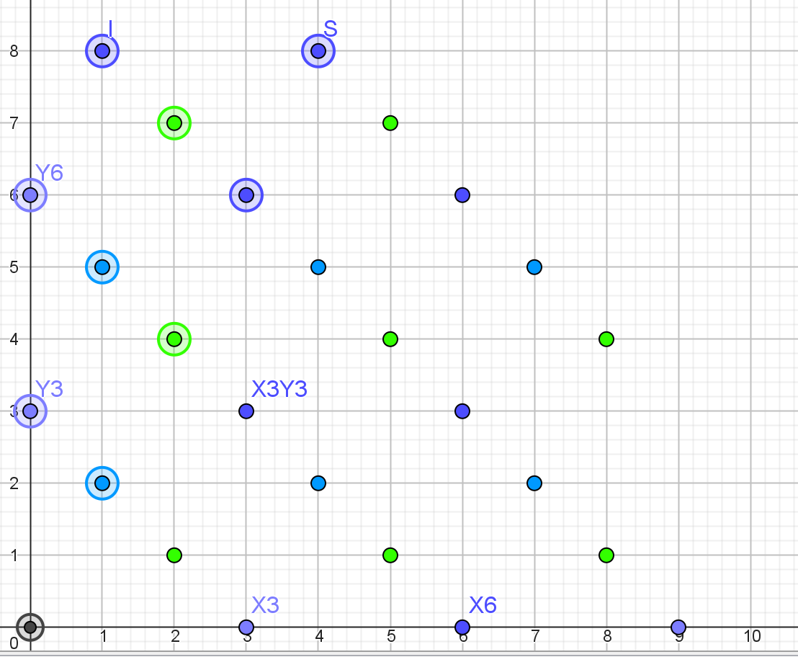

${\rm Defination\ 2.3}$ 对形式幂级数环 $k[[x_1,\cdots,x_n]]$ ，Weiestrass多项式是 $k[[x_1,\cdots,x_{n-1}]][x_n]$ 中的首一多项式 $x_n^d+a_1\cdot x_n^{d-1}+\cdots+a_d$ ，其中 $a_i\in k[[x_1,\cdots,x_{n-1}]]$ 常数项为零（也就是不可逆）

${\rm Theorem\ 2.4}$ （Weiestrass预备定理） *$k[[x_1,\cdots,x_n]]$ 中任何形式幂级数可以唯一写作 $x_n^s\cdot \text{unit}\cdot W$ ，其中，$W$ 是某个Weiestrass多项式，$\text{unit}$ 是可逆元*

只对 $k[[x,y]]$ 情形证明其中任何形式幂级数可以唯一写作 $x^s\cdot \text{unit}\cdot W$ ，多元情况的证明没区别。

假设 $f\in k[[x,y]]$ 非零，把 $x$ 因子提出来，那么不妨设系数非零的 $y^n$ 中次数最小者为 $y^s$ ，则如图所示，给 $f$ 乘上某个 $(1+c_{01}y)$ 可以消去 $y^{s+1}$ 项，再乘某个 $(1+c_{0w}y)$ 可以消去 $y^{s+w}$ 项……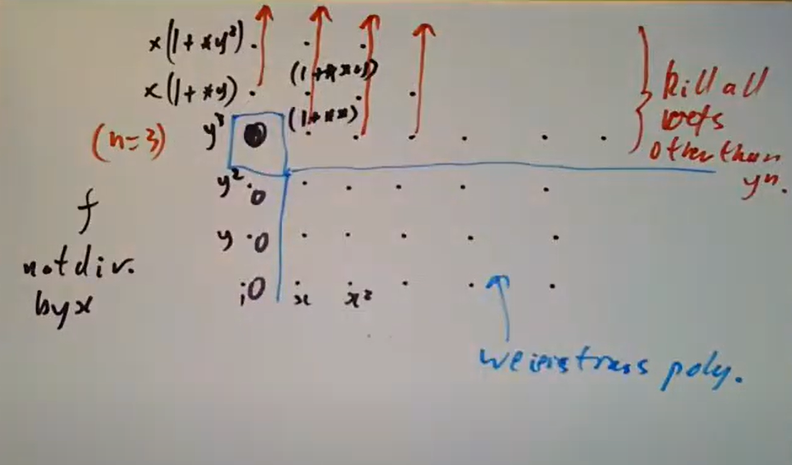这样下来乘上这些元素的无穷乘积即可消去诸 $y^n$ ( $n>s$ )，进而类似地乘 $(1+c_{11}xy)(1+c_{12}xy^2)\cdots$ 消去 $xy^n$  ，……把这些乘积再乘起来得到某个可逆元，作用于 $f$ 则得到Weiestrass多项式。从这样证明中其实也立即可见如此分解的唯一性。$\square$

${\rm Theorem\ 2.5}$ *域上多元形式幂级数环$k[[x_1,\cdots,x_n]]$是UFD*

考虑二元情况。假设 $f$ 不可约且 $f|gh$ ，想证明 $f|g$ 或 $f|h$ 之一成立，则只需考虑 $f,gh$ 是Weiestrass多项式的情形。现在 $gh=fr$ ，如果可以证明 $r$ 是Weiestrass多项式，那么由 $k[[x]][y]$ 是UFD可以推出 $f|g$ 或 $f|h$ 。而想证明这点只需要考虑将 $r$ 分解为 $r=r_0r_1$ ，其中 $r_0$ 是Weiestrass多项式，于是 $gh=(fr_0)r_1$ 给出 $gh$ 在 $2.4$ 意义下的唯一分解，由是知 $r_1=1$ 。多元情形与此并无区别，归纳即可。$\square$

注1：我们不能希望像 $R$ UFD推 $R[x]$ UFD那样证明形式幂级数环UFD，因为 $R$ UFD不意味着 $R[[x]]$ UFD，例如 $(k[x,y,z]/(x^2+y^3+z^7))_{(x,y,z)}$ 是UFD（$K[x,y,z]/(x^2+y^3+z^7)$ 在 $(x,y,z)$ 的局部化）但其形式幂级数环不然。

注2：收敛幂级数环并非UFD。例如考虑一个有无穷多零点 $z_0,z_1,\cdots$ 的收敛幂级数 $f$ ，那么 $x-z_i$ 皆整除 $f$ ……

## 环素谱的可视化

> Exercises: 1.24

引入素谱的动机从一类特殊的环说起。对紧Hausdorff空间 $X$ ，考虑 $C(X)$ （即 $X\to\mathbb R$ 连续函数环），它是一个交换 $C^*$-代数。 $C(X)$ 的极大理想和 $X$ 中的点有着一一对应， $x$ 对应极大理想 ${\frak m}_x=\{f\in C(X):f(x)=0\}$ 。类似地也可以通过这样的办法来重建 $X$ 的拓扑。

具体来说，首先证明 $C(X)$ 中素理想 $\mathfrak{p}$ 中函数公共零点存在且唯一，从而极大理想自然具有 $\mathfrak{m}_x$ 形式。如果不存在，那么对每个 $x$ 都存在 $f_x(x)\ne 0$ ，从而在 $x$ 某个开邻域非零，那么由紧性可以取出有限个 $x_1,\cdots,x_n$ 使对应开邻域覆盖 $X$，从而 $f_{x_1}^2+\cdots+f_{x_n}^2$ 为可逆元，矛盾。而若 $x$ 是公共零点，$y\ne x$ ，那么取 $x,y$ 的不交开邻域 $U,V$ ，由Urysohn引理存在 $f$ 在 $U^c$ 取 $0$ ，在 $y$ 取 $1$ ，和 $g$ 在 $V^c$ 取 $0$ ，在 $x$ 取 $1$ ，则 $fg=0$ 意味着 $f,g$ 之一属于 $\mathfrak{p}$ ，可知 $f$ 属于 $\mathfrak{p}$ 从而 $y$ 并非公共零点。

这种漂亮的对应我们希望也能推广到任意环上，于是得到了所谓环的极大谱，但有一个问题是极大谱不具有函子性（极大理想的原像不一定是极大理想，如 $\mathbb Z\to\mathbb Q$ ）。不过考虑到 $S$ 的极大理想对应 $S\to k$ 满射的核，$R\to S\to k$ 复合不一定能确保满射，只能保证像 $k$ 的子环，也就是像是整环，所以应该把极大理想修改为素理想，而且这样确实可以处理这一问题。于是我们便得到了素谱：

$\mathrm{3.1.\ Defination.\ }$ 环 $R$ 的**素谱** ${\rm Spec}(R)$ 定义为 $R$ 全体素理想组成的集合，配备由 $V(I)$ 定义闭集所给出的拓扑，其中 $V(I)$ 为全体包含理想 $I$ 的素理想组成的集合。具体的验证和一些性质见Atiyah第一章习题。

$\mathrm{3.2.\ Example.\ }$ 零环的素谱是空集；${\rm Spec}(k)=\{(0)\}$ 由单点组成。

$\mathrm{3.3.\ Example.\ }$ $\operatorname{Spec} (C(X))$ 中极大理想的拓扑和 $X$ 的拓扑完全相同。事实上考虑 $X$ 子集 $Y$ 的闭包对应 $V(\cap_{y\in Y} \mathfrak{m}_y)$ 中的极大理想，证明同样Urysohn秒杀之。

$\mathrm{3.4.\ Example.\ }$ $\mathbb C[x]$ 的素理想里面极大的部分形如 $(x-\alpha)$ ，其中 $\alpha\in\mathbb C$ ，而唯一的非极大素理想是 $(0)$ ，它在拓扑上是一个“一般点”（generic point），闭包是全空间。可视化的话就可以画成如图中的样子，不过全体闭集是全集和一切有限集，蓝色的是一般点 $(0)$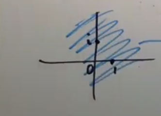

$\mathrm{3.5.\ Example.\ }$ 考虑 ${\rm Spec}(\mathbb Z)$ ，其中极大理想是 $(2),(3),\cdots$ ，非极大理想是 $(0)$ ，闭集是 $\{(2),(3),\cdots\}$ 的有限子集或 ${\rm Spec}(\mathbb Z)$ ，它可以被可视化为这样的形象，其中 $(0)$ 是一个“一维的”一般点，而诸极大理想落在其闭包上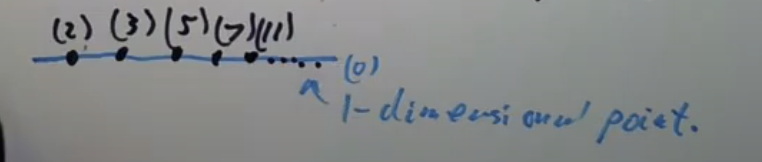

$\mathrm{3.6.\ Example.\ }$  ${\rm Spec}(\mathbb R[x])$ 中，极大理想是 $(x-\alpha),\ \alpha\in \mathbb R$ 和 $(x-\alpha)(x-\bar\alpha),\ \alpha\in \mathbb C\backslash\mathbb R$ ，非极大理想依然是一般点 $(0)$ ，某种意义上可以看作“对折”的 $\mathbb C$ 。更一般地来说，${\rm Spec}( k[x])$ 是 $(0)$ 加上 ${\rm Gal}(\bar k/k)$ 作用于 $\bar k$ 的轨道，其中 $\bar k$ 为 $k$ 的代数闭包。

$\mathrm{3.7.\ Example.\ }$ 令 $A\in M_n(k)$ ，$R=\mathbb C[A]$ ，则 ${\rm Spec}(\mathbb C[A])$ 便是 $A$ 的特征值（考虑到 $\mathbb C[A]\cong \mathbb C[x]/\prod(x-\lambda_i)^{d_i}$ ，从而非零素理想都形如 $(x-\lambda_i)$），而特征值被称作谱是由于量子力学上的渊源，这也是为什么素谱被称作“spectrum”的原因之一。

$\mathrm{3.8.\ Example.\ }$ 某种意义上我们可以这样分解 ${\rm Spec}(\mathbb Z)$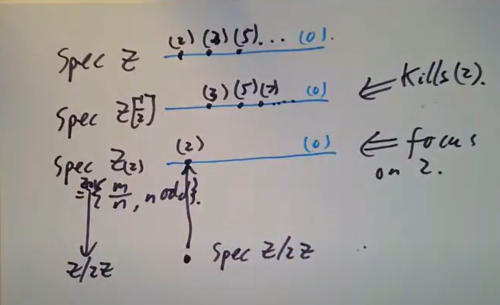

$\mathrm{3.9.\ Example.\ }$ 考虑 ${\rm Spec}(\mathbb Z[i])$ ，$\mathbb Z\to\mathbb Z[i]$ 嵌入诱导出 ${\rm Spec}(\mathbb Z[i])\to {\rm Spec}(\mathbb Z)$ ，从而给出这样的可视化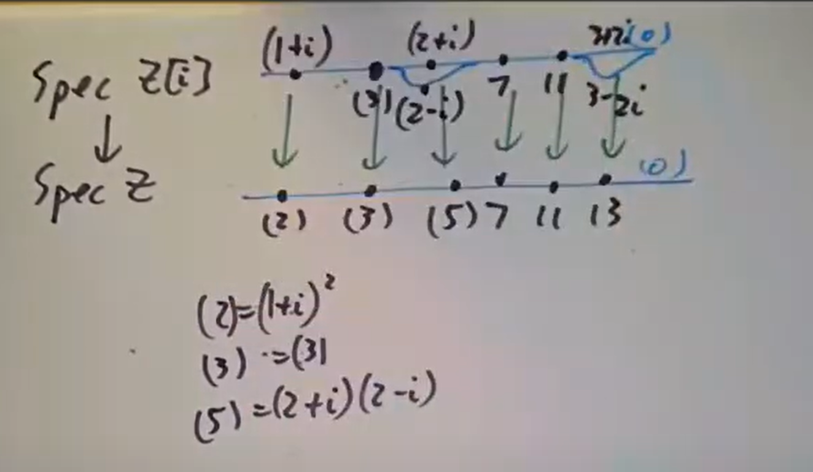

$\mathrm{3.10.\ Example.\ }$ ${\rm Spec}(\mathbb C[x,y])$ 中，极大理想形如 $(x-\alpha,y-\beta)$ 对应单点，其它非零素理想形如 $(f)$ 其中 $f$ 是素元（$\mathbb C[x,y]$ 中互素多项式 $f,g$ 只能有有限多个公共零点，从而对非主理想 $I$ ，$V(I)$ 是基数 $\geqslant 2$ 的有限集（按零点定理如果它只有唯一公共零点，则具有 $(x-\alpha,y-\beta)$ 形式），从而可约，于是 $I$ 非素理想），除此以外依然有一般点 $(0)$ ，可视化如图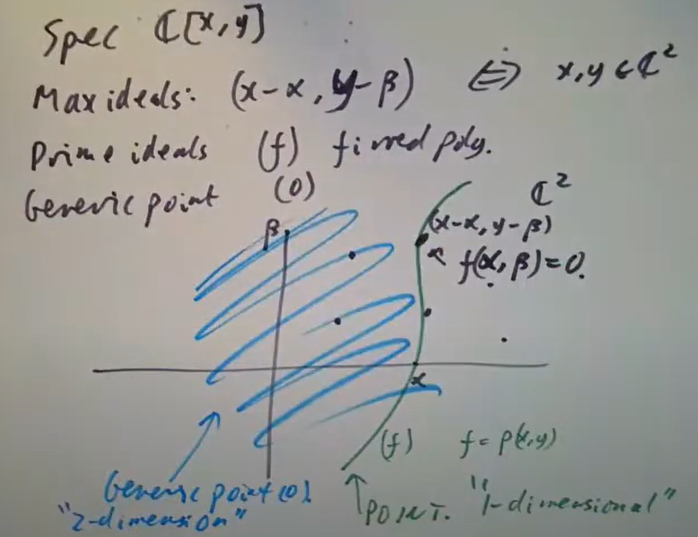

$\mathrm{3.11.\ Example.\ }$ ${\rm Spec}(\mathbb C[[x,y]])$ 中，极大理想只有 $(x,y)$ （ $\mathbb C[[x,y]]\backslash (x,y)$ 元素皆可逆），而非极大素理想皆为主理想（考虑到 $\mathbb C[[x]]$ 的分式域 $\mathbb C((x))=\mathbb C[[x]][x^{-1}]$ ，也就是全体 $\sum_{n=-k}^\infty a_nx^n$ 组成的形式幂级数域，假设素理想 $I$ 非主，也就是存在互素 $f,g\in I$ ，对 $y$ 使用Weiestrass预备定理，则要么直接 $x$ 在 $I$ 中，要么不妨设 $f,g$ 是Weiestrass多项式，但后一种情况下在 $\mathbb C((x))[y]$ 中存在环量组合为 $1$ ，也就是 $\mathbb C[[x]][y]$ 中存在 $s,t$ 使 $sf+gt=x^n$ ，于是知 $x\in I$ ，类似对 $y$ 应用预备定理知 $y\in I$ ，从而 $I=(x,y)$ ），形如 $(f)$ ，其中 $f$ 不可约，某种意义上可以可视化为过原点的全体“无穷小”这样的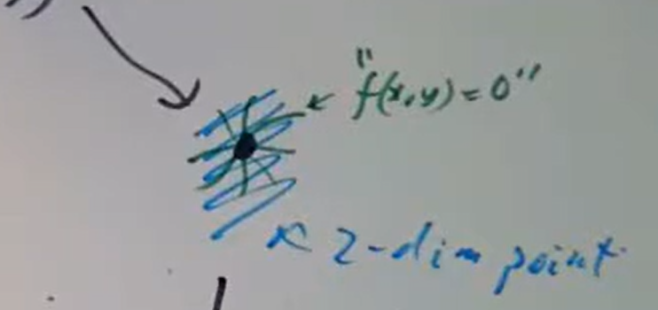

$\mathrm{3.12.\ Example.\ }$ 考虑 ${\rm Spec}(\mathbb Z[x])$ ，首先由 $\mathbb Z\to\mathbb Z[x]$ 得到 ${\rm Spec}(\mathbb Z[x])\to {\rm Spec}(\mathbb Z)$ ，然后考虑这个映射的纤维：$(p)$ 的原像即为 $\mathbb Z[x]$ 中包含 $p$ 的素理想，也即是 ${\rm Spec}(\mathbb F_p[x])$ ，而对 $(0)$ 的原像，考虑 $\mathbb Z[x]$ 中常数项平凡的素理想 $\frak q$ ，则有 $\mathbb{Z}[x]/\mathfrak{q}\otimes \mathbb{Q}\cong \mathbb{Q}[\alpha]$ （考虑到 $\mathfrak{q}$ 在 $\mathbb{Q}[x]$ 中生成的理想形如 $(f(x))$ ），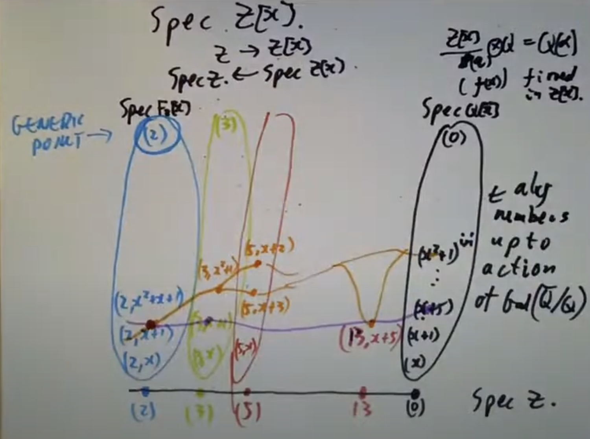

$\mathrm{3.13.\ Example.\ }$ 考虑模形式$$\begin{aligned}E_{12}&=\frac{691}{65520}+\sum_{n}\sigma_{11}(n)q^{n}\\&=\frac{691}{65520}+q+2049q^{2}+\cdots\\\Delta_{12}&=q\prod_{n\geqslant 1}(1-q^n)^{24}\\&=q-24q^{2}+\cdots\\&=\sum_n\tau(n)q^n\end{aligned}$$定义Hecke算子$$\begin{aligned}&T_{n}(E_{12})=\sigma_{11}(n)E_{12}\\&T_{n}(\Delta _n)=T(n)\Delta\end{aligned}$$考虑 $T_n$ 张成的Hecke代数，于是这个Hecke代数也可以视为 $\mathbb{Z}\times \mathbb{Z}$ 的子环，由一切 $(\sigma_{11}(n),\tau(n))$ 生成，而已知 $\sigma_{11}(n)\equiv \tau(n)\pmod {691}$ ，于是我们知道这个环 $R$ 实际就是所有 $(m,n)$ ，其中 $m\equiv n\pmod{691}$ 。通过 $R\to \mathbb{Z}\times \mathbb{Z}$ 嵌入得到 $\operatorname{Spec} (\mathbb{Z})\sqcup  \operatorname{Spec} (\mathbb{Z})\to \operatorname{Spec} (R)$ ，而考虑到 $R\to \mathbb{Z}\times \mathbb{Z}\to \mathbb{Z}_{(p)}\times 1\to \mathbb{Z}/p\mathbb{Z} $ 即 $(m,n)\mapsto m\pmod p$ ，于是有如下可视化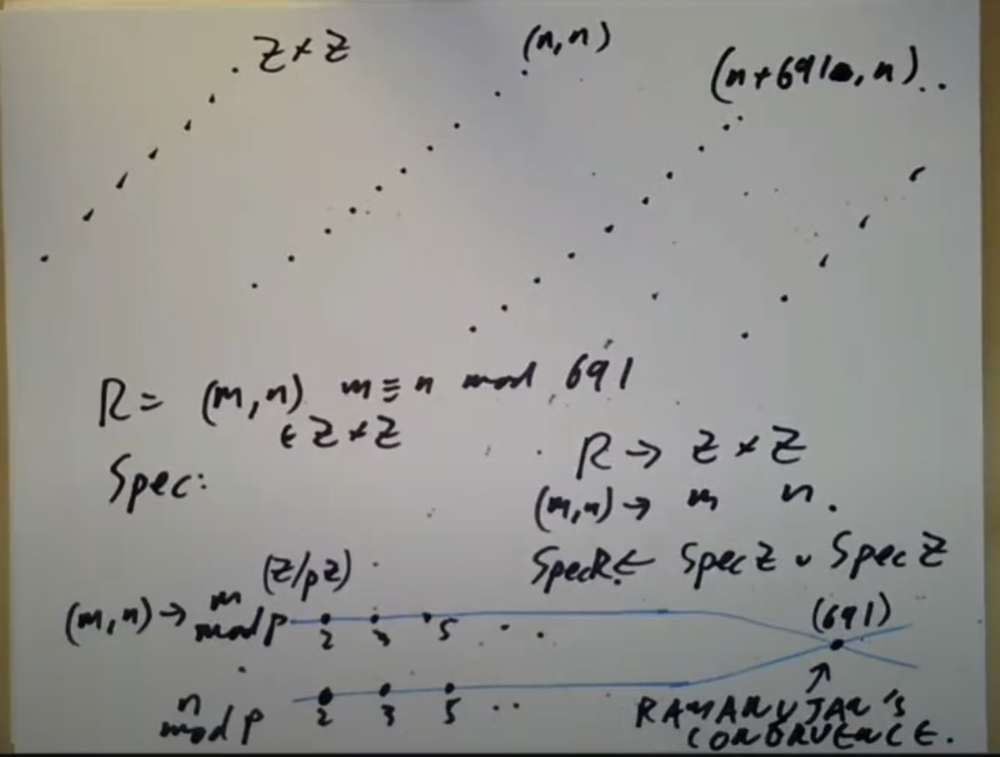像691这样的素数被称为Eisenstein素数。

> Exercises: 1.13, 1.14
Draw Spec R, where R is the subring of elements (m,n) of the product ZxZ with m = n mod 100.

## 素谱的拓扑

$\mathrm{4.1.\ Theorem.\ }$ *环 $R$ 的素谱 $\operatorname{Spec} (R)$ 拟紧*

$\operatorname{Spec} (R)$ 被开集族 $U_{f_i}$ 覆盖相当于说不存在某个素（极大）理想包含一切 $f_i$ ，也就是诸 $f_i$ 生成的理想是 $(1)$ ，其中有限多 $f_i$ 环量组合出 $1$ 。$\square$

注：拟紧和紧的定义完全一致，叫这个名字只是因为20世纪50年代拟紧被定义时，紧经常指紧Hausdorff。

$\mathrm{4.2.\ Theorem.\ }$ $$\operatorname{Spec} (A\times B)=\operatorname{Spec} (A)\sqcup \operatorname{Spec} (B)$$

$\mathrm{4.3.\ Example.\ }$ $\mathbb{Z}/120\mathbb{Z}\cong \mathbb{Z}/8\mathbb{Z}\times \mathbb{Z}/3\mathbb{Z}\times \mathbb{Z}/5\mathbb{Z}$ ，而后三个环都只有一个素理想，因而 $\operatorname{Spec} (\mathbb{Z}/120\mathbb{Z})$ 形如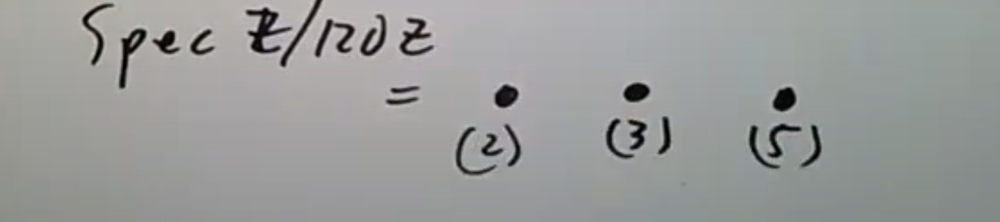

$\mathrm{4.4.\ Example.\ }$ 令 $G=K_4$ 为Klein四元群，考虑 $\operatorname{Spec} (\mathbb{Q}[G])$ 。假设 $\chi$ 为 $G$ 的特征，也就是 $\operatorname{Hom}_{\mathsf{Grp}} (G,\mathbb{C}^\times)$ 中同态，则 $e=\frac{1}{|G|}\sum_{g\in G}\chi(g)g$ 是幂等元。具体到 $G$ ， $G$ 由四个元素 $1,a,b,c$ 组成，其中 $a^2=b^2=c^2=1$ 且 $abc=1$ ，从而易知 $G$ 有四个特征，于是得到四个幂等元$$\begin{aligned}
&e_0=\frac{1+a+b+c}{4},&e_1=\frac{1-a+b-c}{4} \\&e_2=\frac{1-a-b+c}{4},&e_1=\frac{1+a-b-c}{4}
\end{aligned}$$满足 $e_i^2=e_i$ ，$e_ie_j=0\ (i\ne j)$ 且 $e_0+e_1+e_2+e_3=1$ ，于是$$R=e_0R\times e_1R\times e_2R\times e_3R$$从而可以可视化为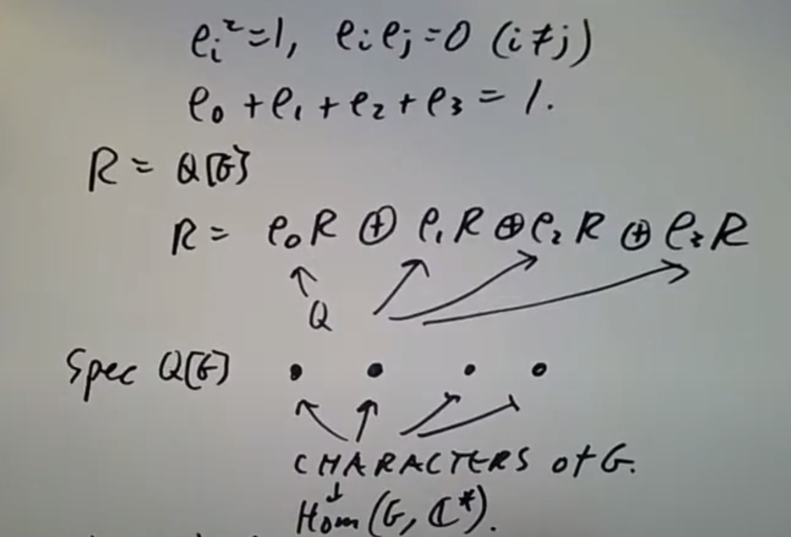

> Exercises: 1.10, 2.25
Draw Spec Z[Z/6Z] = Z[x]/(x^6-1), the group ring of the cyclic group of order 6.

## 不可约空间

$\mathrm{5.1.\ Defination.\ }$ 称拓扑空间 $X$ **不可约**，如果 $X$ 非空且不是两个真闭子集的并，或者等价来说 $X$ 中任意两个非空开集有交

不可约是极强的性质，而且高度非Hausdorff，事实上Hausdorff且不可约等于说 $X$ 是单点。

$\mathrm{5.2.\ Example.\ }$ $\operatorname{Spec} (\mathbb{Z})=\overline{(0)}$ ，从而不可约。

$\mathrm{5.3.\ Example.\ }$ 令 $G$ 为Klein四元群，$\operatorname{Spec} (\mathbb{Z}[G])$ 是一个非不可约空间的例子。事实上 $\mathbb{Z}\to \mathbb{Z}[G]$ 嵌入，以及 $\mathbb{Z}[G]\to \mathbb{Z}$ 的四个特征给出素谱间的反向连续映射。事实上考虑 $\operatorname{Spec} (\mathbb{Z}[G])\to \operatorname{Spec} (\mathbb{Z})$ 的纤维，其中 包含素数 $p$ 的素理想 $\mathfrak{q}\subset \mathbb{Z}[G]$ 一一对应于 $\mathbb{Z}[G]/p\mathbb{Z}[G]\cong \mathbb{F}_p[G]$ 的素理想，而 $\mathbb{F}_p[G]$ 到域的同态像特征 $p$ ，从而只能是 $0$ 或 $\mathbb{F}_p$ ，由是知 $p\ne 2$ 时，$\mathbb{F}_p$ 的素理想对应 $G$ 的四个特征，而不包含任何素数的情形就是 $\mathbb{Q}[G]$ 的例子。接着考虑  $\operatorname{Spec} (\mathbb{Z})\to \operatorname{Spec} (\mathbb{Z}[G])$ 的四个映射，便得到可视化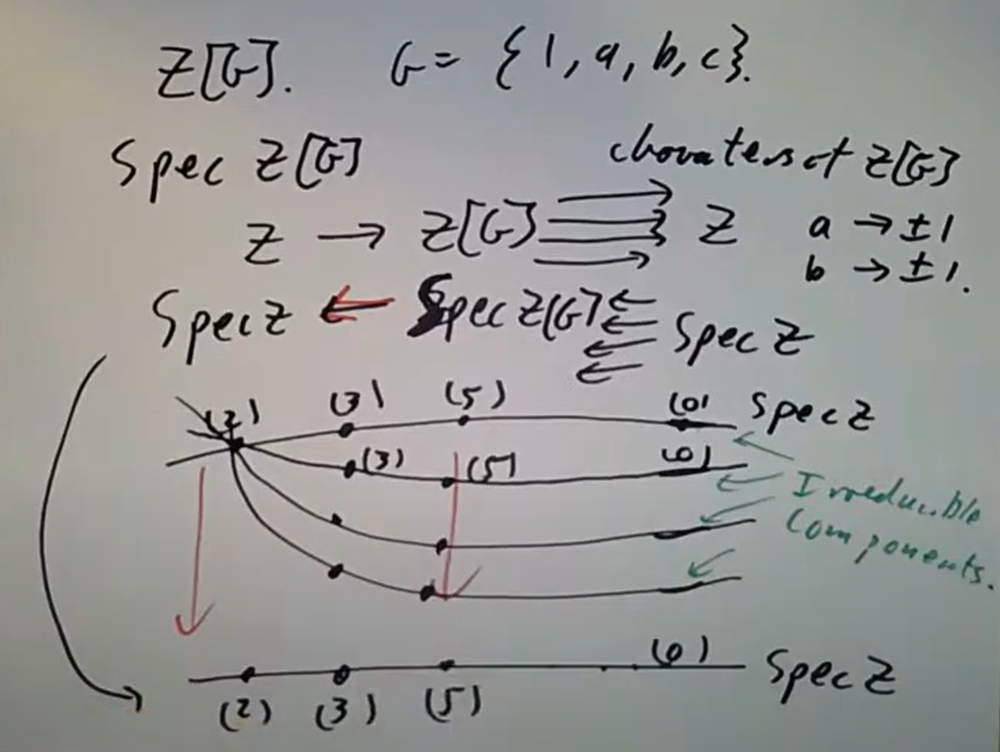总共这里有四个不可约分支，对应四个 $\mathbb{Q}[G]$ 中点的闭包

$\mathrm{5.4.\ Example.\ }$ $\operatorname{Spec} (\mathbb{C}[x,y]/(xy))$ 形如 $x$ 轴和 $y$ 轴之和，这是两个不可约分支（irreducible component）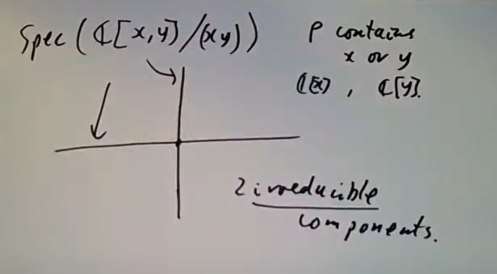

$\mathrm{5.5.\ Example.\ }$ $\operatorname{Spec} (\mathbb{R}[x,y]/(y^2-x^3+x))$ 不可约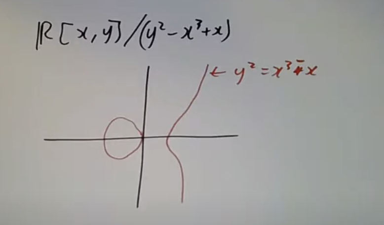

$\mathrm{5.6.\ Lemma.\ }$ *假设 $S$ 是环 $R$ 的乘性子集，$I$ 是与 $S$ 不交的理想，则存在素理想包含 $I$ 且与 $S$ 不交*

对全体包含 $I$ 且与 $S$ 不交的集合应用Zorn引理得到某个极大元 $\mathfrak{p}$ ，假设 $ab\in \mathfrak{p}$ ，则 $\mathfrak{p}+(a)$ 和 $\mathfrak{p}+(b)$ 不能都与 $S$ 有交，不妨假设是 $\mathfrak{p}+(a)$ ，从而由极大性 $\mathfrak{p}+(a)=\mathfrak{p}$ 。$\square$

$\mathrm{5.7.\ Theorem.\ }$ *$\operatorname{Spec} (R)$ 中，某个闭集不可约当且仅当其具有 $\bar{x}$ 形式*

事实上假设 $V(I)$ 不可约，那么不妨设 $I=\sqrt I$ ，现证 $I$ 是素理想。事实上对 $ab\in I$ ，$(I,a)(I,b)\subset I$ 意味着 $V(I,a)\cup V(I,b)=V(I)$，则由不可约应有 $V(I,a)=V(I)$ 或 $V(I,b)=(I)$，不妨设 $V(I,a)=V(I)$ ，那么假若 $a\not\in I$ ，则 $I$ 与 $\{ 1,a,a^2, \cdots\}$ 不交，应用引理得到素理想 $\mathfrak{p}$ 包含 $I$ 且与 $\{ 1,a,a^2, \cdots\}$ 不交，与 $V(I,a)=V(I)$ 矛盾。$\square$

$\mathrm{5.8.\ Example.\ }$ 对紧Hausdorff空间 $X$ ，考虑 $C(X)$ （即 $X\to\mathbb R$ 连续函数环）的素谱。首先 $\operatorname{Spec} (C(X))$ 中极大理想具有 $\mathfrak{m}_x$ 形式。假设 $\mathfrak{p}$ 为 $C(X)$ 的素理想，则 $\frak p$ 中函数公共零点存在且唯一，从而包含于唯一的 $\mathfrak{m}_x$。此外可以证明，如果 $\mathfrak{p}$ 是闭的素理想，则 $\mathfrak{p}=\mathfrak{m}_x$ 。

但非闭的素理想则会变得奇异。考虑如此构造：取某个非孤立点 $x$ ，则可以找到 $f$ 使得 $f(x)=0$ 且 $f$ 在 $x$ 的任何邻域上不恒为零，于是取 $I$ 为某个在 $x$ 某个邻域上为 $0$ 汉斯组成的理想，$S=\{1,f,f^2,\cdots\}$ ，依 $5.6$ 存在素理想 $\mathfrak{p}$ 包含 $I$ 而与 $I$ 不交，所以 $\mathfrak{p}$ 真包含于 $\mathfrak{m}_x$ ，于是是非极大的素理想。而且商掉非闭的素理想会导致商环本身拓扑非Hausdorff，这是很糟糕的性质。

> Exercises: 1.9, 1.11, 1.25

## 诺特空间

$\mathrm{6.1.\ Defination.\ }$ 拓扑空间 $X$ **诺特**，如果下列等价条件成立：
(i) 非空闭集族有极小元
(ii) 非空开集族有极大元
(iii) 开集无穷包含升链稳定（闭集包含降链同理）
(iv) 开集（事实上任何子集）皆拟紧

$\mathrm{6.2.\ Theorem.\ }$ *诺特环 $R$ 的素谱 $\operatorname{Spec} (R)$ 是诺特空间*

考虑到 $\operatorname{Spec} (R)$ 中闭集皆形如 $V(I)$ 和 $6.1$ 中的(i)。$\square$

$\mathrm{6.3.\ Example.\ }$ 令 $R=k[x_1,x_2,\cdots]/(x_1^2,x_2^2,\cdots)$ ，则 $R$ 只有唯一的素理想 $(x_1,x_2,\cdots)$ ，此理想非有限生成，故 $R$ 非诺特，但 $\operatorname{Spec} (R)$ 是单点从而诺特。这说明 $6.2$ 的逆命题并不成立。

Hausdorff和诺特是高度不相容的性质。

$\mathrm{6.4.\ Theorem.\ }$ *若Hausdorff空间 $X$ 诺特，则 $X$ 是有限集的离散拓扑*

只需证 $X$ 有限，有限Hausdorff自动离散。取 $a\in X$ ，对任意 $x\in X\backslash\{a\}$ ，取不交开集 $U_x,V_x$ 分离 $a$ 与 $x$ ，其中 $a\in U_x$ ，则依 $X\backslash\{a\}$ 紧性，可以取出有限多 $V_x$ 覆盖 $X$ ，而对应 $U_x$ 的交 $\{a\}$ 是开集。$\square$

$\mathrm{6.5.\ Theorem.\ }$ *（Noetherian induction）假设 $X$ 是诺特空间，$P$ 是关于 $X$ 的闭集的性质，则如果对任意闭集 $C$ ， $C$ 的任何子集具有 $P$ 蕴含 $P(C)$ ，则 $X$ 的任何子集都具有 $P$*

取所有不满足 $P$ 的闭集组成集合，如果非空则取极小元即得矛盾。$\square$

$\mathrm{6.6.\ Theorem.\ }$ *诺特空间中的闭集皆为有限多不可约闭集的并*

令 $P(C)$ 为“$C$ 是有限多不可约闭集的并”，则闭集 $C$ 要么本身不可约，要么是有限多真子闭集的并，故可以应用诺特归纳。$\square$

$6.6$ 与 $5.7$ 结合某种意义上就分类了诺特环素谱的全部闭集。

$\mathrm{6.7.\ Example.\ }$  $X$ 为紧Hausdorff空间，$C(X)$ 并非诺特环，考虑 $\operatorname{Spec} (C(X))$ 。$\operatorname{Spec} (C(X))$ 中不可约闭集形如 $\bar{\mathfrak{p}}$ ，所以如 $3.3$ 中所述，至多包含一个极大理想，因此 $\operatorname{Spec} (C(X))$ 中显然会有巨量闭集不能被表示为有限多不可约闭集之并（譬如说考虑到 $\operatorname{Spec} (C(X))$ 中极大理想重建了 $X$ 的拓扑，见 $3.3$ ），是一个高度非诺特的空间。

$\mathrm{6.8.\ Example.\ }$ 令 $R$ 为 $\mathbb{Z}[\mathsf{S}_3]$ 的中心，也就是 $1$ ，$a=(12)+(23)+(13)$ ，$b=(123)+(132)$ 生成的环（有限群的话只取决于共轭类），作为Abel群 $R\cong \mathbb{Z}\oplus \mathbb{Z}\oplus \mathbb{Z}$ ，而且$$\begin{aligned}a^{2}&=3+3b\\b^{2}&=2+b\\ab&=2a\end{aligned}$$现在我们想研究 $\operatorname{Spec} (R)$ 和其中的不可约元素。

取 $R$ 中素理想 $\mathfrak{p}$ ，则 $R/\mathfrak{p}$ 中 $b^2-b-2=0$ ，即 $b=2$ 或 $b=-1$ 。带入上面其它约束条件知 $b=-1$ 时得到 $a=0$ ，而 $b=2$ 时 $a=\pm 3$ ，这给出了 $R\to \mathbb{Z}$ 三种可能的同态（事实上 $R\to \mathbb{C}$），诱导出三个同态 $\operatorname{Spec} (\mathbb{Z})\to \operatorname{Spec} (R)$ 。

现在考虑 $\operatorname{Spec} (R)\to \operatorname{Spec} (\mathbb{Z})$ 的纤维，和 $5.3$ 时完全相同，包含素数 $p$ 的理想对应 $\mathbb{F}_p$ 系数的情形，而模 $2$ 或 $3$ 时，$a=-3,b=2$ 同态和 $a=3,b=2$ 同态相同，而 $a=0,b=-1$ 同态只在模 $3$ 时与前两者相同，于是有如下可视化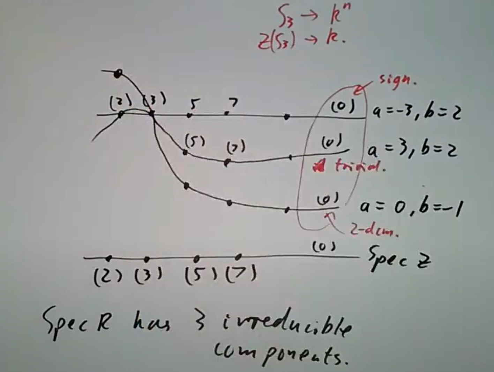三个不可约分支对应三个 $(0)$ 的闭包。由此也可以得到 $\operatorname{Spec} (R)$ 的全部不可约闭子集，无非是图上某个点的闭包。这和 $\mathsf{S}_3$ 的表示密切相关，这三条线某种意义上和 $\mathsf{S}_3$ 的三个不可约表示有对应，具体的对应关系图中已经标注。图中除了 $2$ 或 $3$ 的其它素数处和 $0$ 处并无本质区别，某种意义上这是因为 $\mathsf{S}_3$ 的表示论在特征非 $2$ 或 $3$ 的域上和特征 $0$ 情形区别不大，而特征为 $2$ 或 $3$ 时则会出现奇异的性质，这与 $\mathsf{S}_3$ 的modular representation theory很有关系。

> Exercises: 1.2