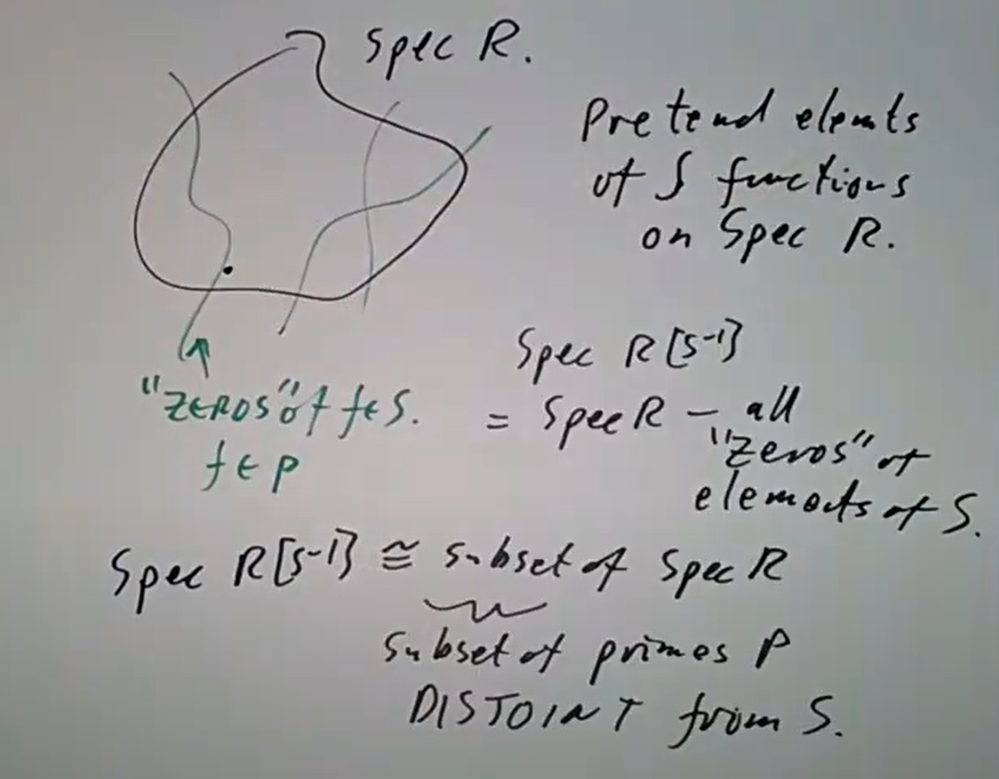
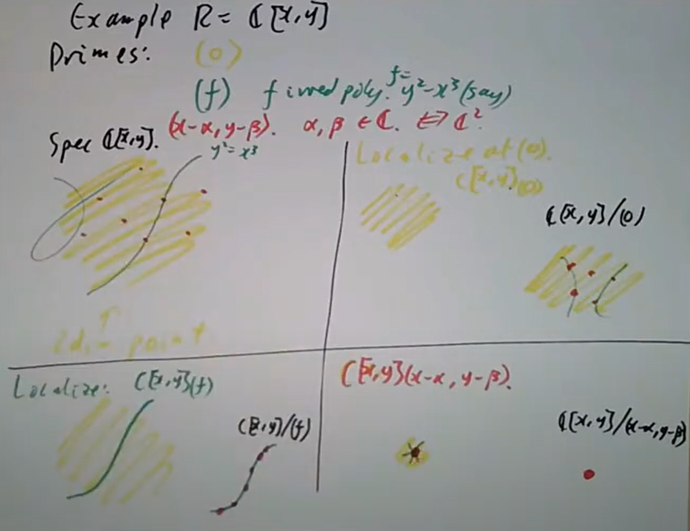
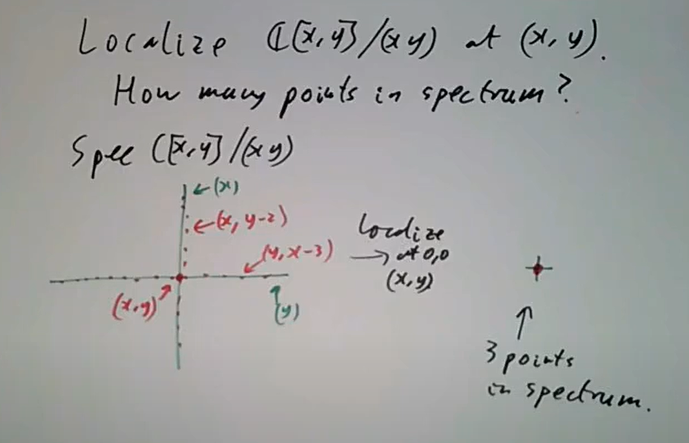
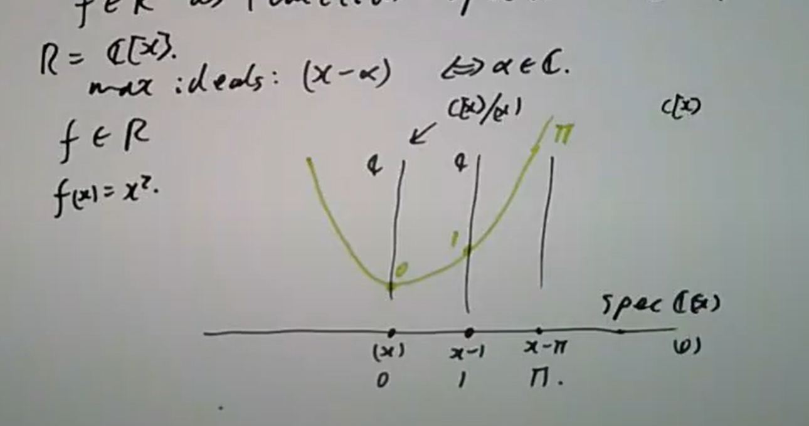
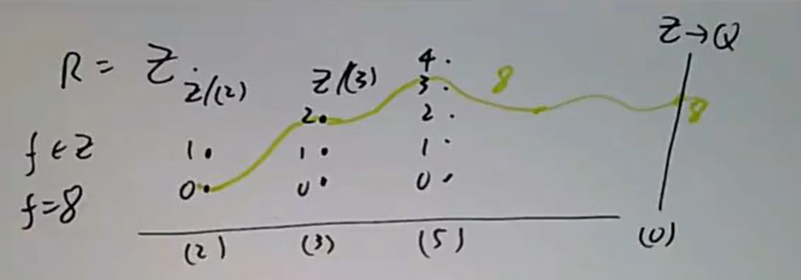
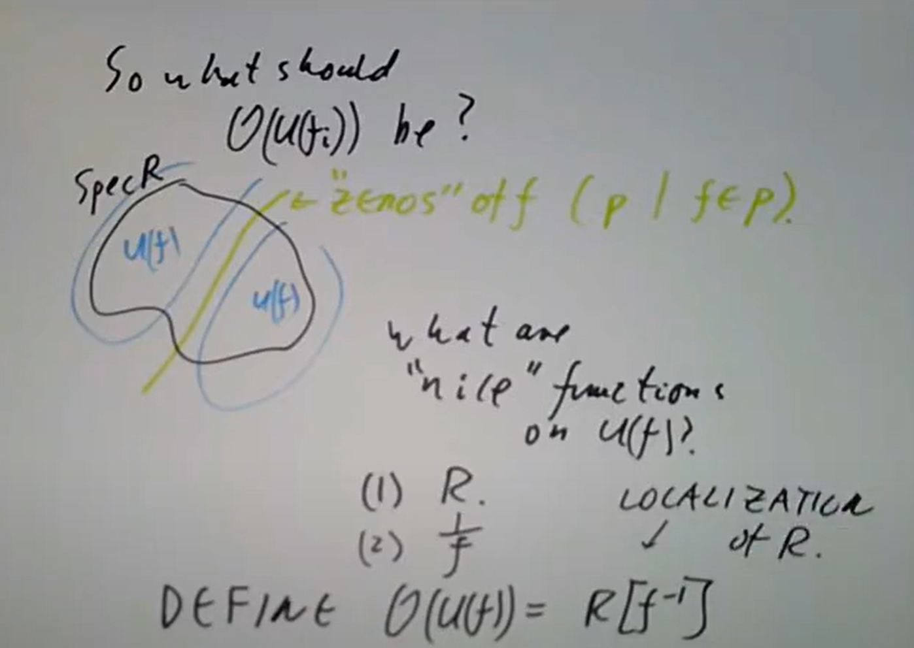
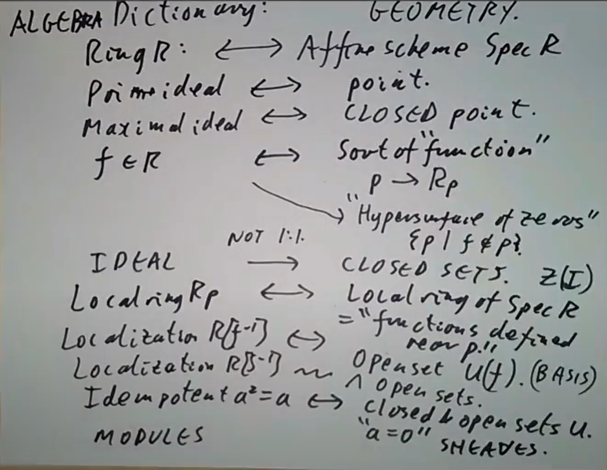
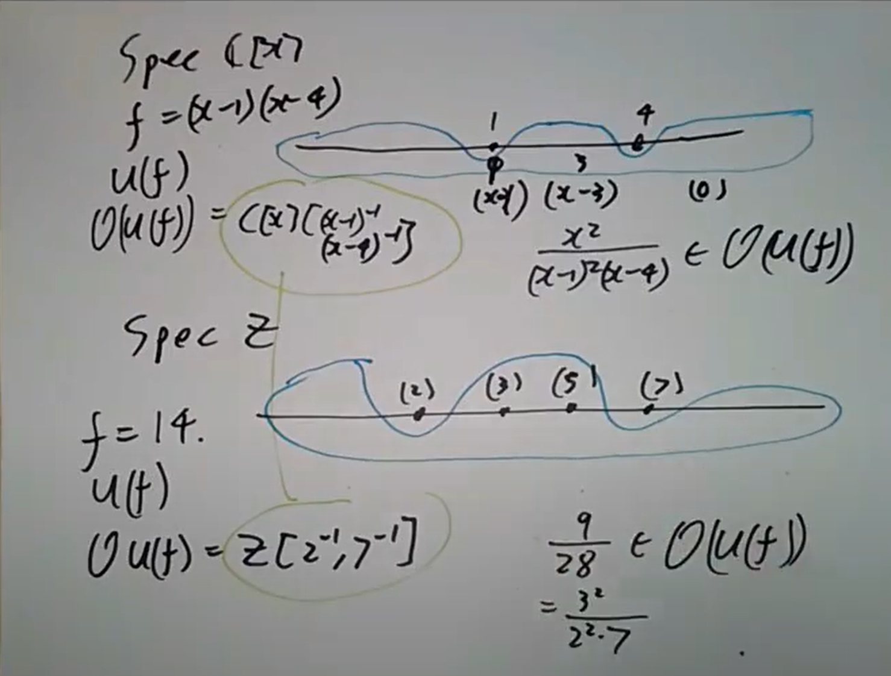

## 局部化的定义
直观上，$R$ 关于子集 $S$ 的局部化 $R[S^{-1}]$ 就是使 $S$ 中元素在 $R$ 中可逆，由此出发最直接的定义是 $R[t_1,t_2,\cdots]/\left<t_1x_1-1,t_2x_2-1,\cdots \right>$ ，其中 $x_i$ 遍历 $S$ 。这种定义可以自然地用泛性质表达：

$\mathrm{1.1.\ Defination.\ }$ 环 $R$ 关于乘性子集 $S$ 的**局部化**为满足如下泛性质的环 $R[S^{-1}]$ ：任意交换环的同态 $\varphi: R \to A$ 若满足 $\varphi(S) \subset A^\times$, 则存在唯一的环同态 $\varphi[S^{-1}]: R[S^{-1}] \to A$ 使下图交换.
```tikz
\usepackage{tikz-cd}
\begin{document}
\Large\begin{tikzcd}
	R \arrow[r, "\varphi"] \arrow[d] & A \\
	R[S^{-1}] \arrow[ru, "{\varphi[S^{-1}]}"'] &
\end{tikzcd}
\end{document}
```
这种形式上取逆的做法事实上比较非构造性，让我们对 $R[S^{-1}]$ 的大小失去了控制，比如我们难以直接知道哪些 $R$ 中元素会在自然映射 $R\to R[S^{-1}]$ 下变成 $0$ 。如果对 $r\in R$ ，存在 $s\in S$ 使 $rs=0$ ，那么 $r$ 会被打到 $0$ ，事实上自然映射 $R\to R[S^{-1}]$ 的核由被某个 $s\in S$ 作用得 $0$ 的 $r$ 组成。

直接考虑将 $R[S^{-1}]$ 构造出来，仿照熟悉的分式环就是对 $(r,s)$ 商去 $(r,s)\equiv (r',s')$ 当且仅当 $rs'-r's=0$ ，但这样证明传递性时，如果 $r_1/s_1=r_2/s_2$ ，而 $r_2/s_2=r_3/s_3$ ，则 $s_2r_1s_3=r_2s_1s_3=s_2s_1r_3$ ，需要 $s_2$ 非零因子才可以有消去律。这样 $S$ 不含零因子时可以定义 $R[S^{-1}]$ ，如果 $S$ 是 $R$ 中一切非零因子的集合，则 $R[S^{-1}]$ 称为 $R$ 的**全商环（total quotient ring）**，它是 $R$ 最大的使 $R$ 仍然是其子环的局部化。

$\mathrm{1.2.\ Example.\ }$ $\mathbb{Z}\times \mathbb{Z}$ 的全商环是 $\mathbb{Q}\times \mathbb{Q}$

更进一步的，对于 $S$ 有零因子的情形，令 $I=\{ r:rs=0\text{ for some }s\in S \}$ ，则 $S$ 在 $R/I$ 中的像无零因子，从而可以有局部化 $(R/I)[S^{-1}]$ （注意 $S\to R/I$ 并不一定单射）

$\mathrm{1.3.\ Theorem.\ }$ *$(R/I)[S^{-1}]$ 满足 $R$ 关于 $S$ 局部化的泛性质，从而 $\operatorname{Ker} (R\to R[S^{-1}])=I$*

于是 $R[S^{-1}]$ 中元素皆有 $r/s$ 形式，$r/s=0$ 当且仅当 $rs_1=0$ 对某个 $s_1\in S$ ，一般来说 $r_1/s_1=r_2/s_2$ 当且仅当存在某个 $s\in S$ 使得 $s(r_1s_2-r_2s_1)=0$ ，这就是一般局部化构造性的定义。

$\mathrm{1.4.\ Example.\ }$ 令 $R=\mathbb{C}[x,y]/(xy)$ ，$S=\{ x \}$ ，则 $R[S^{-1}]\cong \mathbb{C}[x,x^{-1}]$ 

$\mathrm{1.5.\ Example.\ }$ 令 $\mathfrak{p}$ 为 $R$ 中素理想，$S=R\backslash \mathfrak{p}$ ，则 $S$ 是乘性子集，$R[S^{-1}]$ 记作 $R_{\mathfrak{p}}$ ，称为 $R$ 在 $\mathfrak{p}$ 处的局部化。

$\mathrm{1.6.\ Example.\ }$ $\mathbb{Z}_{(2)}=\{ \frac{m}{n}:n\text{ odd} \}$ ；$\mathbb{C}[x]_{(x)}$ 是一切在 $0$ 处有定义的有理函数。

> Reading: Section 2.1
Exercises: 2.1, 2.7

## 局部化的 $\operatorname{Spec} $

$\mathrm{2.1.\ Theorem.\ }$ *如果 $J$ 是 $R[S^{-1}]$ 的理想，$f:R\to R[S^{-1}]$ 是自然的映射，则 $J=J^{ce}$ （这里 $J^c$ 表示理想的收缩 $f^{-1}(J)$ ，$I^e$ 表示理想的扩张 $f(I)R[S^{-1}]$），于是 $J\mapsto f^{-1}(J)$ 是单射*

注意到若 $x\in J$ ， $x=r/s$ ，则 $r/1\in J$ ，从而 $r\in f^{-1}(J)$ ，$x=f(r)s^{-1}\in J^{ce}$ 。$\square$

$\mathrm{2.2.\ Corollary.\ }$ *如果 $R$ 诺特，则 $R[S^{-1}]$ 诺特*

$\mathrm{2.3.\ Corollary.\ }$ *$\operatorname{Spec} (R[S^{-1}])$ 可以被嵌入 $\operatorname{Spec} (R)$*

某种意义上可以将 $S$ 中元素看作函数，作为 $\operatorname{Spec} (R)$ 中余维数为 $1$ 的“点”，其零点就是 $V(f)$ ，其中 $f\in S$ ，那么自然 $\operatorname{Spec} (R[S^{-1}])$ 就是 $\operatorname{Spec} (R[S])$ 中去除这些点事实上

$\mathrm{2.4.\ Theorem.\ }$ *$\operatorname{Spec} (R[S^{-1}])$ 同构于 $\operatorname{Spec} (R)$ 中与 $S$ 不交的素理想组成的子空间*

首先 $\operatorname{Spec} (R[S^{-1}])$ 中理想的收缩一定与 $S$ 不交。反过来如果 $I$ 是 $R$ 中与 $S$ 不交的素理想，则只需证明 $I^{ec}\subset I$ ，而注意到因为素理想而且与 $S$ 不交，$f^{-1}(0)\subset I$ 之后一切显然。$\square$

$\mathrm{2.5.\ Corollary.\ }$ *如果 $S$ 有限生成，则 $\operatorname{Spec} (R[S^{-1}])$ 是 $\operatorname{Spec} (R)$ 的开子集*

一般来说 $\operatorname{Spec} (R[S^{-1}])$ 是无穷多开集的交，并非开集，但实际和开集的行为会比较像。

$\mathrm{2.6.\ Example.\ }$ $\mathbb{C}[x,y]$ 中素理想有 $(0)$ 、$(f)$ （$f$ 不可约）、$(x-\alpha,y-\beta)$ 三类，它的素谱在[上一章3.10](https://deideidei.github.io/2024/12/27/Notes-on-Commutative-Algebra-2/#%E7%B4%A0%E8%B0%B1%E7%9A%84%E6%8B%93%E6%89%91)已经有过可视化。关于 $(0)$ 处局部化 $\mathbb{C}[x,y]_{(0)}$ 的 $\operatorname{Spec} $ 中只有一般点 $(0)$ ，而 $\mathbb{C}[x,y]_{(f)}$ 则是 $f$ 对应“一维点”加上一般点，至于 $\mathbb{C}[x,y]_{(x-\alpha,y-\beta)}$ 则是点 $(\alpha,\beta)$ 加上过这点的曲线和一般点注意素理想局部化的素谱和商环的素谱大相径庭，譬如说 $\mathbb{C}[x,y]/(0)$ 的素谱就是 $\operatorname{Spec} (\mathbb{C}[x,y])$ ，$\operatorname{Spec} (\mathbb{C}[x,y]/(f))$ 则是 $f$ 曲线带上其上的这些红点，$\operatorname{Spec} (\mathbb{C}[x,y]/(x-\alpha,y-\beta))$ 就是单点。总体来说，一般直观上商环 $R/\mathfrak{p}$ 的素谱是 $\mathfrak{p}$ 以及 $\mathfrak{p}$ “内部”的所有点，而局部化 $R_{\mathfrak{p}}$ 则是 $\mathfrak{p}$ 和在 $\mathfrak{p}$ 附近外部的点，在这种意义上商和局部化是相反的操作。

一般来讲， $\operatorname{Spec} (R/\mathfrak{p})=\bar{p}$ ，把 $\mathfrak{p}$ 变成最小的理想，素谱的一般点。而 $\operatorname{Spec} (R_{(\mathfrak{p})})=\{ \mathfrak{q}:\mathfrak{p}\in \bar{\mathfrak{q}} \}=\{\mathfrak{q}:\mathfrak{q}\subset \mathfrak{p}\}$ ，把 $\mathfrak{p}$ 变成最大的理想，变成素谱中唯一的闭点。

$\mathrm{2.7.\ Example.\ }$ 考虑 $\mathbb{C}[x,y]/(xy)$ 在 $(0,0)$ 处的局部化，它的素谱中有三个点

> Reading: Section 2.1
Exercises: 2.10

## $\operatorname{Spec} $ 上的函数

对紧Hausdorff空间 $X$ ，我们熟知 $X\cong \operatorname{Max} (C(X))$ ，而 $C(X)$ 这元素皆为 $X$ 上的函数，于是也就是 $\operatorname{Max} (C(X))$ 上的函数。类似地对一般的环 $R$ ，也有类似的将 $f\in R$ 视作 $\operatorname{Spec} (R)$ 上函数的观点。

$C(X)$ 中极大理想形如 $\mathfrak{m}_x$ ，$C(X)$ 中函数在 $x$ 处取值于实数，也就是 $C(X)/\mathfrak{m}_x\cong \mathbb{R}$ 。对一般的环，则 $f\in R$ 在 $\mathfrak{p}$ 处的取值应在 $R/\mathfrak{p}$ 中。

$\mathrm{3.1.\ Example.\ }$ 取 $R=\mathbb{C}[x]$ ，则非零理想都形如 $(x-\alpha)$ ，$(x-\alpha)$ 处的取值就是 $f(\alpha)$ 

$\mathrm{3.2.\ Example.\ }$ 取 $R=\mathbb{Z}$ ，$f=8$ 就具有如下函数图像

但这种函数化会出现一个问题，就是 $R$ 到函数的映射并不一定是单射。事实上如果 $f$ 对应的函数是 $0$ ，也就是 $f$ 属于一切 $\mathfrak{p}$ ，也就是 $f\in \mathrm{rad}(0)$ （由上节引理5.6，对任何乘性子集 $S$ ，如果 $S$ 与理想 $I$ 不交，则存在素理想 $\mathfrak{p}\supset I$ 与 $S$ 不交，然后取 $S=\{1,a,a^2,\cdots\}$）。

事实上我们有更好的方法来表示出这样的函数，具体来说是使 $f$ 在 $\mathfrak{p}$ 处在局部化环 $R_{\mathfrak{p}}$ 中取值。注意到 $f$ 在 $R_{\mathfrak{p}}$ 中的像是 $0$ 当且仅当存在 $s\not\in \mathfrak{p}$ ，$fs=0$ ，于是 $f$ 对应的函数是 $0$ 的当且仅当存在可逆元杀掉 $f$ ，也就是 $f=0$ 。现在 $f$ 对应的函数在 $\mathfrak{p}$ 处取值于 $R_{\mathfrak{p}}$ ，有时也可以进一步考虑 $R_{\mathfrak{p}}/(\mathfrak{p})$ （如果没用幂零元？），不过一般还是考虑局部环

$\mathrm{3.3.\ Example.\ }$ 对开集 $U\subset X$ ，令 $\mathcal{O}(U)$ 表示 $U$ 上全体连续函数组成集合，则它具有以下性质：
(i)：如果 $U\subset V$ ，则有函子性（也就是保持自然含入映射的复合，但是反向）的限制映射 $\mathcal{O}(V)\to \mathcal{O}(U)$
(ii)（预层性质）：如果 $U=\bigcup U_i$ ，$f$ 在一切 $\mathcal{O}(U_i)$ 上的限制是 $0$ ，则 $f=0$ 
(iii)（层性质）： 如果 $U=U_i$ ，有一族连续函数 $f_i\in \mathcal{O}(U_i)$ 且 $f_i,f_j$ 在 $\mathcal{O}(U_i\cap U_j)$ 上的限制相同，则存在 $f\in \mathcal{O}(U)$ ，$f$ 在 $\mathcal{O}(U_i)$ 上的限制是 $f_i$ 

我们希望对任意的环 $R$ 定义 $\mathcal{O}(U)$ 。事实证明在处理具体问题时，几乎所有问题中我们都只需要考虑 $\mathcal{O}(U_{f_i})$ ，所以实际上我们只需要考虑这些基本开集。

直观上来说，$\operatorname{Spec} (R)$ 中 $f$ 的“零点” $V(f)$ 是一个超曲面，于是 $U(f)$ 就是余维数 $1$ 的集合（直观上讲就是 $f$ 不为零的点之集合），而对在 $U(f)$ 上的“好函数”，首先 $R$ 中的函数都一定可以，其次因为 $f$ 在 $U(f)$ 上“不消失”，所以 $1/f$ 也行，于是遂把 $\mathcal{O}(U(f))$ 定义为 $R[f^{-1}]$

> Exercise: 2.6
Exercises: Suppose R is the ring of continuous real functions on the circle. Is the natural map from R to the localization at a maximal ideal injective? What if R is the ring of smooth  functions on the circle? What if R is the ring of analytic functions on the circle?

## 仿射概形

某种意义上仿射概形的观点在于将 $R$ 看作 $\operatorname{Spec} (R)$ 上的函数环。在此前我们给每个 $U(f)$ 定义了一个环 $\mathcal{O}(U(f))=R[f^{-1}]$ ，现在我们来说明这种定义确实使 $\mathcal{O}(U(f))$ "表现得和 $U(f)$ 上函数环一样"，也就是它满足限制性质、预层性质和层性质。

具体来说 (1) 对含入映射（对应函数的限制） $U(f_1f_2)\to U(f_1)$ 有自然的映射 $R[(f_1f_2)^{-1}]\leftarrow R[f_1^{-1}]$ ，并且显然满足函子性。 

(2) 假设 $U(f)$ 被 $U(f_i)$ 覆盖，$g\in \mathcal{O}(U(f))$ 在一切 $\mathcal{O}(U(f_i))$ 上限制为 $0$ ，不妨将 $R[f^{-1}]$ 替换 $R$ ，且设 $f=1$ ，那么诸 $U(f_i)$ 覆盖 $\operatorname{Spec} (R)$ ，也就是没有素理想（极大理想）包含一切 $f_i$ ，因此有有限多个 $f_i$ 生成 $(1)$，也就是 $\sum a_if_i=1$ ，考虑它的幂次知 $(f_1^{n_1},\cdots,f_k^{n_k})$ 也是 $(1)$，而 $g$ 在 $R[f_i^{-1}]$ 中为零等于说 $f_i^ng=0$ ，从而即知 $g=0$ 。

(3) 这里只考虑 $R$ 是整环的情形，虽然说非整环情况下结论也正确。如果 $U(f)=\bigcup U(f_i)$ ，对每个 $\mathcal{O}(U(f_i))$ 给定了 $r_i/f_i^{n_i}$ ，且在 $U(f_i)\cap  U(f_j)$ 上 $r_i/f_i^{n_i}$ 和 $r_j/f_j^{n_j}$ 相同。这里依然将 $R$ 替换为 $R[f^{-1}]$ 并设 $f=1$ ，从而诸 $U(f_i)$ 覆盖 $\operatorname{Spec} (R)$ ，有 $\sum a_if_i=1$ ，并且可以将 $f_i$ 替换为 $f_i^{n_i}$ ，于是要寻找某个 $r/f^n$ 在一切 $U(f_i)$ 上为 $r_i/f_i^{n_i}$ 变成要找某个 $r\in R$ ，在一切 $U(f_i)$ 上为 $r_i/f_i$ ，也就是 $f_ir=r_i$ 。如果我们找到了这样的 $r$ ，那么 $r=\left(\sum a_if_i\right)r=\sum a_ir_i$ ，事实上对 $r=\sum a_ir_i$ ，由于 $r_i/f_i=r_j/f_j$ ，有 $r_if_j=r_jf_i$ ，因而

$$rf_i=\sum a_jr_jf_i=\sum a_jf_jr_i=r_i$$

$\operatorname{Spec} (R)$ 和相应配套的层 $U(f)$ 与 $\mathcal{O}(U(f))$ 定义了 $R$ 的**仿射概形**。这种几何语言和交换环本身的代数语言之间具有一些对偶关系，具体来说



下面是一些基本例子

> Exercise: 2.19, 2.26
Exercise for the ambitious: Check the sheaf property discussed in the lecture for rings with zero divisors. (This is tricky.)
