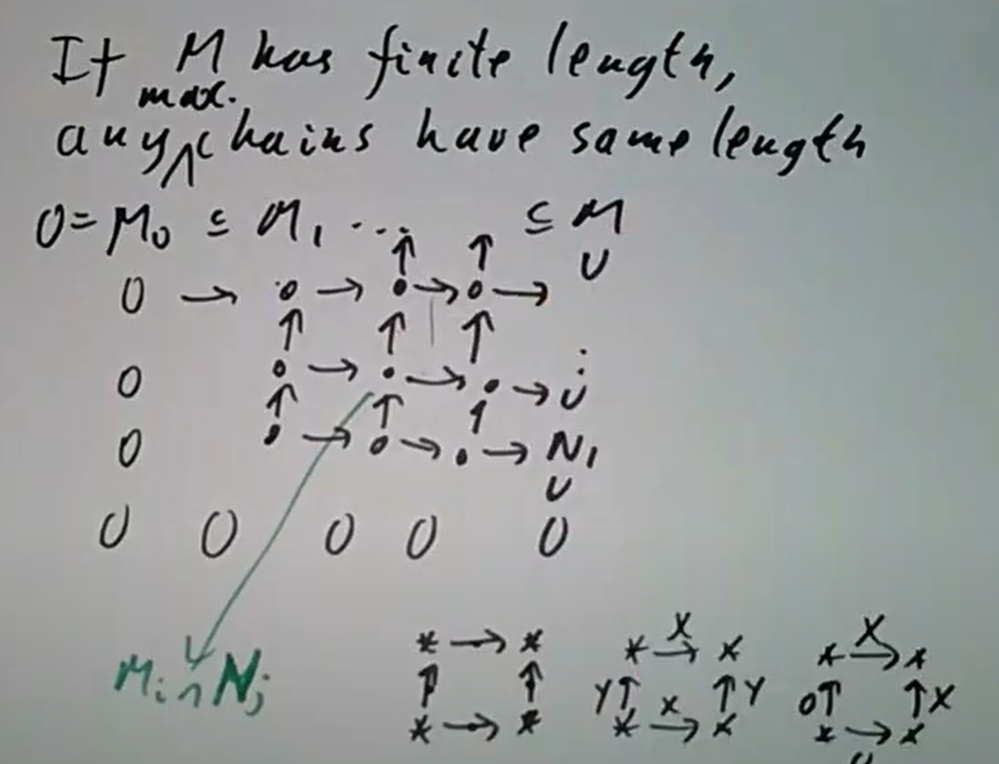
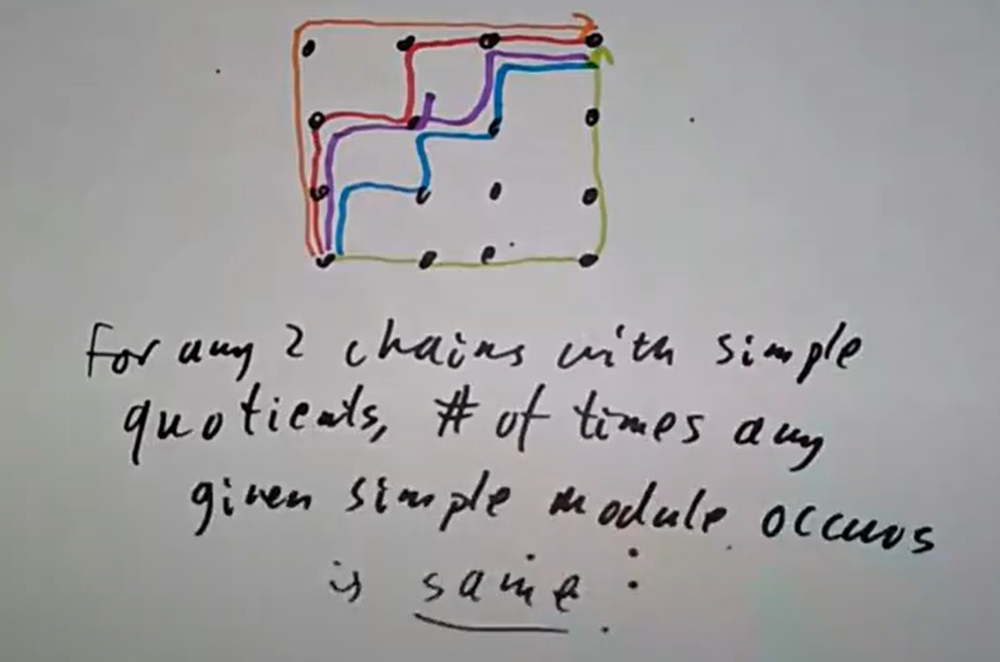

## Artin模

> Reading: Section 2.4
Exercises: 2.23
Classify the modules of finite length over k[x]. Find an Artinian module over this ring that is not Noetherian.

$\mathrm{1.1.\ Example.\ }$ 一切只有有限多元素的模都既Noether又Artin；有限生成的线性空间既Noether又Artin。

$\mathrm{1.2.\ Example.\ }$ $\mathbb{Z}$ Noether但不Artin，考虑 $\mathbb{Z}\supset 2\mathbb{Z}\supset 4\mathbb{Z}\supset \cdots$ ；$\mathbb{Z}_{(2)}$ Noether但不Artin

$\mathrm{1.3.\ Example.\ }$ $\mathbb{Q}$ 作为 $\mathbb{Z}$-模既不Noether也不Artin

$\mathrm{1.4.\ Example.\ }$ $\mathbb{Z}[\frac{1}{2}]/\mathbb{Z}$ Artin但不Noether，事实上注意到它是 $\bigcup \frac{1}{2^n}\mathbb{Z}/\mathbb{Z}$ ，从而有包含升链 $\mathbb{Z}/\mathbb{Z}\subset  \frac{1}{2}\mathbb{Z}/\mathbb{Z}\subset \frac{1}{2^2}\mathbb{Z}/\mathbb{Z}\subset \cdots$ ，而由于这些子模给出它全部真子模，所以它Artin。它被称作 $\mathbb{Z}/2\mathbb{Z}$ 的injective envelope（也是所谓的Prüfer p-群），某种意义上是 $\mathbb{Z}_{(2)}$ 的对偶。

$\mathrm{1.5.\ Example.\ }$ 任何PID商去某个非零理想都同时是Noether环和Artin环；作为非交换的例子，矩阵环 $M_n(k)$ 和有限群的群环 $k[G]$ 都既Noether又Artin，事实上任何是有限维 $k$-线性空间的 $k$-代数都既Noether又Artin，因为它们的理想都是子空间。

> $\mathrm{1.6.\ Defination.\ }$ **单模**是非零的，子模只有 $0$ 和它自己的模

> $\mathrm{1.7.\ Proposition.\ }$ *环 $R$ 上的单模有且仅有 $R/\mathfrak{m}$ ，$\mathfrak{m}$ 是 $R$ 的极大理想*

> $\mathrm{1.8.\ Defination.\ }$ 对模 $M$ ，称它的一个**合成列**是子模的链$$0=M_0\subset M_1\subset \cdots\subset M_n=M$$且每个 $M_i/M_{i-1}$ 皆为单模，如果 $M$ 有合成列则称 $M$ 有有限的长度 $n$

$\mathrm{1.9.\ Example.\ }$ 有限维线性空间都有有限长度，$\mathbb{Z}/n\mathbb{Z}$ 都有有限长度

> $\mathrm{1.10.\ Theorem.\ }$ *$M$ 长度有限当且仅当 $M$ 既Noether又Artin*

假设 $M$ 长度有限。首先单模既Noether又Artin，而我们知道如果有正合列$$0\to A\to B\to C\to 0$$如果 $A,C$ Noether则 $B$ Noether，如果 $A,C$ Artin则 $B$ Artin，那么考虑一系列正合列$$0\to M_i\to M_{i+1}\to M_{i+1}/M_i\to 0$$即可证明 $M$ 既Noether又Artin。

反过来，可以不断选取 $M_0=0$ 和 $M_{i+1}$ 作为极小的真包含 $M_i$ 的子模，这样取出来的升链一定稳定。$\square$

下面这个定理属于带算子的群上Jordan-Holder定理在关于模的情形：

> $\mathrm{1.11.\ Theorem.\ }$ *如果 $M$ 长度有限，则 $M$ 的合成列都有相同的长度，且每个单模在合成列中出现的次数与合成列的选取无关*

取两个合成列 $(M_i)$ 和 $(N_i)$ ，画成下图中的样子其中 $M_i$ 列 $N_j$ 行处是 $M_i\cap N_j$ 。考虑这里面每一个小方块的包含关系，$(M_{i+1}\cap N_j)/(M_i\cap N_j)$ 是 $M_{i+1}/M_i$ 的子模，要么就是 $M_{i+1}/M_i$ 要么是 $0$ ，而竖向的商同理，从而如果左下不等于右上，则小方块里要么四个商都非零，横向两个商相等且竖向两个商相等，要么两个是 $0$ 两个不是（并且只能是左下两个商是 $0$ ，考虑到 $(M_{i+1}\cap N_j)/(M_i\cap N_j)$ 是 $(M_{i+1}\cap N_{j+1})/(M_i\cap N_{j+1})$ 的子模）且右上两个商相等现在考虑按图中最右上和最左下两个路线得到的合成列就是 $(M_i)$ 和 $(N_i)$ ，而我们可以一个小方块一个小方块地把右上一路换到左下，这个过程每一步都不影响合成列中某个单模出现的数量。$\square$

> $\mathrm{1.12.\ Corollary.\ }$ *假设有正合列 $0\to A\to B\to C\to 0$ ，如果 $A,C$ 长度有限，则 $B$ 长度有限，且长度等于 $A$ 与 $C$ 的长度之和*

## Artin环

> Reading: Section 2.4
Exercises: 2.6, 2.22 (this one is a bit tricky)

某种意义上Artin环是有限维线性空间的推广。

> $\mathrm{2.1.\ Theorem.\ }$ *下列条件等价：*
(i) *$R$ 诺特且 $0$ 是极大理想的乘积*
(ii) *$R$ 诺特且素理想皆极大（也就是 $R$ 零维）*
(iii) *$R$ 长度有限*
(iv) *$R$ 是Artin环*

(i)$\implies$(ii)：$0=\mathfrak{m}_1\mathfrak{m}_2\cdots\mathfrak{m}_n\subset  \mathfrak{p}$ ，于是某个 $\mathfrak{m}_i$ 包含于 $\mathfrak{p}$
(ii)$\implies$(iii)：假设 $R$ 长度不有限，取极大的使 $R/I$ 长度不有限的理想 $I$ ，先证明 $I$ 素理想。记 $S=R/I$ ，假若 $S$ 中 $ab=0$ 且 $a,b$ 非零，则 $S/a,S/b$ 长度有限，且乘 $a$ 自然给出满射 $S/b\to aS$ ，由于满射所以 $aS$ 也长度有限，从而由正合列$$0\to aS\to S\to S/a\to 0$$知 $S$ 长度有限，矛盾，故 $a,b$ 之一为零，即 $I$ 素理想，从而 $I$ 是极大理想，$R/I$ 是单模，矛盾。
(iii)$\implies$(iv)：已经证明。
(iv)$\implies$(i)：首先证明 $0$ 是极大理想的乘积。取极大理想的所有乘积中极小的 $J$ ，则 $J \mathfrak{m}=J$ 对任意极大理想 $\mathfrak{m}$ 成立，从而由于 $J$ 是极大理想的乘积，$J^2=J$ 。如果 $J\ne (0)$ ，则可以取极小的使 $IJ\ne 0$ 的 $I$ ，那么对某个 $x\in I$ ，$xJ\ne (0)$ ，于是按 $I$ 极小性 $I=(x)$ 。同时 $(IJ)J\ne 0$ 给出 $IJ=I$ ，从而 $xy=x$ 对某个 $y\in J$ ，也就是 $x(y-1)=0$ 。而 $J$ 包含于一切极大理想中（否则 $J\mathfrak{m}\subset \mathfrak{m}$ 于是 $J \mathfrak{m}$ 真包含于 $J$ ），故 $y-1$ 不在任何极大理想中从而可逆，$x=0$ ，矛盾，于是知 $J=0$。

现在证明 $R$ 诺特。设 $0=\mathfrak{m}_1\mathfrak{m}_2\cdots\mathfrak{m}_n$ ，考虑$$R\supset \mathfrak{m}_1\supset \mathfrak{m}_1\mathfrak{m}_2\supset\cdots \supset\mathfrak{m}_1\mathfrak{m}_2\cdots\mathfrak{m}_n=0$$这里每个 $\mathfrak{m}_1\mathfrak{m}_2\cdots\mathfrak{m}_i/\mathfrak{m}_1\mathfrak{m}_2\cdots\mathfrak{m}_{i+1}$ 都是 $R/\mathfrak{m}_{i+1}$-线性空间，且由Artin条件有限维，从而作为 $R$-模长度有限。每个因子都长度有限意味着 $R$ 长度有限，从而诺特。$\square$

注： $\mathfrak{m}_1\mathfrak{m}_2\cdots\mathfrak{m}_i/\mathfrak{m}_1\mathfrak{m}_2\cdots\mathfrak{m}_{i+1}$ 一般不同构于 $R/\mathfrak{m}_{i+1}$ ，事实上一般前者维数大于1，比如说考虑 $R=k[x,y]/(x^2,xy,y^2)$ ，$\mathfrak{m}=(x,y)$ ，$R\supset \mathfrak{m}\supset \mathfrak{m}^2=0$ ，则 $R/\mathfrak{m}$ 是一维 $k$-线性空间，而 $\mathfrak{m}/\mathfrak{m}^2$ 二维（有基 $x,y$ ）。

> $\mathrm{2.2.\ Corollary.\ }$ *Artin环只有有限多极大理想，且是Artin局部环的乘积*

考虑 $0= \mathfrak{m}_1^{k_1}\mathfrak{m}_2^{k_2}\cdots\mathfrak{m}_n^{k_n}$ ，按中国剩余定理$$R\cong R/\mathfrak{m}_1^{k_1}\times R/\mathfrak{m}_2^{k_2}\times \cdots R/\mathfrak{m}_n^{k_n}$$ 而 $R/\mathfrak{m}_i^{k_i}$ 有唯一的素理想。$\square$

> $\mathrm{2.3.\ Corollary.\ }$ *Artin环的素谱是有限集的离散拓扑，极大理想给出其中的所有点*

注：若诺特环的 $\operatorname{Spec} $ 是有限集的离散拓扑，则可以证明它Artin（显然素理想皆极大），如果没有诺特的条件则不然

$\mathrm{2.4.\ Example.\ }$ 考虑环 $k[x_1,x_2,\cdots]/(x_1^2,x_2^2,\cdots)$ ，它有唯一的素理想 $(x_1,x_2,\cdots)$ （因为 $x_i^2=0$ 从而 $x_i\in \mathfrak{p}$），但它不诺特（从而不Artin）。

Artin环皆长度有限，所以可以按照长度来分类。长度 $0$ 的Artin环只有零环，长度 $1$ 的Artin环都是域。长度 $2$ 时情况开始变得有趣。我们可以举出来一些例子：令 $k=R/\mathfrak{m}$ ，考虑 $k[x]/(f)$ ，$f$ 是一个二次多项式，如果 $f=(x-a)(x-b)$ ，则 $k[x]/f\cong k\times k$ ，如果 $f$ 有重根则相当于 $k[x]/(x^2)$ 这些都是长度 $2$ 的情况，而 $f$ 不可约时则 $k[x]/(f)$ 是域长度 $1$ 。当然也有 $R$ 非 $k$-线性空间的例子，比如说 $R=\mathbb{Z}/p^2 \mathbb{Z}$ 而 $k=\mathbb{Z}/2\mathbb{Z}$ 。

长度 $3$ 的情况也类似，比如说 $k\times k\times k$ ，$k[x]/(x^2)\times k$ 也可以是 $k[x,y]/(x^2,xy,y^2)$ 。对长度 $4$ 的情况，考虑 $R\supset \mathfrak{m}\supset \mathfrak{m}^2\supset \mathfrak{m}^3=0$ ，$\mathfrak{m}$ 具有 $\dim 3$ 而 $\mathfrak{m}^2$ 具有 $\dim 1$ ，平方是 $\mathfrak{m}/\mathfrak{m}^2\to \mathfrak{m}^2/\mathfrak{m}^3$ 的映射，后者 $\dim 1$ 所以同构于 $k$，某种意义上这相当于在其中编码了一个二次型。长度 $5,6$ 的情况则更复杂，取某个 $\mathfrak{m}\subset R$ ，$\mathfrak{m}^n=0$ ，相当于要分类 $R$ 中的幂零元。幂零的数学对象，像是Artin环、幂零李代数、有限 $p$-群等等，在生成元多的时候会变得极其复杂，比如说 $2^10$ 阶群有 $49487365422$ 个。

> Reading: Section 2.4 
Exercises: 2.24
Try to classify Artinian  rings of length 3 or 4 over a field. (You do not need to succeed: the point is that you see how complicated this is.)