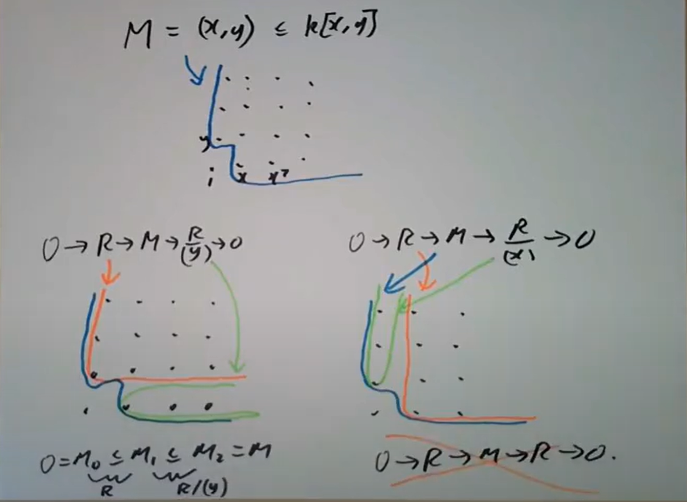

> Reading: Section 3.1
Exercises: 3.1, 3.2, 3.14

我们想在一般的模上找到一些模，拥有比较接近有限长度的性质，从现在开始我们考虑诺特环上的有限生成模。比如说 $R=\mathbb{Z}$ ，则 $M$ 取有限生成Abel群，我们知道 $M$ 都可以被写成

$$\mathbb{Z}^n\oplus \bigoplus _p\bigoplus _{n_i} \mathbb{Z}/p^{n_i}\mathbb{Z}$$

这里某种意义上的基本组成是 $\mathbb{Z}/(p)$ 和 $\mathbb{Z}/(0)$ ，虽然并非单模但都是 $\mathbb{Z}$ 商素理想。首此启发，我们考虑能否如此分解 $M$ ，使得有子模的链

$$0=M_0\subset M_1\subset \cdots \subset M_n=M$$

其中 $M_{i+1}/M_i$ 都同构于某个 $R/\mathfrak{p}$ 。

> $\mathrm{1.1.\ Lemma.\ }$ *若 $M\ne 0$ 是诺特模，则存在某个素理想 $\mathfrak{p}$ ，使 $R/\mathfrak{p}$ 同构于 $M$ 的子模*

取极大的使得存在 $M$ 的某个子模同构于 $R/\mathfrak{a}$ 的理想 $\mathfrak{a}$ ，而 $R/\mathfrak{a}$ 同构于 $M$ 的子模等于说 $\mathfrak{a}$ 是某个 $\operatorname{Ann}(x)$ ，$x\in M$ 。现在证明 $\mathfrak{a}$ 是素理想：假若不然，存在 $x,y\not\in \mathfrak{a}$ 且 $xy\in \mathfrak{a}$ ，考虑 $\bar{x}\in R/\mathfrak{p}\subset M$ ，则 $\operatorname{Ann}(\bar{x})$ 包含 $\mathfrak{a}$ 和 $y$ ，而 $x\not\in \mathfrak{a}$ 意味着 $\bar{x}\ne 0$ ，从而 $\operatorname{Ann}(\bar{x})\ne (1)$ ，与 $\mathfrak{a}$ 极大矛盾。$\square$

> $\mathrm{1.2.\ Theorem.\ }$ *对诺特环 $R$ 上的有限生成模 $M$ ，存在子模的链

$$0=M_0\subset M_1\subset \cdots \subset M_n=M$$

其中 $M_{i+1}/M_i$ 都同构于某个 $R/\mathfrak{p}$*

取 $M$ 的子模 $M_1\cong R/\mathfrak{p}$ ，取 $M/M_1$ 同构于某个 $R/\mathfrak{p}_2$ 的子模，则在 $M$ 中的原像 $M_2$ 满足 $M_2/M_1\cong R/\mathfrak{p}_2$ ，如此取出一系列 $M_i$ ……由于 $M$ 诺特，所以取出来的升链稳定。$\square$

我们现在想像合成列一样定义 $R/\mathfrak{p}$ 在有限长度的 $M$ 中出现的次数。它应当在正合列上具有加性。

比如说直观上在 $\mathbb{Z}\oplus \mathbb{Z}/2\mathbb{Z}$ 中，我们希望 $\mathbb{Z}$ 和 $\mathbb{Z}/2\mathbb{Z}$ 出现的次数都是 $1$ 。现在考虑

$$0\to \mathbb{Z}\to \mathbb{Z}\to \mathbb{Z}/2\mathbb{Z}\to 0$$

则 $\mathbb{Z}/2\mathbb{Z}$ 的次数在 $\mathbb{Z}$ 上为 $0$，在 $\mathbb{Z}/2\mathbb{Z}$ 上为 $1$ ，从而这样的次数并不具有加性。如果我们修改定义比如说出现在商里也算出现，那上面正合列的核是 $\mathbb{Z}$ ，所以 $\mathbb{Z}/2\mathbb{Z}$ 会在 $\mathbb{Z}$ 中出现任意多次。

但对一些特殊情况我们可以定义符合上述性质的次数。比如说 $\mathbb{Z}/(0)$ 在 $M$ 中出现的次数，就可以直接定义为 $\dim_{\mathbb{Q}}(M\otimes _{\mathbb{Z}}\mathbb{Q})$ ，此时如果 $M$ 同构于 $\mathbb{Z}^n$ 直和某些有限群，则 $\dim_{\mathbb{Q}}(M\otimes _{\mathbb{Z}}\mathbb{Q})=n$ ，显然这是加性的。这其实就是所谓有限生成群的秩。当然，$\dim_{\mathbb{Z/2Z}}(M\otimes _{\mathbb{Z}}\mathbb{Z/2Z})$ 就不具有加性，因为 $-\otimes \mathbb{Z}/2\mathbb{Z}$ 不正合。

综上，我们说明了对 $\mathbb{Z}/(p)$ 在某个有限生成Abel群中的次数，如果 $p=0$ 则可定义一个对应加性的次数，如果 $p\ne 0$ 则不具有加性（甚至无法良定义一个“次数”）。不过任意的 $p$ 对有限群都具有加性。

接下来还可以有一些更神秘的例子。比如说考虑 $M=(x,y)$ 而 $R=k[x,y]$ ，$M$ 在图中是蓝色部分，橙色部分是一个同构于 $R$ 的子模，商模则是绿色部分下边的两张图都对应了两个正合列，从而也是两个子模包含链 $0=M_0\subset M_1\subset M_2=M$ ，考虑左边的图可知 $R/(x)$ 并没有在 $M$ 中出现，考虑右边的图则知 $R/(y)$ 并没有在 $M$ 中出现，所以事实上只有 $R$ 在 $M$ 中出现，然而我们无法只用 $R$ 构建 $M$ （也就是不存在正合列 $0\to R\to M\to R\to 0$ ）。

> $\mathrm{1.3. \ Defination.\ }$ 定义 $\operatorname{Ass} (M)$ 为所有作为某个 $M$ 中元素零化子的素理想，也就是所有使得 $R/\mathfrak{p}$ 同构于 $M$ 某个子模的素理想 $\mathfrak{p}$ 组成的集合。

直观上来讲 $\operatorname{Ass} (M)$ 是“一定”出现在 $M$ 中的 $R/\mathfrak{p}$ 对应素理想的集合。由1.1，如果 $M$ 非零且诺特，则 $\operatorname{Ass} (M)$ 非空。

$\mathrm{1.4.\ Example.\ }$ 就前面提到的几个例子， $\operatorname{Ass} (\mathbb{Z})=\{ (0) \}$ ，$\operatorname{Ass} (\mathbb{Z}\oplus \mathbb{Z}/2\mathbb{Z})=\{ (0),(2) \}$ ，$\operatorname{Ass} ((x,y))=\{ (0) \}$ 。

> $\mathrm{1.5.\ Proposition.\ }$ *对正合列 $0\to A\to B\to C\to 0$ ，$\operatorname{Ass} (A)\subset \operatorname{Ass} (B)\subset \operatorname{Ass} (A)\cup \operatorname{Ass} (C)$*

事实上对 $R/\mathfrak{p}\cong X\subset B$ ，如果 $X\cap A=0$ ，那么意味着 $R/\mathfrak{p}$ 可以嵌入 $C$ ，$\mathfrak{p}\in \operatorname{Ass} (C)$ ；如果 $X\cap A\ne 0$  ，由于 $R/\mathfrak{p}$ 是整环，其中任何非零元的 $\operatorname{Ann} =0$ ，所以 $X$ 中任何非零元素零化子皆为 $\mathfrak{p}$ ，特别的，取非零的 $x\in X\cap A$ 则 $Rx\cong R/\mathfrak{p}$ 。$\square$

对一般正合列 $0\to A\to B\to C\to 0$ ，$\operatorname{Ass} (B)\ne \operatorname{Ass} (A)\cup \operatorname{Ass} (C)$ ，$0\to \mathbb{Z}\to \mathbb{Z}\to \mathbb{Z}/2\mathbb{Z}\to 0$ 就是反例。

> $\mathrm{1.6.\ Corollary.\ }$ *对诺特模 $M$ ，$\operatorname{Ass} (M)$ 是有限集*

1.1中给出子模升链

$$0=M_0\subset M_1\subset \cdots \subset M_n=M$$

其中 $M_{i+1}/M_i$ 都同构于某个 $R/\mathfrak{p}_i$ ，从而 $\operatorname{Ass} (M_{i+1}/M_i)=\{ \mathfrak{p}_i \}$ ，而 $\operatorname{Ass} (M)$ 包含于它们的并。$\square$

> $\mathrm{1.7.\ Corollary.\ }$ *对子模升链

$$0=M_0\subset M_1\subset \cdots \subset M_n=M$$

其中 $M_{i+1}/M_i$ 都同构于某个 $R/\mathfrak{p}_i$ ，$\operatorname{Ass} (M)$ 中每个素理想都在诸 $\mathfrak{p}_i$ 中出现*

> Reading: Section 3.2
Exercises: 3.16, 3.17, 3.20

