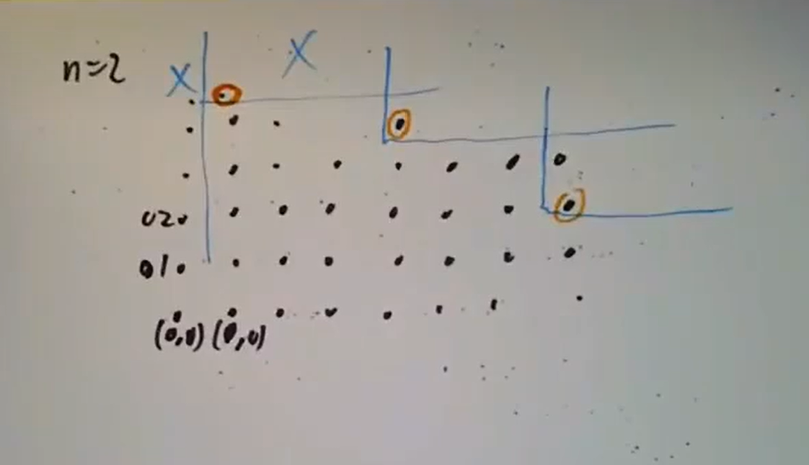
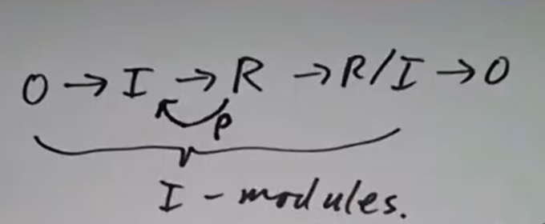
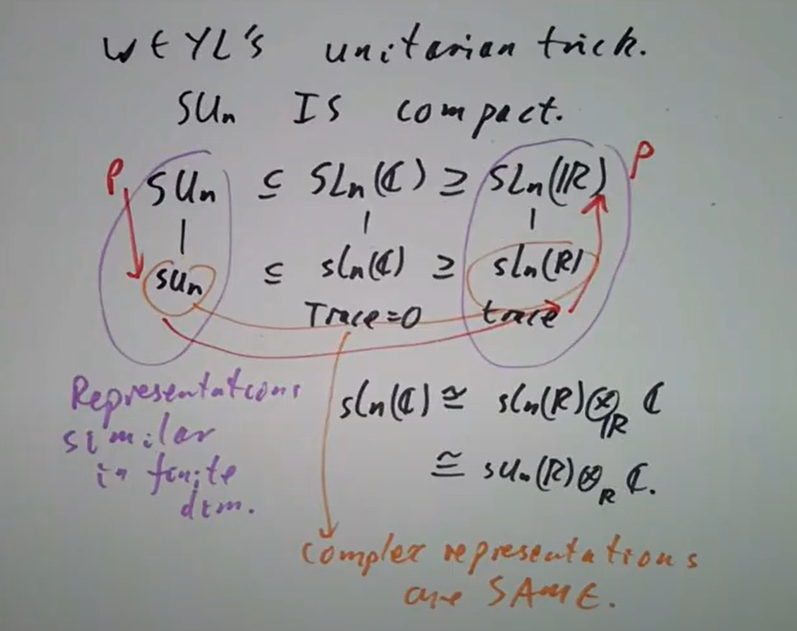

> Borcherds交换代数网课的笔记

## 关于环与模

${\rm Example\ 2.1}$ 群环（Groupring）往往是非交换环。 

${\rm Example\ 2.2}$ 微分算子环

$$\sum a_{ij}x^i\left(\frac{d}{dx}\right)^j$$

中有

$$\frac{d}{dx}\cdot x-x\cdot\frac{d}{dx} = 1$$

在这里 $ab-ba$ 某种意义上比 $a,b$ 本身更简单，$a, b$ 分别为 $\frac{d}{dx}, x$ 。也因为这样的原因类似这样的环和交换环“相差不是很远”，很多交换环上的技术在这种环上也可以应用。

burnside多项式

对一般的不含幺环，我们某种意义上有办法把它变成一个含幺环，也就是“硬塞”一个新的单位元 $1$ ，记号上可以感性地写作 $\mathbb Z[R]$ ，其中环中元素皆有 $n+r$ 形式，乘法的定义是自然的（有点像半直积）。

${\rm Defination\ 2.2}$ 将这种构造称作 $R$ 的**unitization**，记为 $\mathbb Z\oplus R$ ，此处的 $\oplus$ 是Abel群的直和而非 $\sf Rng$ 中的直和。

注：unitization具有函子性，并且是 $\sf Ring\to Rng$ 遗忘函子的左伴随。事实上

$${\rm Hom}_{\sf Ring}(\mathbb Z[R],S)\cong{\rm Hom}_{\sf Rng}(R,U(S))$$

自然可知。

${\rm Example\ 2.3}$ 具有compact support的 $\mathbb R\to\mathbb R$ 关于加法和卷积形成一个不含幺环。

${\rm Example\ 2.4}$ 对局部紧拓扑空间 $X$ ，称其上函数vanishes on infinity如果对任意 $\varepsilon$ ，存在紧集 $C$ 使得 $C$ 以外函数绝对值小于 $\varepsilon$ ，则全体这样函数组成的环 $C_0(X)$ 有单位元当且仅当 $X$ 紧致。这给出了一种不含幺环与局部紧拓扑空间，含幺环与紧空间的对应，unitization则对应单点紧化。事实上单点紧化也是带点拓扑空间范畴 $\mathsf{Top}_\bullet$ 到 $\mathsf{Top}$ 的遗忘函子之左伴随。

取 $X=[0,1)$ ，$X$ 的单点紧化是 $[0,1]$ ，而 $C_0(X)\oplus\mathbb R$ 是 $C_0([0,1])$ ，这里的同构依 $(f-f(1))+f(1)$ 给出。然而对 $X\sqcup X$ 也即两个 $[0,1)$ ，有 $C_0(X\sqcup X)\oplus \mathbb R\cong C_0(X)\oplus \mathbb R$ （因为 $[0,2]\cong [0,1]$ ）而 $C_0(X\sqcup X\sqcup X)\oplus \mathbb R$ 则不然（此时是相当于三个 [0,1) 将其开的那端同接上同一个点之后的 $C_0$）。

模

${\rm Note\ 2.5}$ 模因为对商封闭而比理想更灵活。

${\rm Example\ 2.6}$ Abel群=$\mathbb Z$-模 

${\rm Example\ 2.7}$ 线性空间和 $k$- 模有一一对应，线性变换和 $k[x]$- 模有一一对应。

${\rm Example\ 2.8}$ 理想 $I$ 作为 $R$ 的子模，商环 $R/I$ 作为 $R$-模，且两者之间有一一对应 $I={\rm Ann}(R/I)$

${\rm Example\ 2.9}$ $R$-代数 $S$ 等于说环同态 $\varphi:R\to S$ ，$r\cdot s=\varphi(r)s$

${\rm Example\ 2.10}$ 群代数（又名群环）$k[G]$-模等于说 $k$-线性表示。

## 代数不变量

${\rm Defination\ 3.1}$ 群 $G$ 作用于 $X$ 和 $Y$ ，则 $G$ 在 $X\to Y$ 函数空间的作用可以被自然地定义为

$$(gf)(x)=gf(g^{-1}x)$$

或者等价地说

$$(gf)(gx)=g(fx)$$

${\rm Note\ 3.2}$ 这有点类似在乘积 $A\times B$ 上的作用可以被自然地定义为 $g(a\times b)=ga\times gb$ 这里 $A$ 是函数空间而 $B$ 是 $X$。而如果比如 $gf(x)=f(gx)$ ，则 $(g_2g_1 f)(x)=f(g_1g_2 x)$ ，这也就是取 $g^{-1}$ 的意义所在之一。
另一种观点是考虑群 $G$ 作为单点范畴，那么 $G$ 在集合上的作用即为 $G\to{\sf Set}$ 函子，上述 $G$-映射的定义无非自然变换
```tikz
\usepackage{tikz-cd}
\Large\begin{document}
    \begin{tikzcd}[sep=huge]
		\cdot \arrow[r, "f"] \arrow[d, "g"'] & \cdot \arrow[d, "g"] \\
		\cdot \arrow[r, "gf"'] & \cdot 
    \end{tikzcd}
\end{document}
``` 
也即 ${\rm Fct}(G,{\sf Set})$ 中的态射。

${\rm Example\ 3.3}$ 正交群作用于 $\mathbb R^3$ 时一个自然不变的多项式是长度平方 $x^2+y^2+z^2$ 。${\rm SL}_n(k)$ 被定义为（作用于 $\underbrace{k^n\oplus\cdots\oplus k^n}_{n个}$ 上）保持 $\det$ 的群。

${\rm Example\ 3.4}$ ${\sf S}_n$ 作用于 $\mathbb C^n$ 从而作用于 $\mathbb C[x_1,...,x_n]$ ，不变量是全体对称多项式，构成一个 $\mathbb C$ 上有限生成代数（由全体基本对称多项式生成），多项式环 $\mathbb C[e_1,...,e_n]$。事实上这种不变量的代数是多项式，也就是没有约束地自由生成当 $G$ 是反射群（reflection group）时会发生。

${\rm Example\ 3.5}$  ${\sf A}_n$ 作用于 $\mathbb C^n$ ，全体不变量（多项式）由 $e_1,...,e_n,\Delta$ 生成，其中 $\Delta=\prod_{i<j} (x_i-x_j)$ ，且有唯一的非平凡关系

$$\Delta^2-p(e_1,...,e_n)=0$$

其中 $p$ 为多项式（因为 ${\sf A}_n$ 即定义为 ${\sf S}_n$ 保持 $\Delta$ 不变的子群， $\Delta^2$ 为对称多项式）。这是一阶合冲（syzygy）的例子。

${\rm Example\ 3.6}$  $\mathbb Z/3\mathbb Z$ 作用于 $\mathbb C^2$ ，具体来说是乘上三次单位根 $(x,y)\mapsto (\omega x,\omega y)$ ，则全体不变多项式由 $x^3,x^2y,xy^2,y^3$ 生成，记它们分别为 $z_0,z_1,z_2,z_3$ ，则有关系

$$\begin{aligned}z_0z_3-z_1z_2&=a_2\\z_1^2-z_0z_2&=a_3\\z_2^2-z_1z_3&=a_1\end{aligned}$$

中 $a_1, a_2,a_3$ 应为零且

$$b=z_1a_1+z_2a_2+z_3a_3$$

应为零，这在某种意义上是“低阶”和“高阶”的生成元间关系。

令 $R$ 为 $k[z_0,z_1,z_2,z_3]$ ，这种关系可以用模的正合列（$\text {invariants}$ 按如 $z_0\cdot f=(x^3)f$ 这样的规则自然成为一个 $R$-模）

$$0\to R\to R^3\to k[z_0,z_1,z_2,z_3]\to \text {invariants}\to 0$$

表达，其中， $R^3\to R$ 把 $R^3$ 的自由生成元 $a_i$ 打到上式中对应的 $R$ 中多项式（常数），$R\to R^3$ 则把 $1$ （对应 $b$ ）打到诸 $a_i$ 的线性组合。诸 $a_i$ 对应关系称为一阶合冲（syzygy）， $b$ 对应关系被称为二阶合冲。直观来讲二阶的合冲就像轭把耕牛绑在一起一样把一阶合冲绑在一起，或许这是其得名原因。这种概念有着一般的定义：

${\rm Defination\ 3.7}$ 一个 $R$-模的**复形**指一系列 $F_i$ 和模同态 $F_i\to F_{i-1}$ ，满足 $F_{i+1}\to F_i\to F_{i-1}$ 结合皆为零。满足 ${\rm coker}(\varphi_1)=M$ 且正合的自由 $R$-模组成复形

$$\mathcal{F}: \cdots\to F_n\xrightarrow{\varphi_n}\cdots\to F_1\xrightarrow{\varphi_1}F_0$$

称为 $M$ 的**自由解消**，$\varphi_i$ 的像称为 $M$ 的 $i$ 阶**合冲**。如果 $F_{n+1}=0$ 而对任意 $i\leqslant n$ 都有 $F_i$ 非零，则称 $\cal F$ 的**长度**为 $n$ 。上面例子里 $M=\text {invariants}$ 。

${\rm Example\ 3.8}$ 考虑 $\mathbb C$ 上全体二元齐次多项式形如

$$a_{n}x^{n}+a_{n-1}x^{n-1}y+\cdots+a_{0}y^{n}$$

被 ${\rm SL}_2(\mathbb C)$ 作用（乘在 $(x,y)^T$ ）。在作用下不变的 $a_0,...,a_n$ 的多项式有诸如所谓 catalecticant等。Paul Gordon证明了这些不变量有限生成。

${\rm Note\ 3.9}$  有限生成有多种不同的含义：

1. 作为模或者理想有限生成
2. 作为 $R$ 上代数有限生成
3. 作为域有限生成

$k[x]$ 属于2而非1，$(x)\subset k[x,y]$ 或者 $\{xp+c:p\in k[x,y],c\in k\}$ （后者含幺）属于1而非2，$k(x)$ 属于3而非2或1。

${\rm Example\ 3.10}$ 对 $k$-模 $R=k[x]/(x^2)$ 和 $M=R/(x)\cong k$ ，

$$\cdots\to R\to k\to 0$$

给出一个长度无限的自由解消。

## 诺特环

> Reading Section (Eisenbud'c Commutative Algebra): 1.4
Exercises: 1.1, 1.3, 1.4, 1.5

${\rm Defination\ 4.1}$ **诺特环** $R$ 是所有理想均有限生成的环。

${\rm Proposition\ 4.2}$ 如下条件等价：
1. $R$ 是诺特环
2. 任何 $R$ 理想组成的集合（在包含关系下）有极大元素
3. $R$ 理想包含升链稳定

${\rm Example\ 4.3}$ 考虑一系列环：$\mathbb R[x]$ ，$\mathbb R$ 上解析函数环，$[0,1]$ 上解析函数环， $(0,1)$ 上光滑函数环，$0$ 处的解析函数环，$0$ 处的光滑函数环（商去函数芽的等价）$\mathbb R[[x]]$ ，这些环每一个都包含于下一个（除最后一步只能是映射到形式幂级数环外） 。它们中第一三五七个为诺特环，二四六非诺特环。具体来说，对24考虑取定义域内无极限点无限集，则在其上除有限点外均为 $0$ 函数给出非有限生成理想，对3我们可以证明在闭区间上解析函数只有有限多零点，从而任何解析函数可以被写作多项式乘可逆元（无零点幂级数），对5注意到任何 $0$ 处解析函数都可以被写作 $x^n$ 乘某个可逆元，对6考虑 $(f)\subset (f^{1/2})\subset\cdots$ 其中 $f=e^{-1/x^2}$），而且，其中 $0$ 处解析函数环和 $\mathbb R[[x]]$ 因为非零真理想都是 $(x^n)$ 成为所谓离散赋值环的例子。在这些例子里，我们发现诺特的那些中的零点都表现得很好，都有有限的大小而且可以被控制，而

${\rm Example\ 4.4}$ 对任意整环 $R$ ，$R(x)$ 是诺特环，而其子环 $R$ 未必是

${\rm Proposition\ 4.5}$ *诺特环 $R$ 的商环 $R/I$ 是诺特环，从而诺特环上有限生成代数作为多项式环的商环是诺特环*

注意到 $R/I$ 中理想和 $R$ 中包含 $I$ 理想有自然的对应，从而 $R$ 中任何理想组成的集合有最大元这一性质也被赋予给 $R/I$ 。$\square$

多元多项式环中理想的生成元数量并不能被未定元数控制。例如

${\rm Example\ 4.6}$ 考虑 $k[x,y]$ 中，一切次数不小于 $3$ 的多项式组成的理想 $I$ ，也就是 $I=(x^3,x^2y,xy^2,y^3)$ ，那 $I/(\text {degree>4})$ 是一个四维的线性空间，它的一组生成元至少包含一组基，于是这个理想不可能被小于四个元生成。

${\rm Example\ 4.7}$ （Puiseaux series）考虑对

$$k[[x]]\subset k[[x^{1/2}]]\subset k[[x^{1/6}]]\subset k[[x^{1/24}]]\subset\cdots$$

取并，则得到一个非诺特环。

## Hilbert基定理

> Reading: Section 1,4
Exercises: 15.15 a

${\rm Theorem\ 5.1}$ *（Hilbert）诺特环 $R$ 的多项式环是诺特环*

对 $R[x]$ 中理想 $I$ ，考虑理想 $I_k$ 定义为 $I$ 中 $\deg \leqslant k$ 的多项式首项系数生成的理想，则 $I_k\subset I_{k+1}$ ，从而存在 $n$ 使 $I_n=I_{n+1}$ ，诸 $I_k$ 有限生成。令 $S_k$ 为首项系数生成 $I_k$ 的 $k$ 次多项式有限集，则 $S=\cup S_k$ 给出 $I$ 的生成元集。$\square$

${\rm Theorem\ 5.2}$ *诺特环 $R$ 的形式幂级数环是诺特环*

对 $R[[x]]$ 中理想 $I$ ，考虑理想 $I_k$ 定义为一切 $\omega\geqslant k$ 的幂级数第 $k$ 次项系数（$\omega$ 为最小系数非零次项次数），则 $I_n$ 构成 $R$ 中理想升链从而稳定为 $I_n$。因而对某个形式幂级数 $a_0+a_1x+\cdots$ ，不妨设其非零项次数大于等于 $n$ （$<n$ 部分和上一个证明完全无异），则会得到一系列（$a_{n+1}$ 在 $a_n$ 被消去后变成 $a_{n+1}'$）

$$\begin{aligned}a_n&=r_{n1} x^{i_1} s_1+\cdots +r_{nk} x^{i_k} s_k\\a_{n+1}'&=r_{(n+1)1}x^{i_1+1} s_1+\cdots +r_{(n+1)k}x^{i_k+1} s_k\\&\quad\vdots\end{aligned}$$

这涉及到无穷多次求和的操作，但注意到其中 $s_i$ 系数（对次数大于等于 $n$ 时）形如

$$r_ns_i+r_{n+1}xs_i+r_{n+2}x^2s_i+\cdots$$

可和，从而也是形式幂级数。$\square$

${\rm Lemma\ 5.3}$ *（Gordon，虽然称为Dickson引理）  $k[x_1,...,x_n]$ 中单项式组成的集合关于整除关系只有有限多极小元*

证明 $n=2$ 的情况，其它情况同理。考虑如中一样将单项式列出，横轴为诸 $x^i$ 而纵轴为诸 $y^j$ ，那么取第一列中属于 $X$ 的极小元，则它小于等于一切再它右上的元素，从而第二列之后再取最小的有极小元的列时，取得的极小元至少比第一次取得者低一行……如此往复则至多可以取有限次。$\square$

注：5.3的证明对任何有限生成的自由Abel群均适用。

${\rm 5.4}$ 于是我们有了Hilbert基定理的另一个证明：对 $k[x_1,...,x_n]$ 的理想 $I$ ，它中多项式 $f$ 在字典序意义下的首项组成单项式的集合，关于整除关系只有有限多极小元，取有限个极小元对应首项的多项式，一步步消去 $f$ 的首项，从而由字典序的良序性可以把 $f$ 消除至 $0$。$\square$ 

事实上上面证明了 $I$ 有一组有限Gröbner基。

## 不变量的有限生成性

> Reading: Section 1.5

利用基定理可以证明一些不变量的有限生成性，至少是对有限群 $G$ 作用于特征 $0$ 域 $k$ 上 $n$ 维线性空间，或者 $p={\rm Char}\ k$ 不整除 $|G|$ 时。我们将证明 $G$ 作用于 $R=k[x_1,...,x_n]$ 的不变量环 $I$ 是有限生成 $k$-代数。

${\rm Theorem\ 6.1}$ *$I$ 是有限生成 $k$-代数*

$I$ 关于次数有自然的分次（Abel群直和意义下）

$$I=I_0\oplus I_1\oplus I_2\oplus\cdots $$

考虑 $I_1,I_2,...$ 生成的理想 $J$ ，则依诺特性 $J=(a_1,...,a_n)$ ，其中诸 $a_i\in I$。现断言诸 $a_i$ 是代数 $I$ 的生成元，对 $I$ 中多项式次数归纳证明之：

${\rm Defination\ 6.2}$ *定义 $I$-模间线性映射 $\rho:R\to I$ 为

$$\rho (f)=\frac1{|G|}\sum_{G} g(f)$$

则 $\rho (f)$ 是 $G$-不变量，且 $f$ 是 $G$-不变量则 $\rho(fg)=f\rho(g)$ 。*

注1：$\rho$ 被称为Reynolds算子，起源于流体力学（Reynolds数那个Reynolds），最开始是考虑将从某处流过的液体换为考虑平均流过的液体（也就是被时间平移作用）。

注2：对满足 $S_0=k$ 的分次诺特环 $S$ ，如果对 $S$ 的 $k$-子代数 $R$ ，存在 $R$ 模同态 $\varphi:S\to R$ 保持次数且使 $R$ 不动，则此时称 $R$ 是 $S$ 的一个**summand**，此时可以照搬上文证明 $R$ 是有限生成 $k$-代数。

$\rho$ 使如下 $I$-模的正合列分裂，从而 $R=I\oplus (\ker\rho)$ 。

现在回到6.1的证明：取 $f\in I$ ，则

$$f=a_1c_1+\cdots+a_nc_n$$

从而

$$f=\rho(f)=a_1\rho(c_1)+\cdots+a_n\rho(c_n)$$

因为 $\deg a_i\geqslant 1$ 故 $\deg \rho(c_i)=\deg c_i<\deg f$ ，从而由归纳假设 $\rho(c_i)$ 皆为诸 $a_i$ 的多项式。$\square$

注1：此处的论证适用于一大类分次环。对分次环 $R=R_0\oplus R_1\oplus\cdots$ ，如果 $R$ 诺特那么 $R_0$ 诺特，从而类似地对次数归纳便知 $R$ 为有限生成 $R_0$-代数。如对 $R$ 的子代数 $I$ ，存在 $I$-模线性映射 $\rho:R\to I$ 满足 $\rho$ 使 $I$ 不动，则可以照搬上面过程论证 $I$ 为诺特环。

注2：一般分次环中 $J$ 的理想生成元没理由也能在 $k$-代数意义上生成 $I$ 。例如考虑 $I$ 为 $(x)$ 生成的 $k$-代数， $J$ 为 $(x)$ ，但 $x$ 并不是 $k$-代数 $I$ 的生成元，事实上 $I$ 并非有限生成代数甚至。

应当注意到Reynolds算子对任意群和任意域并非总是存在，例如

${\rm Example\ 6.3}$ 令

$$G=\left\{\begin{pmatrix}1&*\\0&1\end{pmatrix}\right\}\subset {\sf SL}_{2}(k)$$

则 $G$ 同构于 $k$ 加群，且自然地作用于 $k^2$ 。现在取 $k=\mathbb F_p$ ，则易证 $G$ 在 $k$ 上作用必平凡（也就是全是恒等变换），则正合列

$$0\to k\to k^2\to k\to 0$$

不能被分裂，因而Reynolds算子不能存在（这里考虑Reynolds算子实则是考虑一堆 $I$-模，这里 $I$ 为 $k[x]$嵌入 $R=k[x,y]$ ）。

${6.1}$的证明首先可以拓展到紧群，因为紧群上可以积分，从而也可以定义类似的Reynolds算子为 $g (f)$ 的积分除以 $G$ 的体积。

此外对非紧群 ${\sf SL}_n(\mathbb C)$ ，这个证明同样可以通过所谓Weyl's unitarian trick的方法拓展。具体来说，${\sf SU}_n$ 是紧群，而我们有对应 ${\sf SU}_n\subset {\sf SL}_n(\mathbb C)\supset {\sf SL}_n(\mathbb R)$ ，它们对应的李代数是 ${\rm \frak su}_n\subset {\rm \frak sl}_n(\mathbb C)\supset {\rm\frak sl}_n(\mathbb R)$ ，其中 ${\rm \frak sl}_n(\mathbb C)$ 和 ${\rm\frak sl}_n(\mathbb R)$ 即为迹为零的 $M_n(\mathbb C)$ 和 $M_n(\mathbb R)$ 中矩阵。而我们知道在Lie群单连通时，Lie群的有限维表示和其对应Lie代数的有限维表示有对应，而虽然 ${\sf SL}_n(\mathbb R)$ 并非单连通，但它足够“接近”单连通以至于 ${\sf SL}_n(\mathbb R)$ 和 ${\rm\frak sl}_n(\mathbb R)$ 的有限维表示基本上是对应的。而 ${\rm\frak sl}_n(\mathbb C)\cong {\rm\frak sl}_n(\mathbb R)\otimes_{\mathbb R} \mathbb C$ 同时 ${\rm\frak sl}_n(\mathbb C)\cong {\rm\frak su}_n(\mathbb R)\otimes_{\mathbb R} \mathbb C$ ，也就是说 ${\rm\frak sl}_n(\mathbb C)$ 和 ${\rm\frak su}_n(\mathbb C)$ 的复化是相同的，从而它们的复表示也相同。从而这给出 ${\sf SU}_n$ 和 ${\sf SL}_n(\mathbb R)$ 的有限维表示之间的对应，也就可以把 ${\sf SU}_n$ 上的Reynolds算子对应到 ${\sf SL}_n(\mathbb R)$ 表示的Reynolds算子上，如图所示
而这套论证在无穷维时则会基本失效，此时 ${\sf SU}_n$ 和 ${\sf SL}_n(\mathbb R)$ 的表示间并无太多对应（例如几乎所有 ${\sf SU}_n$ 的不可约酉表示都有限，而几乎所有 ${\sf SL}_n(\mathbb R)$ 的不可约酉表示都无限），这是因为 ${\sf SL}_n(\mathbb R)$ 和 ${\rm \frak sl}_n(\mathbb R)$ 间的对应依赖指数映射，而无限维时矩阵exp的收敛性不能很好保证。

## 诺特模

Noether对定理6.2中 $k$ 特征非零的情形给出了一个证明，不过这个证明并不能很好像Hilbert的证明一样推广的无限群。

> Reading: Section 1.7 （似乎实则应当1.11（？
Exercises: 1.22, 1.23

${\rm Defination\ 7.1}$ *诺特模 $M$ 是所有子模都有限生成的模。特别的，环 $R$ 是诺特环等于说环是诺特 $R$-模。*

与诺特环的情形一致，我们有：

${\rm Proposition\ 7.2}$ 下列条件等价：

1. $M$ 是诺特模
2. 任何 $M$ 子模组成集合都有包含意义下的极大元
3. 任何子模的包含升链稳定

${\rm Lemma\ 7.3}$ *对模的正合列

$$0\to A\to B\to C\to 0$$

 $B$ 是诺特模当且仅当 $A,C$ 是诺特模。特别的，诺特模的直和是诺特模。*

只需证 $A,C$ 诺特时 $B$ 诺特即可。考虑取 $B$ 的子模 $M$ ，取一组有限 $x_i\in B$ 使 $x_i$ 的像生成 $M$ 的像，再取 $M\cap A$ 的有限生成元集 $y_j$ ，则它们的并生成 $M$ 。

${\rm Proposition\ 7.4}$ *诺特环上的有限生成模是诺特模。*

诺特环上 $R$ 上模 $M$ 有限生成也就是说有正合列 $R^n\to M\to 0$ ，其中第一个映射为满同态。依引理可知 $R^n$ 是 $n$ 个 $R$ 的直和为诺特模，从而 $M$ 同构于 $R^n/\ker$ 为诺特模。$\square$

${\rm Note\ 7.5}$ 交换代数中相当一部分内容就是在研究诺特环上的有限生成模，这些模比一般任意的模好处理得多。

${\rm Theorem\ 7.6}$ 如果不变量是有限生成代数，则合冲为有限生成理想。

令 $R=k[x_1,\cdots,x_n]$ ，$r$ 为不变量的生成元个数，则有正合列（类似地这里也是 $k$-代数同态，所以其实并非正合） $R\to \text{invariants}\to0$ 。这些生成元之间的关系，也就是不变量的一阶合冲为 $\ker [R\to \text{invariants}\to0] $ ，是有限生成理想，从而自然导致 $R$-模同态 $R^n\to R$ 。依引理，$R^n$ 诺特，从而二阶合冲，也就是 $\ker[R^n\to R]$ 有限生成，因而自然导致 $R^m\to R^n$ ……这样就产生了正合列

$$ \cdots \to R^m\to R^n\rightarrow R\to \text{invariants}\to0$$

 $\square$

事实上这还能进一步推广：

${\rm Theorem\ 7.7}$ 任何模都有自由解消。特别地，如果 $M$ 是诺特环上的有限生成模，则 $M$ 有自由解消

$$\cdots \to R^{n_2}\to R^{n_1}\to M\to 0$$

其中 $n_i$ 皆有限。

证明则是完全相同的。

这里的自由解消并不保证有限，也不保证唯一，但Hilbert证明了对一些特定环和其上的模，自由解消总是有限而且某种意义上几乎唯一，可以从分次自由解消中取出某种“最小”解消，然后其它自由解消就相当于在其基础上加上如 $\to R^m\to R^n\to$中两次交换像与核，变成更长的正合列

$$\cdots\to R^m\to R^m\to R^m\to R^n\to\cdots$$

这样的扰动。

${\rm Defination\ 7.8}$ 设 $R=R_0\oplus R_1\oplus\cdots$ 是分次环，$R$ 上的**分次模**是形如

$$M=\bigoplus_{-\infty}^\infty M_i\quad as\textit{ abelian groups}$$

的满足 $R_iM_j\subset M_{i+j}$ 的 $R$-模。记 $M(d)$ 为将 $M$ 中分次左平移 $d$ 之后的新分次模，也即 $M(d)_e=M_{d+e}$。**分次自由 $R$-模**定义为一系列 $R(d)$ 的直和。

${\rm Defination\ 7.9}$ 称 $R$-模 $M$ 的自由解消 $\cal F$ 是**分次自由解消**，如果 $R$ 是分次环，且诸 $F_i$ 皆分次自由。

则Hilbert的定理可以被陈述为：

${\rm Theorem\ 7.10}$ 令 $R=k[x_1,\cdots,x_r]$ ，则有限生成分次 $R$-模都有长度不超过 $r$ 的分次自由解消，其中项皆有限生成自由模。

这种消解的“几乎唯一”性给出了许多 $M$ 的不变量，例如

$$\cdots \to R^{n_2}\to R^{n_1}\to M\to 0$$

中的这些指数 $n_1,n_2$ 等等。

## 不变量的有限生成性（续）

诺特证明了任意特征域上的${\rm Theorem\ 6.1}$，即

${\rm Theorem\ 8.1}$ 有限群 $G$ 作用于特征域 $k$ 上 $n$ 维线性空间 $V$ ，则对应的不变量 $I$ 是有限生成 $k$-代数

令 $R=k[x_1,\cdots,x_r]$ ，则 $x_i$ 为 $\prod_{g\in G}(x-gx_i)\in R[x]$ 的根。$\prod_{g\in G}(x-gx_i)$ 的系数都是诸 $g_1x_i,\cdots,g_{|G|}x_i$ 的基本对称多项式，从而是 $G$-不变量。现在考虑全体 $x_i$ 的这些系数（总共 $r|G|$ 个元素）生成的 $k$-代数 $S$ ，我们有

$$S\subset \text{invariants}\subset R=k[x_1,\cdots,x_r]$$

因为 $x_i$ 在 $S$ 上整（是 $S[x]$ 中首一多项式的根），所以 $R$ 是有限生成 $S$-模（考虑到 $x^{|G|}$ 是 $1,x,\cdots,x^{|G|-1}$ 的线性组合bala）。$S$ 为有限生成 $k$-代数，从而是诺特环，因此由$7.4$，$R$ 是诺特模，从而 $\text{invariants}$ 是有限生成 $S$-模，取一组有限生成元和一组 $S$ 作为 $k$-代数的有限生成元并起来，就得到 $\text{invariants}$ 作为 $k$-代数的有限生成元组。$\square$

注：诺特的证明相比Hilbert对特征零情形的证明，难以推广到无限群的情形。

对更一般的情形，我们有定理：

${\rm Theorem\ 8.2}$ （Nagata，Haboush）设 $k$ 代数闭，$G$ 是一个代数群，则下列条件等价：

1. $G$ 在有限生成 $k$-代数上作用的不变量总是有限生成 $k$-代数
2. $G$ 是约化群（reductive group）
3. 如果 $G$ 在线性空间 $k^n$ 上作用有非零的不动向量 $v$ ，则存在 $G$ 作用下不动的多项式 $f$ 使得 $f(0)\ne f(v)$ 

注1：Nagata证明了3推1，1推2某种意义上也是因为Nagata找到了一个G不是约化群时候不变量并非有限生成的例子，Haboush证明了2推3。

注2：条件3某种意义上在说存在一个非线性的Reynolds算子。在特征零的情况下，$f$ 是线性多项式（它和Reynolds算子关系很大），而在特征 $p$ 的情况下则会出现非线性的情况。

注3（Borcherds猜测）：$G$ 和 $k$ 的加群 “无关”（例如reductive便是没有形如 $k^n$ 加群的正规子群），则不变量有限生成。
