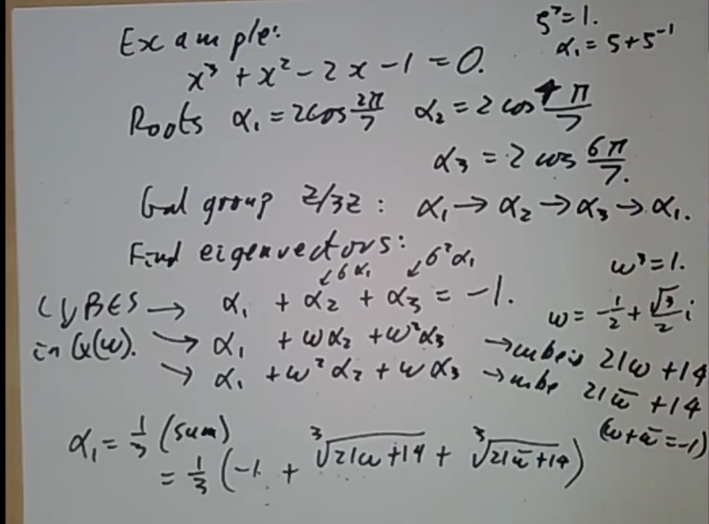

## 正十七边形

称一个复数可尺规作图，如果它可以从有理数中通过域运算和开根号构造（考虑尺规作图道理，加减乘除通过画平行线和比例论手段，开根需平分辐角；而反过来，联立二次方程（圆）和直线只能得到二次扩域）。

> $\mathrm{1.1.\ Proposition.\ }$ *$\alpha$ 可尺规作图当且仅当 $\alpha$ 在一个 $2^n$ 次的正规扩张中*

假设 $\alpha$ 可尺规作图。考虑一系列域扩张$$\mathbb{Q}=K_0\subset K_1\subset K_2\subset \cdots\subset K_n$$其中 $\alpha\in K_n$ 且 $K_1=K_0(\sqrt{\alpha_0})$ 其中 $\alpha_0\in K_0$，$K_2=K_1(\sqrt{\sigma_1\alpha_1},\cdots,\sqrt{\sigma_n\alpha_1})$ ，其中 $\alpha_1\in K_1$ ，$\sigma_1,\cdots,\sigma_n$ 取遍 $\operatorname{Gal} (K_1|K_0)$ ，类似地 $K_3=K_2(\sqrt{\sigma_1'\alpha_2},\cdots,\sqrt{\sigma_m'\alpha_2})$ ，$\sigma_i'$ 取遍 $\operatorname{Gal} (K_2|K_0)$……由于每一步都把 $\alpha_i$ 的所有共轭都添进来，所以 $K_{i+1}/K_i$ 是正规扩张（它是分裂域）。

假设 $\alpha$ 在某个 $2^n$ 次正规扩张中，那么这个扩张的Galois群是 $2^n$ 阶。而有限 $2$-群皆幂零，所以合成列给出二次域扩张的塔。$\square$

注：这里的正规不可少，因为比如说不是所有四次方程的根都可尺规作图。

$\mathrm{Example.\ }$ 正七边形不可尺规作图。事实上 $\cos \frac{2\pi}{7}$ 的极小多项式三次。

现在考虑尺规作正 $p$ 边形，这多少相当于考虑 $p$ 次单位根是否可以尺规作图。考虑到 $(x^p-1)/(x-1)=x^{p-1}+\cdots+x+1$ ，后者以 $x+1$ 代 $x$ 再用Eisentein判别法知不可约。令 $\zeta=\cos \frac{2\pi}{p}+i\sin \frac{2\pi}{p}$ ，则 $x^{p-1}+\cdots+1$ 的其它根是 $\zeta^2,\zeta^3,\cdots,\zeta^{p-1}$ ，从而 $\mathbb{Q}(\zeta)/\mathbb{Q}$ Galois ，$\mathbb{Q}$ 扩某个 $n$ 次单位根形式的扩张成为分圆扩张。

易见 $\operatorname{Gal}(\mathbb{Q}(\zeta)|\mathbb{Q})=(\mathbb{Z}/p\mathbb{Z})^\times$ ，那么正 $p$ 边形可尺规作图等于说 $p$ 具有 $2^n+1$  形式，这是著名的费马素数，可以证明 $n$ 具有 $2^n$ 形式，从而这些素数就是 $2,3,5,17,257,65537,\cdots$

对 $p=17$ 的情况，我们知道 $17$ 有原根 $3$ ，于是有子群的合成列$$\{ 1 \}\subset \{ 1,16 \}\subset \{ 1,4,13, 16 \}\subset \{ 1,2 ,4,8,9,13,15 ,16 \}\subset (\mathbb{Z}/17 \mathbb{Z})^\times $$显然一个被 $1,16$ 固定的元素是 $\zeta+\zeta^{16}$ ，$1,16$ 的陪集有 $2,15$ ，$3,14$ ……所以也有 $\alpha=\zeta+\zeta^{16}$ 的共轭（被某个自同构作用后的像） $\zeta^2+\zeta^{15}$ ，$\zeta^3+\zeta^{14}$ ……类似地四阶群的陪集有 $1,4,13,16$ 、$2,8,9,15$ 、$3,12,5,14$ 、$6,7,10,11$ ，对应 $\beta=\zeta+\zeta^4+\zeta^{13}+\zeta^{16}$ 等等。

考虑到 $\zeta^2-\alpha\zeta+1=0$ ，于是 $\zeta$ 可以写成带 $\alpha$ 的二次根式 $\zeta=\frac{\alpha-\sqrt{\alpha^2-4}}{2}$ 。类似地，我们考虑 $\alpha$ 的共轭 $\alpha'=\zeta^4+\zeta^{13}$ ，则 $\alpha+\alpha'=\beta$ 且 $\alpha\alpha'=\zeta^3+\zeta^{12}+\zeta^5+\zeta^{14}$ 是 $\beta$ 的共轭，所以 $\alpha$ 可以写成某个 $\{ 1,4,13, 16 \}$ 不动域系数的二次方程的根。类似地考虑 $1,4,13,16$ 和 $2,8,9,15$ 对应的和……而我们可以计算 $\gamma=\zeta+\zeta^2+\zeta^4+\zeta^8+\zeta^9+\cdots=\frac{\sqrt{17}-1}2$ ，从而一路下来可以将 $\alpha$ 用一堆有理数和二次根式表达出来。

## 代数基本定理

我们已经知道一些拓扑或者分析手段的证明，比如说考虑winding number，或者比如说假设没有零点则 $1/f$ 全纯有界，按Liouville定理是常数等等。现在给出一个比较代数的证明。

假设已知 
(i) $F\subset E$ 是特征 $0$ 的有限扩张
(ii) 奇次数的 $F[x]$ 中多项式都在 $F$ 中有根
(iii) $E$ 没有二次扩域（相当于说 $E$ 中元素总有平方根）

取某个 $F$ 的有限正规扩张 $F\subset E\subset  X$ 我们将证明 $X=E$ 。特征 $0$ 意味着 $X/F$ Galois，令 $G=\operatorname{Gal} (X|F)$ ，条件(ii)意味着 $F$ 没有奇次数的非平凡扩张，从而 $G$ 的奇数指数子群只有 $G$ 自己。假设 $H=\operatorname{Gal} (X|E)$ ，那么 $E$ 的扩域相当于 $H$ 的子群，于是 (iii)相当于 $H$ 也没有偶数指数的子群。

现在 $G$ 的Sylow 2-子群是 $G$ 自己，从而 $|G|=2^n$ ，因而 $|H|=2^m$ ，从而 $H$ 是幂零群，如果 $|H|>1$ 则 $H$ 有指数 $2$ 子群。$\square$

## 本原元定理

如果 $M/K$ 满足 $M=K(\alpha)$ ，则称 $\alpha$ 是一个本原元素。

> $\mathrm{Lemma.\ }$ *如果 $M/K$ 有限可分，则只有有限多个中间域*

考虑某个有限Galois扩张（比如说根扩出 $M$ 的有限个极小多项式的分裂域） $K\subset M\subset N$ ，令 $G=\operatorname{Gal} (N|K)$ ，则 $M/K$ 的中间域都对应 $G$ 的子群，而 $G$ 是有限群。$\square$

> $\mathrm{Lemma.\ }$ *无限域上线性空间不能表示为有限多个真子空间的并*

取真子空间 $V_1,\cdots,V_k$ ，不妨设 $V_k$ 不包含于 $V_1\cup \cdots \cup V_{k-1}$ ，取 $V_k$ 中不在 $V_1,\cdots,V_{k-1}$ 上的点，再取 $V_{k-1}$ 中不在 $V_k$ 上的点，两点连线不在任何 $V_i$ 中，所以和每个 $V_i$ 都只有至多一个交点，而上面有无限多个点。$\square$

> $\mathrm{Theorem.\ }$ *有限可分扩张 $M/K$ 是单扩张*

如果 $K$ 是有限，则 $M$ 有限，其乘法群是循环群，从而自然有本原元。

现在设 $K$ 无限，则 $M$ 不能被有限多真子空间覆盖，事实上从而取不在这些子空间之并中的 $\alpha$ ，则 $K(\alpha)=M$ 。$\square$

$\mathrm{Example.\ }$ 考虑 $\mathbb{Q}\subset \mathbb{Q}(\sqrt 2,\sqrt 3)$ ，则中间域是 $\mathbb{Q}[\sqrt 2],\mathbb{Q}[\sqrt 3],\mathbb{Q}[\sqrt 6]$ ，不在这些中间域中相当于要求 $a+b\sqrt 2+c\sqrt 3+d \sqrt 6$ 中 $b,c,d$ 至少两个非零。

$\mathrm{Example.\ }$ 对不可分的情况，一个基本的原则是它们几乎是一切事情的反例。假设特征 $p$ ，那么 $p$ 次的不可分扩张显然是单扩张。现在考虑 $k(x,y)/k(x^p,y^p)$ ，对每个 $x\in k(x,y)$ ，由Frobenius同态道理知 $x^p\in k(x^p,y^p)$ ，从而 $k(t^p,y^p)$ 的单扩张至多是 $p$ 次。我们同样观察到（如果 $k$ 无穷） $k(x,y)/k(x^p,y^p)$ 次数有限但却有无限多个中间域（否则作为无限域上线性空间前面论证适用于此）。

## Abel定理

> $\mathrm{Theorem.\ }$ *$\mathbb{Q}$ 上一般的五次方程 $ax^5+bx^4+cx^3+dx^2+ex+f=0$ 无法通过加减乘除和开 $n$ 次根给出一般的求根公式*

事实上我们将证明

> $\mathrm{Theorem.\ }$ *$\alpha$ 可以被特征 $0$ 域 $K$ 通过根式表达，则 $\alpha$ 属于 $K$ 的某个Galois群可解的有限Galois扩张*

这里可解指存在正规列$$1=G_0\triangleleft G_1\triangleleft\cdots  \triangleleft G_n=G$$其中 $G_{i+1}/G_i$ 皆Abel。

我们通过几步来构造这个Galois扩张：
(i) 向 $K$ 中加入我们所需的所有单位根，也就是取某个足够大的 $n$ 和 $x^n-1$ 的分裂域。对特征 $0$ 的情况，$\operatorname{Gal} (K(\zeta)|K)\subset (\mathbb{Z}/n \mathbb{Z})^\times$ 是Abel群，从而可解。
(ii) 考虑一系列扩张 $K_0=K$ ，$K_1=K(\zeta)$ ，$K_2=K_1(\sqrt[k_1]{\sigma_1\alpha_1},\cdots,\sqrt[k_1]{\sigma_n\alpha_1})$ ，其中 $\alpha_1\in K_1$ ，$\sigma_1,\cdots,\sigma_n$ 取遍 $\operatorname{Gal} (K_1|K_0)$ ，类似地 $K_3=K_2(\sqrt[k_2]{\sigma_1'\alpha_2},\cdots,\sqrt[k_2]{\sigma_{n_1}'\alpha_2})$ ，$\sigma_i'$ 取遍 $\operatorname{Gal} (K_2|K_0)$……直到 $\alpha\in K_m$ 。由于 $K_i$ 包含所有的 $k_i$ 次单位根（对 $i\geqslant 1$），所以 $K_{i+1}/K_i$ 正规，更进一步的因为每次扩张都把所有共轭扩进来，所以 $K_m/K$ 正规从而Galois。现在我们得到了一系列域扩张的塔$$K_0\subset K_1\subset \cdots\subset K_m$$其中 $K_i/K_j$ 对任意 $j\leqslant i$ 皆Galois。假设对应的Galois群是$$G_0\supset G_1\supset\cdots\supset G_m$$则 $G_{i+1}\triangleleft G_i$ 。此外考虑到如果 $L$ 包含所有 $k_i$ 次单位根， $L(\sqrt[k_i]{\alpha})/L$ 的自同构把 $\sqrt[k_i]{\alpha}$ 打到某个 $\sqrt[k_i]{\alpha}\zeta^j$ ，从而 $\operatorname{Gal} (L(\sqrt[k_i]{\alpha})/L)\subset \mathbb{Z}/k_i \mathbb{Z}$ ，将 $K_{i+1}/K$ 分解为依次扩进 $\alpha_i$ 某个共轭的 $k_i$ 次根，则 $G_i/G_{i+1}\cong\operatorname{Gal} (K_{i+1}|K_i)$ 可以被定位为 若干 $\mathbb{Z}/k_i \mathbb{Z}$ 直积的子群，从而Abel。
$\square$

$\mathrm{Example.\ }$ $\mathbb{Q}(x_1,\cdots,x_5)^{\mathsf{S}_5}=\mathbb{Q}(e_1,\cdots,e_5)$ ，$e_i$ 是基本对称多项式，多项式$$x^5-e_1x^4+\cdots=\prod (x-x_i) $$有根 $x_1,\cdots,x_5$ ，从而其Galois群是 $\mathsf{S}_5$ ，不可解，于是 $x_1,\cdots,x_5$ 无法通过 $e_1,\cdots,e_n$ 用根式表达。

下面的命题是找到无根式解的多项式的一个好办法：

> $\mathrm{Proposition.\ }$ *假设五次多项式 $f\in \mathbb{Z}[x]$ 不可约，且恰有两个虚根，则其Galois群不可解*

不可约意味着扩张次数被 $5$ 整除，Galois群阶被 $5$ 整除，从而包含某个 $5$-循环。另一方面恰有两个虚根意味着Galois群包含对换（复共轭），而对换和 $5$-循环可以生成整个 $\mathsf{S}_5$ 。$\square$

$\mathrm{Example.\ }$ $x^5-4x+2$ 恰有三个实根（画图可知），且有Eisentein判别法知其不可约，从而它的Galois群是 $\mathsf{S}_5$ 。

$\mathrm{Example.\ }$ 在有 $0$ 或 $4$ 个虚根时，Galois群可能可解，比如说 $x^5-2$ ，考虑它的分裂域是 $\mathbb{Q}\subset \mathbb{Q}(\zeta)\subset \mathbb{Q}(\zeta,\sqrt[5]2)$ ，$\zeta$ 是一个五次本原单位根，于是它的Galois群是 $20$ 阶群，$\mathbb{Q}(\sqrt[5]2)$ 对应的Galois群是 $\mathbb{Z}/5\mathbb{Z}$ （把 $\sqrt[5]2$ 打到另外某个 $2$ 的五次根），且由于 $\mathbb{Q}(\zeta)/\mathbb{Q}$ 正规$$\operatorname{Gal} (\mathbb{Q}(\zeta,\sqrt[5]2)|\mathbb{Q})/\operatorname{Gal} (\mathbb{Q}(\zeta,\sqrt[5]2)|\mathbb{Q}(\zeta))\cong \operatorname{Gal}  (\mathbb{Q}(\zeta)|\mathbb{Q})\cong (\mathbb{Z}/5\mathbb{Z})^\times $$而零个虚根的情况类似，譬如说考虑 $2\cos \frac{2\pi}{11}=\zeta+\zeta^{-1}$ ，$\zeta$ 是 $11$ 次单位根，类似地 $11$ 次单位根在实轴上的投影还有 $2\cos \frac{4\pi}{11},2\cos \frac{6\pi}{11},\cdots$ ，总共五个。易见这就是 $\frac{2\pi}{11}$ 的全部共轭，从而 $\mathbb{Q}(\frac{2\pi}{11})/\mathbb{Q}$ 正规，$\operatorname{Gal} (\mathbb{Q}(\frac{2\pi}{11})|\mathbb{Q})$ 是 $\operatorname{Gal} (\mathbb{Q}(\zeta)|\mathbb{Q})\cong (\mathbb{Z}/11\mathbb{Z})^\times$ 的商群，具体来说就是五阶循环群。

## Kummer扩张

某种意义上说群 $G$ 可解相当于说 $G$ 可以被分解为许多循环群，从而自然产生一个问题，就是对Galois扩张 $M/K$ ，如果 $\operatorname{Gal} (M|K)$ 循环，那么我们能得到什么这个域扩张的性质。

假设 $\operatorname{Gal} (M|K)$ 是 $\mathbb{Z}/n \mathbb{Z}$ ，$K$ 包括所有的 $n$ 次单位根，且 $\operatorname{Char}(K)$ 不整除 $n$ ，除此之外在以下讨论中为方便起见设 $n$ 素数（虽然说这个条件并不必要）。我们现在说明 $M=K(\sqrt[n]a)$ 。

假设 $\operatorname{Gal} (M|K)$ 由 $\sigma$ 生成，由于 $K$ 的特征不整除 $n$ ，所以 $n$ 次单位根 $1,\zeta,\zeta^2,\cdots,\zeta^{n-1}$ 互不相同。而 $\sigma$ 把 $\sqrt[n]a$ 打到 $\zeta^i\sqrt[n]a$ ，从而 $\sqrt[n]a$ 是 $\sigma$ 的特征值为 $\zeta^i$ 的特征向量。 $\sigma^n=1$ 从而 $M=\operatorname{Ker} (\sigma^n-1)=\bigoplus _{i=0}^{n-1}\operatorname{Ker} (\sigma-\zeta^i) $ （这里用到 $K$ 包含 $n$ 次单位根和 $\zeta^i$ 互不相同），于是 $\sigma$ 可对角化，从而取 $\zeta$ 对应的特征向量 $t$ ，$\sigma(t)=\zeta t$ 从而 $\sigma(t^n)=t^n$ 即 $t^n\in K$ ，于是 $M=K(\sqrt[n]t)$ 。

$\mathrm{Example.\ }$ 考虑多项式 $x^3+x^2-2x-1=0$ ，它有根 $\alpha_1=2\cos \frac{2\pi}{7},\alpha_2=2\cos \frac{4\pi}{7},\alpha_1=2\cos \frac{6\pi}{7}$ ，Galois群是 $\mathbb{Z}/3 \mathbb{Z}$ （也就是这些根的3循环置换）。现在考虑找到一个特征向量。首先显然的是 $\alpha_1+\alpha_2+\alpha_3$ ，而这等于 $-1$ ；再考虑 $\alpha_1+\omega \alpha_2+\omega^2 \alpha_3$ ，其中 $\omega=-\frac{1}{2}+\frac{\sqrt{3}}{2}i$ 是三次单位根；以及同样考虑 $\alpha_1+\omega^3 \alpha_2+\omega \alpha_3$ 。这三者分别被 $\sigma,\omega \sigma,\omega^2\sigma$ 固定（从而都是特征向量），它们加起来得到 $\alpha_1$ （实际就是考虑 $\alpha_1+\sigma\alpha_1+\sigma^2\alpha_1$）。具体计算来说就能得到这样一坨……

现在考虑 $K(\sqrt[n]a)$ 与 $K(\sqrt[n]b)$ 何时相等。事实上如果它们相等，$\sqrt[n]a$ 特征值是 $\zeta$ 而 $\sqrt[n]b$ 特征值为 $\zeta^i$ ，将 $\sqrt[n]b$ 替换为某个幂次则两者同特征值。此时 $\sqrt[n]a/\sqrt[n]b$ 被 $\sigma$ 所固定，从而属于 $K$ ，于是 $\frac ab$ 是 $K$ 中某个元素的 $n$ 次幂，反过来如果这个条件成立显然 $K(\sqrt[n]a)=K(\sqrt[n]b)$ 。

因此我们知道在上述条件下Galois群为 $\mathbb{Z}/n \mathbb{Z}$ 的Galois扩张对应于 $K^\times /(K^\times )^n$ 中的元素。我们可以得到一种被称作Kummer pairing的 $\operatorname{Gal} (K(\sqrt[n]x:x\in K)|K)\times (K^\times /(K^\times )^n)$ 到 $n$ 次单位根的映射，具体来说，对某个 $\sigma$ 和 $a$ ，考虑 $\sigma(\sqrt[n]a)=\zeta^i\sqrt[n]a$ ，取 $\zeta^i$ 即可。这里相当于说某种意义上 $\operatorname{Gal} (K(\sqrt[n]x:x\in K)|K)$ 与指数 $n$ 的Abel群 $K^\times /(K^\times )^n$ 的对偶关系。而这里 $n$ 次单位根群虽然作为抽象的群同构于 $\mathbb{Z}/n \mathbb{Z}$ ，但 $\zeta$ 的Galois群对它的作用有所不同，此事某种意义上被称作Tate twist。在特征 $p$ 而 $p$ 整除 $n$ 时会出问题。