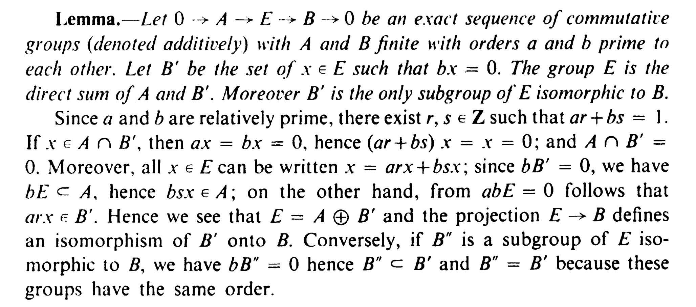

> 参考了包括但不限于ProofWiki

## Lec 1&2
$\rm{Corollary\ 1.5. }$ *正特征域上绝对值均非阿，有限域上绝对值均平凡*

注意到特征 $p$ 域上 $n^p=n$ ，从而 $|n|$ 为 $0$ 或 $1$ 。 如果 $k$ 是有限域，则 $|x|^{|k|}=|x|$ ，从而 $x$ 非零时 $|x|=1$ 。 $\square$

$\rm{Problem\ 1.0. }$ 

(a) 在试图证1.5的时候我发现 $|-1|=1$ 等等，再考虑到仿照 $||x|-|y||\leqslant |x-y|$ 的想法得到如下证明：由 $|-y|=|y|$ ，有 $|x|\leqslant \max(|y|,|x+y|)$ 同理 $|y|\leqslant \max(|x|,|x+y|)$ ，若 $|x|\ne |y|$ 则可知 $|x+y|\geqslant \max(|x|,|y|)$ 。$\square$
(b) 注意到有将 $t$ 映到 $t^n$ 的 $\mathbb F_p(t)→\mathbb F_p(t)$ 嵌入。
(c) $f=(x^2-5)^2-24$

$\rm{Problem\ 1.1. }$

(a) 如果 $|x+y|>|x|$ 即 $|1+y/x|>1$，则欲证 $|x+y|\leqslant \max(|x|,|y|)$ 只需证 $|x+y|\leqslant |y|$ ，即 $|1+y/x|\leqslant |y/x|$ 。现在只需证 $|1+x|>1$ 推出 $|1+x|\leqslant |x|$ ，而假若不然 $|1+x|>1$ 时，$|1+x|^n\leqslant 1+|x|+\cdots +|x|^n$ ，但因为 $|x|<|1+x|$ 左边是右边的高阶无穷大，矛盾。 $\square$

(b) 假设 $\left| \cdot\right|$ 是一个 $\mathbb{Q}$ 上的绝对值。首先证明存在 $m\geqslant 2$ 使得 $|m|\leqslant 1$ ，则 $\left| \cdot\right|$ 非阿：取 $n\geqslant 2$ ，把 $n$ 关于 $m$ 进制展开

$$n = a_0 + a_1 m + a_2 m^2 + \cdots + a_s m^s\quad 0\leqslant a_i\leqslant m-1$$

因为 $|k|=|k\cdot 1|\leqslant k$ 所以

$$\left| n \right|\leqslant m(1+s)\leqslant m(1+\log_{m}n)$$

以 $n^k$ 代 $n$ 则是 $|n|\leqslant m^{\frac{1}{k}}(1+kc)^{\frac{1}{k}}$ ，其中 $c=\log_{m}n$ ，使 $k\to \infty$ 得到 $|n|\leqslant 1$ ，明所欲证。现在假设 $\left| \cdot\right|$ 阿基米德，任意 $n\geqslant 2$ 均满足 $|n|>0$ ，取 $n,m\geqslant 2$ ，如上以 $m$ 进制展开 $n$ ，令 $\alpha=\log_{m} |m| $ ，则 $\alpha>0$ ，从而

$$\begin{aligned}\left| n \right|&\leqslant 1+m^\alpha+m^{2\alpha}+\cdots+m^{s\alpha}\\&\leqslant \dfrac{m^{(s+1)\alpha}-1}{m^\alpha-1}\leqslant \dfrac{m^{(s+1)\alpha}}{m^\alpha-1}\leqslant n^\alpha\left( \dfrac { {m}^\alpha} { {m}^\alpha - 1} \right) \end{aligned}$$

以 $n^k$ 代 $n$ 得到 $\left| n \right| \leqslant n^{\alpha}\left( \dfrac { {m}^\alpha} { {m}^\alpha - 1} \right)^{\frac{1}{k}}$ ，使 $k\to \infty$ 得到 $\left| n \right|\leqslant n^\alpha$ 。由于 $m$ 可以任取，令 $c=\inf\{ \log_m|m|:m\geqslant 2 \}$ ，则 $|n|= n^c$ ，而且因为阿基米德所以 $c>0$ ，进而给出 $\left| \cdot\right|$ 和 $\left| \cdot\right|_\infty$ 的等价。而如果  $\left| \cdot \right|$ 非阿，考虑赋值环 $A=\{ x\in \mathbb{Q}:|x|\leqslant 1 \}$ ，对应有极大理想 $\mathfrak{m}=\{ x\in \mathbb{Q}:|x|<1  \}$ ，特别的，$\mathbb{Z}\subset  A$ ，$\mathfrak{m}\cap \mathbb{Z}$ 是 $\mathbb{Z}$ 中素理想，从而为某个 $(p)$ 。由此知，对一切与 $p$ 相异的素数 $q$ ，$|q|=1$ ，而 $|p|<1$ ，从而 $|x|=|p|^{v_p(x)}=|x|_p^{-\log_p |p|}$ 。$\square$

(c) 考虑到

$$\left|\pm \prod_{q} q^{e_q} \right|_p=p^{-e_p} $$

对 $p<\infty$ ，而 $|x|_\infty=|x|$ 。 $\square$

$\rm{Problem\ 1.2. }$

(a) $|r|_\pi=0$ 当且仅当 $v_\pi(r)=\infty$ 即 $r=0$ ；$v_\pi(xy)=v_\pi(x)+v_\pi(y)$ ；$v_\pi(x+y)\geqslant \min(v_\pi(x),v_\pi(y))$ 。$\square$

(b) 显然。

(c) $\pi$ 非 $\infty$ 时，$v_{\pi}$ 是 $\mathbb{F}_q(t)$ 的一个离散赋值，对应离散赋值环为局部化环 $\{ x\in \mathbb{F}_q(t) :v_\pi(x)\geqslant 0\}=\mathbb{F}_q[t]_{(\pi)}$，其极大理想是 $\{ x\in \mathbb{F}_q(t) :v_\pi(x)>0\}$ ，也就是局部化 $(\pi)_{(\pi)}$ ，从而剩余域 $\mathbb{F}_q[t]_{(\pi)}/(\pi)_{(\pi)}=(\mathbb{F}_q[t]/(\pi))_{(\pi)}=\mathbb{F}_q[\alpha]$ 为 $\pi$ 对应的单代数扩张。 $\square$

(d) $R=\{ x\in \mathbb{F}_q(t):\deg x\leqslant 0 \}$ ，其极大理想 $\mathfrak{m}$ 是一切不可逆元组成的理想，也就是一切 $\deg<0$ 的元素。取 $f/g\in R$ ，$n=\deg g$ 且 $g=a_nt^n+\cdots$ 而 $f=b_nt^n+\cdots$ （$b_n$ 可以为 $0$ ），那么“在 $\infty$ 处的取值”，将 $f/g$ 打到 $b_n/a_n$ 给出 $R\to \mathbb{F}_q$ 满同态，其Kernel正是 $\mathfrak{m}$ ，由此知剩余域 $R/\mathfrak{m}\cong \mathbb{F}_q$ 。

(e) 首先 $\mathbb{F}_q(t)$ 正特征一定非阿。对一般的多项式 $f=a_nt^n+\cdots+a_0$ 有 $|f|\leqslant \max(1,|t|,\cdots,|t|^n)$ 。注意到 $\left| \cdot \right|_\infty$ 中一切正次数多项式绝对值大于 $1$ ，而 $\left| \cdot \right|_\pi$ 中则小于 $1$ ，于是考虑 $|t|$ 的取值。如果 $|t|>1$ ，按Prob 0中(a)问结论，$|f|=|t|^n$ ，从而显然 $\left| \cdot \right| $与 $\left| \cdot \right| _\infty$ 等价；如果 $|t|\leqslant 1$ ，考虑赋值环 $R=\{ x\in \mathbb{F}_q(t):|x|\leqslant 1 \}$ 和其极大理想 $\mathfrak{m}$ ，我们有 $\mathbb{F}_q[t]\subset R$ ，因而 $\mathfrak{m}\cap \mathbb{F}_q[t]$ 是 $\mathbb{F}_q[t]$ 中素理想，形如 $(\pi)$ ，因此 $|\pi|<1$ 而对其它 $\mathbb{F}_q[t]$ 中素元 $\pi'$ 有 $|\pi'|=1$ 。 $\square$
6. 显然。

$\rm{Problem\ 1.3. }$ 

(a) $\mathbb{Q}(\sqrt d)$ 中元素在 $\mathbb{Z}$ 上整当且仅当其在 $\mathbb{Q}$ 上极小多项式系数都在 $\mathbb{Z}$ 中。对 $a+b\sqrt d\in \mathbb{Q}$ ，这相当于要求 $2a\in \mathbb{Z}$ 且 $a^2-b^2d\in \mathbb{Z}$ 。于是知在 $d\equiv 1\pmod 4$ 时，$\mathcal{O}_K=\mathbb{Z}[\frac{1+\sqrt d}{2}]$ ，在 $d\equiv 2,3\pmod 4$ 时，$\mathcal{O}_K=\mathbb{Z}[\sqrt d]$ 。

(b)  $\mathcal{O}_K$ 以及 $\mathbb{Z}[\sqrt d]$ 是自由 $\mathbb{Z}$-模。不妨设 $d\equiv 1\pmod 4$ ，于是 $(\mathcal{O}_K:\mathbb{Z}[\sqrt d])$ 即为 $\mathcal{O}_K$ 中行列式 $|\det(1,\sqrt d)|=2$ 。

(c) $\mathfrak{p}\cap \mathbb{Z}$ 是 $\mathbb{Z}$ 中素理想，从而必然包含某个 $p \mathbb{Z}$ 。如果 $\mathcal{O}_K$ 中理想 $(p)$ 真包含于 $\mathfrak{p}$ ，按 (a) 结论 $\mathcal{O}_K$ 是诺特环 $\mathbb{Z}[x]$ 的商环从而诺特。接下来说明 $\mathfrak{p}$ 是极大理想：令 $\mathfrak{q}=\mathfrak{p}\cap \mathbb{Z}$ ，则 $\mathbb{Z}/\mathfrak{q}$ 是 $\mathcal{O}_K/\mathfrak{p}$ 的子环，$\mathbb{Z}/\mathfrak{q}$ 是域而 $\mathcal{O}_K/\mathfrak{p}$ 在 $\mathbb{Z}/\mathfrak{q}$ 上整，从而 $\mathcal{O}_K/\mathfrak{p}$ 是域。此外 $\mathcal{O}_K$ 按定义整闭，这就证明了 $\mathcal{O}_K$ 是Dedekind整环。接下来首先证明 $\mathcal{O}_K$ 中理想都包含某个素理想的有限乘积：按诺特性取不满足者中极大的 $\mathfrak{a}$ ，则 $\mathfrak{a}$ 自己非素理想，存在 $\mathfrak{bc}\subset \mathfrak{a}$ 但 $\mathfrak{b},\mathfrak{c}\not\subset \mathfrak{a}$ ，从而 $\mathfrak{a}+\mathfrak{b}$ 和 $\mathfrak{a}+\mathfrak{c}$ 都包含素理想乘积，而它们乘积包含于 $\mathfrak{a}$ ，从而 $\mathfrak{a}$ 中包含素理想乘积，矛盾。现在 $(p)$ 包含素理想的乘积 $\mathfrak{p}_1^{r_1}\cdots \mathfrak{p}_n^{r_n}$ ，诸 $\mathfrak{p}_i$ 互不相同，取 $x\in \mathfrak{p}-\mathfrak{p}^2$ ，且对 $\mathfrak{p}_i\ne \mathfrak{p}$ 取 $x_i\in \mathcal{O}_K-\mathfrak{p}_i$ ，按中国剩余定理存在某个 $\alpha$ 满足 $\alpha\equiv x_i\pmod {\mathfrak{p}_i^{r_i}}$ 且 $\alpha\equiv x\pmod{\mathfrak{p}}$ ，那么 $(p,\alpha)$ 在一切极大理想处的局部化与 $\mathfrak{p}$ 相同（考虑到 $\mathcal{O}_K$ 关于素理想的局部化都是DVR），从而两者作为它们的交相同 （Prop 2.16）。

(d) 先假设 $p$ 是奇素数。考虑到 $(p)\subset \mathfrak{p}$ ，而 $\mathcal{O}_K$ 为 $\mathbb{Z}[\sqrt d]$ 或 $\mathbb{Z}[\frac{1+\sqrt d}{2}]$ ，从而 $\mathcal{O}_K/\mathfrak{p}$ 特征 $p$ 且是 $\mathbb{F}_p$ 的至多二次扩张。如果 $\mathbb{F}_p$ 中没有 $\sqrt d$ ，那么 $\mathcal{O}/(p)$ 同构于 $\mathbb{F}_p[\sqrt d]$ 是域，此时 $(p)$ 是极大理想，$\mathcal{O}_K/\mathfrak{p}\cong \mathbb{F}_{p^2}$ ，按二次剩余道理此时相当于说 $d^{\frac{p-1}{2}}\equiv -1\pmod{p}$ ；反过来如果 $d$ 是模 $p$ 的二次剩余， $d^{\frac{p-1}{2}}\equiv 1\pmod{p}$ ，也就是 $p|x^2-d$ ，$(p)$ 并非 $\mathbb{Z}[\sqrt d]$ 或者 $\mathbb{Z}[\frac{1+\sqrt d}{2}]$ 中的素理想，从而 $\mathfrak{p}$ 严格比 $(p)$ 更大， $|\mathcal{O}_K/\mathfrak{p}|<|\mathcal{O}_K/(p)|=p^2$ ，于是此时 $\mathcal{O}_K/\mathfrak{p}\cong \mathbb{F}_p$ 。

$\rm{Problem\ 1.4. }$ 

(a) 只需注意到 $\mathbb{F}_p(t)$ 情形下绝对值定义为 $p^{\deg f}$ 。

(b)  $a\ \bot\ b$ 意味着 $(a)\cap (b)=(a)(b)$ ，从而 $A/(ab)\cong A/(a)\times A/(b)$ ，这里 $A/(ab)\to A/(a)\times A/(b)$ 满射是因为，取 $s\in (a)$ 和 $t\in (b)$ ，$s+t=1$ ，那么 $xs+yt$ 被打到 $(x,y)$ （现证了一遍CRT），于是 $\phi(a)\phi(b)=\phi(ab)$ 。而 $A/(a^n)$ 中元素 $\bar c$ 可逆等于说 $c\ \bot\ a$ ，整数情况显然，现在考虑 $\mathbb{F}_p[t]$ 情形，$A/(a)$ 中代表元可以选取为次数 $<\deg a$ 的全体多项式，类似的 $A/(a^n)$ 中代表元就是全体次数 $<n\deg a$ 者，其中 $a$ 的全体倍数是 $a$ 乘以一个次数 $<(n-1)\deg a$ 的多项式 ，于是知恰好 $\phi(a^n)=|a|^n(1-1/|a|)$ 。

(c) (b) 和 $A$ UFD性质的立即推论。

(d)考虑 $a$ 在 $A/(b)$ 上的作用给出 $(A/(b))^{\times}$ 上的置换，从而

$$\prod_{x\in (A/(b))^\times } ax=\prod_{x\in (A/(b))^\times } x$$

因此 $a^{\phi(b)}\equiv 1\pmod{b}$ 。
5. $A=\mathbb{Z}$ 时这个乘积相当于 $A/(a)$ 中非零元素乘积的平方，而 $A/(a)$ 中非零元素乘积为 $-1$ （$x^{-1}=x$ 的元素只有 $\pm 1$），它平方为 $1$ ；$A=\mathbb{F}_p[t]$ 时这个乘积相当于 $A/(a)$ 中非零元素乘积，从而为 $-1$ 。
6. $\phi(b)=|b|-1$ 。如果 $a=c^r$ 那么 $a^{(|b|-1)/r}=c^{|b|-1}\equiv 1$ ；反过来 $A/(b)$ 是域，其乘法群是循环群，所以 $a^{(|b|-1)/r}\equiv 1$ 则 $a$ 为其生成元的 $r$ 的倍数次方。考虑Abel群的正合列

$$0→1+b(A/b^n)→(A/b^n)^\times→(A/b)^\times→0$$

其中 $(A/b^n)^\times→(A/b)^\times$  为模 $b$ 投影，按GTM7上这个Lemma （II.3 P16） 有 $(A/b^n)^\times\cong V\times (1+b(A/b^n))$ ，其中 $V=\{ x\in (A/b^n)^\times :x^{|b|-1}=1 \}$ 同构于 $(A/b)^\times $ ，由此知 $(A/b^n)^\times $ 到 $\{ c^r:c\in (A/b^n)^\times  \}$ 群同态 $c\mapsto c^r$ 的Kernel大小恰为 $r$ ，因此 $((A/b^n)^\times)^r$ 大小正是 $\phi(b^n)/r$ 。
