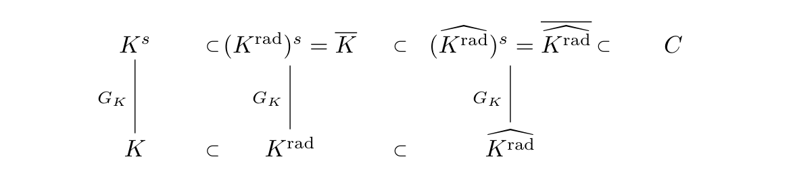
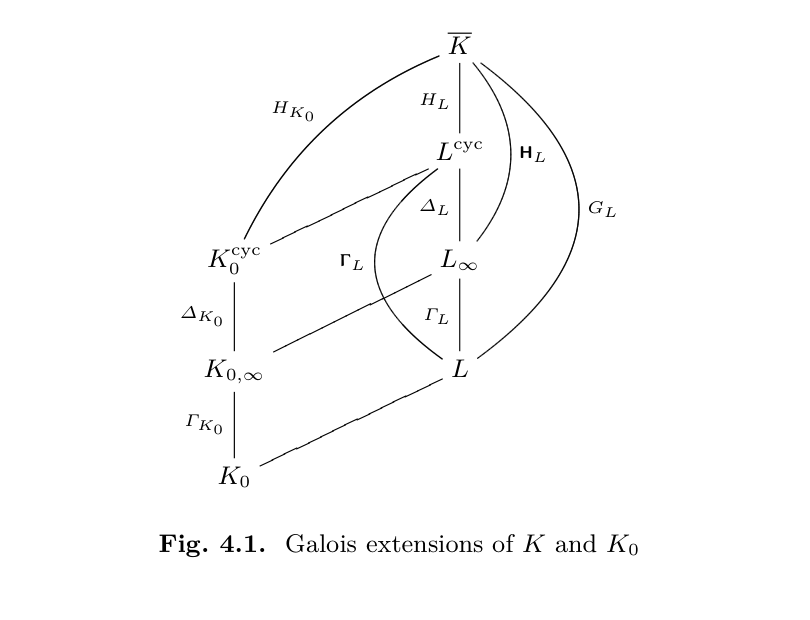

### 第4章 $C$-表示与 Sen 的方法（$C$-representations and Methods of Sen）

#### 4.1 域 $C$ 及其不变子域（The field $C$ and its invariant subfields）
设 $K$ 是一个完备的非阿基米德域 ( 赋值不必离散 ) ，$K^s$ 是 $K$ 的可分闭包，$\overline{K}$ 是包含 $K^s$ 的 $K$ 的代数闭包。令 $C = \widehat{K^s}$，即为 $K^s$ 的完备化。并且如前言所述 $K$ 剩余域的特征为 $p$ , 且是完美域.

**4.1.1 $C$ 是代数闭域（$C$ is algebraically closed）**

**引理 4.1 (Krasner's Lemma)**：设 $F$ 是一个完备非阿基米德域，$E$ 是 $F$ 的闭子域。假设 $\alpha, \beta \in F$，且 $\alpha$ 在 $E$ 上可分。若对 $\alpha$ 在 $E$ 上所有不等于 $\alpha$ 的共轭元 $\alpha'$，均有：$$|\beta - \alpha| < |\alpha' - \alpha|$$则 $\alpha \in E(\beta)$ .

**证明**：令 $E' = E(\beta)$，$\gamma = \beta - \alpha$。则有 $E'(\gamma) = E'(\alpha)$，且 $E'(\gamma)/E'$ 是可分的。我们只需证明在 $E'$ 上不存在与 $\gamma$ 不同的共轭元 $\gamma'$。设 $\gamma' = \beta - \alpha'$ 是一个共轭元，则有 ( prop.1.14b )  $|\gamma'| = |\gamma|$。由此$$|\alpha' - \alpha|=|\gamma' - \gamma| \le |\gamma| = |\beta - \alpha|$$从而 $\alpha'=\alpha$ . 因此 $\gamma$ 在 $E'$ 上无其他共轭元，即 $\alpha \in E(\beta)$ . $\square$

> 注: 可以这样考虑, 固定 $\beta$ 的Galois作用可以看作固定与 $\beta$ 距离不变的变换, 因此对距离 $r=\min |\alpha'-\alpha|$ , $\alpha$ 的共轭中只有 $\alpha$ 距离 $\beta$ 距离小于 $r$ ( 非阿时开球中任意点都是球心 )... Krasner引理告诉我们, 对足够接近的多项式 $P_1,P_2$ , $E[x]/(P_1)\cong E[x]/(P_2)$ .

**定理 4.2**：域 $C = \widehat{K^s}$ 是代数闭域，因此 $C = \widehat{K^s} = \widehat{\overline{K}}$。

**证明**：只需证明以下两点：
1. 若 $\text{char } K = p$，则对于任意的 $a \in C$，存在 $\alpha \in C$ 使得 $\alpha^p = a$ . 因此 $\overline{K}\subset C$ .
2. $C$ 是可分封闭的。

**(i) 的证明**：通过使用一族可分多项式逼近得到 $X^p-a$ 的一个根: 选择 $\pi \in \mathfrak{m}_K$，$\pi \neq 0$。选择估值 $v = v_\pi$，使得 $v(\pi) = 1$。定义$$\begin{aligned}\mathcal{O}_{K^s} &= \{a \in K^s \mid v(a) \ge 0\} \\\mathcal{O}_C &= \varprojlim \mathcal{O}_{K^s} / \pi^n \mathcal{O}_{K^s}\end{aligned}$$由于 $C = \mathcal{O}_C[1/\pi]$ ( 见1.2开头 ) ，对于充分大的 $m$ 有 $\pi^m a \in \mathcal{O}_C$，不妨假设 $a \in \mathcal{O}_C$ . 下面通过对 $X^p-a$ 微扰得到多项式的根, 得到一列趋于 $a$ 某个 $p$ 次根的数列: 

取 $a_n\equiv a\pmod \pi^n$ 的 $a_n\in\mathcal{O}_{K^s}$ , 令$$P_n(X) = X^p - \pi^n X - a_n \in K^s[X]$$则 $P_n$ 可分. 令 $\alpha_n$ 为 $P_n$ 的根, 则$$(\alpha_{n+1} - \alpha_n)^p=\alpha_{n+1}^p - \alpha_n^p\in \pi^n\mathcal{O}_{K^s}$$从而得 $v(\alpha_{n+1} - \alpha_n) \ge n/p$。这说明序列 $(\alpha_n)_{n \in \mathbb{N}}$ 在 $\mathcal{O}_C$ 中收敛。设其极限为 $\alpha$，则：$$\alpha^p = \lim_{n \to +\infty} \alpha_n^p = a$$

**(ii) 的证明**：设：$$P(X) = a_0 + a_1 X + a_2 X^2 + \dots + a_{d-1} X^{d-1} + X^d$$是 $C[X]$ 中的任意可分多项式。我们需要证明 $P(X)$ 在 $C$ 中有根。不妨假设 $a_i \in \mathcal{O}_C$。设 $C'$ 是 $P$ 在 $C$ 上的分裂域。对充分接近 $P$ 的多项式$$P_1(X) = b_0 + b_1 X + b_2 X^2 + \dots + b_{d-1} X^{d-1} + X^d \in K^s[X]$$和 $P_1$ 的一个根 $\beta$ , $$P(\beta) - P_1(\beta)=P(\beta)=\prod_{i=1}^d (\beta - \alpha_i)$$因此在 $P_1$ 与 $P$ 以 $v(b_i - a_i) > rd$ 意义上充分接近时 ( 从而 $v(P(\beta)) > rd$ ), $\beta$ 与某个根 $\alpha$ 以 $v(\beta - \alpha) > r$ 程度充分接近. 若令$$r = \max v(\alpha_i - \alpha_j)$$由Krasner引理可得 $\alpha \in C(\beta) = C$ . $\square$

**4.1.2 Ax-Sen 引理 (Ax-Sen's Lemma)**

设 $E$ 是 $K$ 的代数扩张。对于包含在 $E$ 的某个可分扩张中的任意元素 $\alpha$，定义：$$\Delta_E(\alpha) := \min \{ v(\alpha' - \alpha) \} \quad (4.1)$$其中 $\alpha'$ 跑遍 $\alpha$ 在 $E$ 上的所有共轭元。那么：$$\Delta_E(\alpha) = +\infty \iff \alpha \in E \quad (4.2)$$

**命题 4.3 (Ax-Sen 引理，特征 0 情形)**：设 $K, E, \alpha$ 如上。假设 $\text{char } K = 0$，则存在 $a \in E$ 使得：$$v(\alpha - a) > \Delta_E(\alpha) - \frac{p}{(p-1)^2} v(p) \quad (4.3)$$

**注记 4.4**：
1. 若 $\alpha \in E$，我们取 $a = \alpha$，此时 (4.3) 显然成立。
2. 若我们选择 $v = v_p$，则 $v_p(\alpha - a) > \Delta_E(\alpha) - \frac{p}{(p-1)^2}$，此时右侧减去的是一个绝对常数，但 $\Delta_E(\alpha)$ 仍会随之变化。

> 注: 这个命题是说, 如果一个元素 $\alpha$ 在Galois作用下几乎不动 ( 共轭距离 $\alpha$ 都很近 ) , 那么 $\alpha$ 距离某个 $E$ 中元素 $a$ 非常近...

下面遵循 Ax ([Ax70]) 的证明方法.

*   **引理 4.5**：
    设 $R(X) \in \overline{E}[X]$ 是 $\overline{E}$（$E$ 的代数闭包）上次数 $d \ge 2$ 的首一多项式。假设对于 $R$ 在 $\overline{E}$ 中的任何根 $\lambda$，都有 $v(\lambda) \ge r$。对于 $m \in \mathbb{N}$，且 $0 < m < d$，设 $R^{(m)}(X)$ 是 $R(X)$ 的 $m$ 阶导数。
    那么，存在 $R^{(m)}(X)$ 在 $\overline{E}$ 中的根 $\mu$，满足：$$v(\mu) \ge r - \frac{1}{d-m} v \binom{d}{m}$$

*   **证明**：将 $R(X)$ 展开为$$R(X) = (X - \lambda_1)(X - \lambda_2)\dots(X - \lambda_d) = \sum_{i=0}^d b_i X^i$$其中 $b_i$ 是关于 $\lambda_j$ 的 $d-i$ 次齐次多项式，故有 $v(b_i) \ge (d-i)r$ . 假设 $R^{(m)}(X)$ 的根是 $\mu_1,\cdots,\mu_{d-m}$ , 就有$$\frac{1}{m!} R^{(m)}(X) = \binom{d}{m} \prod (X - \mu_i)$$假设 考虑 $\frac{1}{m!} R^{(m)}(X)$ 的常数项$$\begin{aligned}b_m &= \binom{d}{m} (-1)^{d-m} \mu_1 \mu_2 \dots \mu_{d-m} \\\sum_{i=1}^{d-m} v(\mu_i) &= v(b_m) - v\binom{d}{m} \ge (d-m)r - v\binom{d}{m}\end{aligned}$$从而存在某个 $i$ 使得：$$v(\mu_i) \ge r - \frac{1}{d-m} v\binom{d}{m}$$
$\square$

**命题 4.3 的证明**：对任意 $d \ge 1$，令：$$\varepsilon(d) = \sum_{i \in \mathbb{Z}_+, p^i \le d} \frac{1}{p^i - p^{i-1}}$$显然，当且仅当 $d < p$ 时，$\varepsilon(d) = 0$。我们欲展示：若 $[E(\alpha) : E] = d$，则存在 $a \in E$ 使得：$$v(\alpha - a) > \Delta_E(\alpha) - \varepsilon(d) v(p)$$由于 $\varepsilon(d) \le \varepsilon(d+1)$ 且 $\lim_{d \to +\infty} \varepsilon(d) = \frac{p}{(p-1)^2}$，这能直接推出命题。

对 $d$ 进行归纳。当 $d=1$ 时显然。现设 $d \ge 2$，设 $P(X)$ 为 $\alpha$ 在 $E$ 上的首一极小多项式。我们希望通过引理建立的 $P(X)$ 与 $P^{(m)}(X)$ 的公式来使用归纳假设.

令 $R(X) = P(X + \alpha)$ ，则对 $m \in \mathbb{N}$，有 $R^{(m)}(X) = P^{(m)}(X + \alpha)$。$R(X)$ 的根的形式为 $\alpha' - \alpha$。设 $r = \Delta_E(\alpha)$，并按引理 4.5 选择 $\mu$，写 $\beta = \mu + \alpha$。则有：$$v(\beta - \alpha) \ge r - \frac{1}{d-m} v \binom{d}{m}$$因为 $P^{(m)}(\beta) = 0$ 且 $P^{(m)}(X) \in E[X]$ 的次数为 $d-m$，所以 $\beta$ 是 $E$ 上次数不高于 $d-m$ 的代数元。若 $\beta \in E$，取 $a = \beta$；若 $\beta \notin E$，通过归纳假设可选择 $a \in E$ 满足：$$v(\beta - a) \ge \Delta_E(\beta) - \varepsilon(d-m) v(p)$$接下来需验证 $v(\alpha - a) > r - \varepsilon(d) v(p)$。如此选取 $m$ : 若 $d$ 不是 $p$ 的幂，写成 $d = p^s n$（其中 $n$ 与 $p$ 互素且 $n \ge 2$）, 否则写成 $d = p^s p$ ($s \in \mathbb{N}$)。在两种情况下均取 $m = p^s$。

**情形 1**：$d = mn = p^s n$（$n \ge 2$ 且与 $p$ 互素）。易验证 $v\binom{d}{m} = v\binom{p^s n}{p^s} = 0$，所以 $v(\mu) = v(\beta - \alpha) \ge r$。若 $\beta'= \alpha' + \mu'$ 是 $\beta$ 的任意共轭元，形式为，则：$$v(\beta' - \beta) = v(\alpha' - \alpha + \mu' - \mu) \ge r$$由此 $\Delta_E(\beta) \ge r$。因此：$$\begin{aligned}v(\beta - a) &\ge r - \varepsilon(d - p^s) v(p) \\
v(\alpha - a) &\ge \min \{ v(\alpha - \beta), v(\beta - a) \} \ge r - \varepsilon(d) v(p)\end{aligned}$$

**情形 2**：$d = mp = p^s p$。此时 $v\binom{d}{m} = v\binom{p^{s+1}}{p^s} = v(p)$，且有 $v(\mu) \ge r - \frac{1}{p^{s+1} - p^s} v(p)$。设 $\beta'$ 是 $\beta$ 的任意共轭元，$\beta' = \mu' + \alpha'$，则：$$v(\beta' - \beta) = v(\mu' - \mu + \alpha' - \alpha) \ge r - \frac{1}{p^{s+1} - p^s} v(p)$$这说明 $\Delta_E(\beta) \ge r - \frac{1}{p^{s+1}-p^s} v(p)$。进而：$$\begin{aligned}v(\beta - a) &\ge r - \frac{1}{p^{s+1} - p^s} v(p) - \varepsilon(p^{s+1} - p^s) v(p) \\&= r - \varepsilon(p^{s+1}) v(p)\end{aligned}$$由此可得：$$v(\alpha - a) = v(\alpha - \beta + \beta - a) \ge r - \varepsilon(d) v(p)$$
命题得证。$\square$ 

**命题 4.6 (Ax-Sen 引理，特征 $> 0$ 情形)**：设 $K, E, \alpha$ 如上。假设 $K$ 是特征 $p > 0$ 的完美域。那么对于任意 $\varepsilon > 0$，存在 $a \in E$ 使得：$$v(\alpha - a) \ge \Delta_E(\alpha) - \varepsilon$$

**证明**：令 $L = E(\alpha)$，则 $L/E$ 是可分的。因此存在 $c \in L$ 使得 $\text{Tr}_{L/E}(c) = 1$ 。对于充分大的 $r$，有 $v(c^{p^{-r}}) > -\varepsilon$。令 $c' = c^{p^{-r}}$，则有 $\text{Tr}_{L/E}(c')^{p^r} = \text{Tr}_{L/E}(c) = 1$。通过用 $c'$ 代替 $c$，我们可以直接假设 $v(c) > -\varepsilon$。

记 $S=\operatorname{Hom} _E(L,\overline{E})$ , 定义 $a \in E$ 如下：$$a = \text{Tr}_{L/E}(c\alpha) = \sum_{\sigma \in S} \sigma(c\alpha) = \sum_{\sigma \in S} \sigma(c) \sigma(\alpha) \in E$$由于 $\sum_{\sigma \in S} \sigma(c) \alpha = \text{Tr}_{L/E}(c) \alpha = \alpha$，我们可以得到：$$\begin{aligned}v(\alpha - a) &= v \left( \sum_{\sigma \in S} \sigma(c)(\alpha - \sigma(\alpha)) \right) \\&\ge \min_{\sigma \in S} \{ v(\sigma(c)(\alpha - \sigma(\alpha))) \} \\&\ge \Delta_E(\alpha) - \varepsilon\end{aligned}$$证明完毕。$\square$

> 注: 这个证明的思路或许可以这么考虑: 一个保持 $E$ 不变的 $L\to E$ 的投影一定形如 $P(x)=\operatorname{Tr}_{L/E}(cx)$ , 并且满足 $\operatorname{Tr}_{L/E}(c)=1$ . 假设已知 $\alpha$ 距离 $\sigma(\alpha)$ 都较近, 也就是 $|\alpha-\sigma(\alpha)|$ 都较小, 那么投影带来的误差$$\alpha-P(\alpha)=\sum_{\sigma \in S} \sigma(c)(\alpha - \sigma(\alpha))$$此后为了逼近的估计和放缩都顺理成章...

**4.1.3 应用：Ax-Sen 引理的应用**

**定义 4.7**：若 $F$ 是特征 $p>0$ 的域，定义：$$F^{\text{rad}} := \{ x \in \overline{F} \mid \text{存在 } n \in \mathbb{N}, \text{ 使得 } x^{p^n} \in F \}$$为 $F$ 的完美闭包（perfect closure），也记作 $F^{\text{perf}}$。

回到当前情况。对于完备非阿基米德域 $K$，$G_K$ 的作用可以通过连续性延拓到 $C = \widehat{K^s} = \widehat{\overline{K}}$。设 $H$ 是 $G_K$ 的任意闭子群，$L = (K^s)^H$ 且 $H = \text{Gal}(K^s/L)$。那么就有自然的问题: 

*   **问题 4.8**：什么是 $C^H$？

显然 $C^H \supseteq L$，由连续性可得 $C^H \supseteq \widehat{L}$。此外，若 $\text{char } K = p$，则有 $L^{\text{rad}} \subset \overline{K} \subset C$ 且 $H$ 平凡地作用在 $L^{\text{rad}}$ 上。实际上，对任意 $x \in L^{\text{rad}}$，存在 $n \in \mathbb{N}$ 使得 $x^{p^n} = a \in L$，所以对任意 $g \in H$，有 $(g(x))^{p^n} = x^{p^n}$，这蕴含 $g(x) = x$。因此有 $\widehat{L^{\text{rad}}} \subset C^H$。

**命题 4.9**：对于 $G_K$ 的任意闭子群 $H$，令 $L = (K^s)^H$，则：$$C^H = \begin{cases} \widehat{L}, & \text{若 char } K = 0, \\ \widehat{L^{\text{rad}}}, & \text{若 char } K = p. \end{cases} \quad (4.4)$$特别地，有：$$C^{G_K} = \begin{cases} \widehat{K} = K, & \text{若 char } K = 0, \\ \widehat{K^{\text{rad}}}, & \text{若 char } K = p. \end{cases} \quad (4.5)$$

**证明**：若 $\text{char } K = p$，我们有如下关系图：
其中 $\widehat{K^{\text{rad}}}$ 是完美的。

> 注: 第三列是因为任何 $(\widehat{K^{\text{rad}}})^s$ 中元素, 考虑其极小多项式知它可以被 $(K^{\text{rad}})^s=\overline{K}$ 中元素任意逼近, 因此 $(K^{\text{rad}})^s$ 在 $(\widehat{K^{\text{rad}}})^s$ 中稠密. 现在任何 $\sigma\in\operatorname{Gal} ((\widehat{K^{\text{rad}}})^s/\widehat{K^{\text{rad}}})$ 都把 $(K^{\text{rad}})^s$ 打到 $(K^{\text{rad}})^s$ , 因此限制在 $(K^{\text{rad}})^s$ 上也是自同构. 同时由prop 1.14, 自同构都等距从而连续, 因此由稠密性和连续性的延拓, $\operatorname{Gal} ((\widehat{K^{\text{rad}}})^s/\widehat{K^{\text{rad}}})=G_K$ .

这允许我们用 $\widehat{K^{\text{rad}}}$ 代替 $K$，因此我们可以直接假定 $K$ 是完美的，在此情况下有 $L^{\text{rad}} = L$。命题进而化归为证明 $C^H = \widehat{L}$。

若 $\text{char } K = p$，我们任取 $\varepsilon > 0$；若 $\text{char } K = 0$，我们选择 $\varepsilon = \frac{p}{(p-1)^2} v(p)$。对于任意的 $\alpha \in C^H$，要证明 $\alpha \in \widehat{L}$。我们选择一个 $\overline{K}$ 中的序列 $(\alpha_n)_{n \in \mathbb{N}}$ 使得 $v(\alpha - \alpha_n) \ge n$。对于任意 $g \in H$，有：$$v(g(\alpha_n) - \alpha_n) \ge \min \{ v(g(\alpha_n - \alpha)), v(\alpha_n - \alpha) \} \ge n$$因此 $\Delta_L(\alpha_n) \ge n$，由此得出必存在 $a_n \in L$ 使得：$$v(\alpha_n - a_n) \ge n - \varepsilon$$从而有：$$\lim_{n \to +\infty} a_n = \alpha \in \widehat{L}$$

### 4.2 $G_K$ 的 $\overline{K}$- 和 $\overline{P}$-表示的研究

#### 4.2.1 符号与基本结果汇总

从现在起，若无特别说明，我们将固定以下符号：
1. 设 $K$ 为 $p$-进数域，$\mathcal{O}_K$ 为其整数环，$\mathfrak{m}_K$ 为 $\mathcal{O}_K$ 的极大理想，$k = \mathcal{O}_K/\mathfrak{m}_K$ 为其剩余域（完美，特征为 $p$），$v_K$ 是 $K$ 的规范化估值，且 $e_K = v_K(p)$ 是 $K$ 的绝对分歧指数。
2. 令 $W = W(k)$ 是 $k$ 的Witt向量环，且 $K_0 = \text{Frac } W = W[1/p]$ 为其分式域。
3. 设 $\overline{K}$ 是 $K$ 的一个固定的代数闭包。令 $C = \widehat{\overline{K}} = \widehat{K^s}$ 是 $\overline{K}$ 的 $p$-进完备化（它也是代数闭的）。令 $v$ 是 $C$ 上的唯一估值，满足 $v(p) = 1$；换言之，$v = \frac{1}{e_K} v_K$。
4. 令 $P_0 = W(\overline{k})[1/p] = K_0^{\text{ur}}$ ( 见3.3.2节 ) 且 $P = P_0 K = K^{\text{ur}}$（最大无分歧扩张） ( 考虑有限扩张下, 完备DVR非分歧扩张与剩余域的可分扩张一一对应, 具体来说 (整数环) 由任何剩余域扩张生成元的唯一提升生成 ; 现在 $K$ 与 $K_0$ 有相同的剩余域, 任何 $k$ 上多项式在 $K_0$ 上的提升也是在 $K$ 上的提升... )。 
5. 对于 $C$ 的任意子域 $L$，
    - (a) 令 $\mathcal{O}_L = \{ x \in L \mid v(x) \ge 0 \}$ 为其整数环，$\mathfrak{m}_L = \{ x \in L \mid v(x) > 0 \}$ 为极大理想，且 $k_L = \mathcal{O}_L/\mathfrak{m}_L$ 为剩余域。
    - (b) 令 $\widehat{L}$ 为 $L$ 在 $C$ 中的 $p$-进完备化，这意味着：$$\begin{aligned}\mathcal{O}_{\widehat{L}} &= \varprojlim_{n \ge 1} \mathcal{O}_L / p^n \mathcal{O}_L \\\widehat{L} &= \mathcal{O}_{\widehat{L}}[1/p] \\k_{\widehat{L}} &= k_L\end{aligned}$$
6. 若 $L$ 是 $K_0$ 在 $\overline{K}$ 中的有限扩张，令 $L_0 = W(k_L)[1/p]$。

并且有以下基本性质：
1. $K/K_0$ 是次数为 $e_K$ 的全分歧扩张，$\mathcal{O}_K$ 是秩为 $e_K$ 的自由 $W$-模 ( Thm.1.49 )。若 $\pi_K$ 是 $K$ 的一致元，则 $\{1, \pi_K, \dots, \pi_K^{e_K-1}\}$ 是 $\mathcal{O}_K$ 在 $W$ 上的基，同时也是 $K$ 在 $K_0$ 上的基。
2. $P_0$ 和 $K$ 在 $K_0$ 上线性不相交，且 $P = P_0 K$。
3. 设 $\sigma$ 为 $K_0$ 上的绝对Frobenius映射，则有：$$\sigma(a) \equiv a^p \pmod{pW} \quad \text{若 } a \in W \quad (4.6)$$
4. 若 $K_0 \subseteq L \subseteq \overline{K}$，则：$$C^{G_L} = \widehat{L} \quad (4.7)$$特别地，当且仅当 $[L : K_0] < +\infty$ 时，$\widehat{L} = L$。
5. 设 $G_k = \text{Gal}(\overline{k}/k)$，$I_K$ 为 $G_K$ 的惯性子群，则有如下短正合序列：$$1 \to I_K \to G_K \to G_k \to 1$$此外，$\text{Gal}(\overline{P}/P) = I_K$，其中 $\overline{P}$ 是 $P$ 在 $C$ 中的代数闭包。

**定义 4.10**：对于 $K_0$ 的任意有限扩张 $L$，定义：$$L^{\text{cyc}} := L(\mu_{p^\infty}) = \bigcup_{n \in \mathbb{N}} L(\mu_{p^n}) = L K_0^{\text{cyc}}$$为通过在 $L$ 中添加所有 $p^n$ 次单位根得到的 $\overline{K}$ 的子域。并定义：$$H_L := \text{Gal}(\overline{K}/L^{\text{cyc}}), \quad \Gamma_L := \text{Gal}(L^{\text{cyc}}/L)$$根据 Kummer 理论，分圆特征标 $\chi$ 是如下同态：$$\chi : G_L \to \Gamma_L \hookrightarrow \mathbb{Z}_p^\times$$其中 $H_L = \text{Ker}(\chi)$，且 $\text{Im}(\chi)$ 是 $\mathbb{Z}_p^\times$ 的有限指数子群（当 $L = L_0$ 时，两者相等）( 这里 $\mathbb{Z}_p^{\times }= \operatorname{Gal} (L_0^{\text{cyc}}|L_0)$ 而 $\Gamma_L=\operatorname{Gal} (L_0^{\text{cyc}}|L\cap L_0^{\text{cyc}})$ )。因此，我们将 $\Gamma_L$ 视为 $\mathbb{Z}_p^\times$ 的开子群 ( $\Gamma_L$ 紧致, 从而是 $\mathbb{Z}_p^{\times }$ 的闭子群, 而有限指数从而开...) 。

**引理 4.11**：存在一个常数 $n = n(L) \in \mathbb{N}$ 满足：
1.  $L^{\text{cyc}}/L(\mu_{p^n})$ 是全分歧的，从而 $k_L^c := k_{L^{\text{cyc}}}$ 是 $k_L$ 的有限扩张；
2.  对于任何 $m \ge n$，$L(\mu_{p^n})$ 与 $L_0(\mu_{p^m})$ 在 $L_0(\mu_{p^n})$ 上线性不相交，从而：$$\text{Gal}(L(\mu_{p^n})/L_0(\mu_{p^n})) = \dots = \text{Gal}(L(\mu_{p^m})/L_0(\mu_{p^m})) = \text{Gal}(L^{\text{cyc}}/L_0^{\text{cyc}})$$

特别地，若 $L = L_0$，则可取 $n(L_0) = 0$。

通过同构 $\mathbb{Z}_p^\times = \mathbb{F}_p^\times \times (1 + p\mathbb{Z}_p)$（若 $p=2$ 则为 $\mathbb{F}_2 \times (1 + 4\mathbb{Z}_2)$），我们可以将群 $\mathbf{\Gamma}_L = \text{Gal}(L^{\text{cyc}}/L)$ 分解为：$$\mathbf{\Gamma}_L = \Delta_L \times \Gamma_L$$其中 $\Delta_L$ 是 $\mathbb{F}_p^\times$（当 $p \neq 2$ 时）或 $\mathbb{F}_2$（当 $p=2$ 时）的子群，且 $\Gamma_L \cong \mathbb{Z}_p$。

由此，定义 $L_\infty := (L^{\text{cyc}})^{\Delta_L}/L$ 为 $L$ 的分圆 $\mathbb{Z}_p$-扩张，它是几乎全分歧的 ( 也就是 $L$ 再进行某个有限扩张之后完全分歧 ) 。令 $\mathbf{H}_L := \text{Gal}(\overline{K}/L_\infty)$。

各域之间的包含及伽罗瓦群群作用关系如图 4.1 所示：

**4.2.2 $\overline{K}$- 和 $\overline{P}$-容许表示**

**$\overline{K}$-表示**：$\overline{K}$ 是一个其上带有 $G_K$ 连续作用的拓扑域。$G_K$ 的一个 $\overline{K}$-表示 $X$ 是一个有限维 $\overline{K}$-向量空间，且带有 $G_K$ 的连续半线性作用。对于 $\overline{K}$-表示 $X$，存在如下自然映射：$$\alpha_X : \overline{K} \otimes_K X^{G_K} \to X$$该映射总是单射。如果 $\alpha_X$ 是同构，则称 $X$ 是**平凡的（trivial）**。

> 这个定义相当于说, 存在一组 $G_K$ 不变的 $\overline{K}$-基.

**命题 4.12**：$X$ 是平凡的当且仅当 $G_K$ 在 $X$ 上的作用是离散的。

> 注:  $G_K$ 在 $X$ 上的作用是离散的是指每个元素的稳定化子 $G_x$ 都是 $G_K$ 的开子群, 也就是说存在有限Galois扩张 $L/K$ , $\operatorname{Gal} (\overline{K}/L)$ 固定 $x$ .

**证明**：若作用是离散的, 这相当于说 $\overline{K}$ ( 从而 $X$ ) 配备离散度量下的 $G_K$ 作用是连续的，由希尔伯特定理90 ( Thm.3.8 ) 立即得其充分性。

反之，若 $X$ 是平凡的，则在 $\overline{K}$ 上存在 $X$ 的一组由 $X^{G_K}$ 组成的基 $\{e_1, \dots, e_d\}$。对于任意元素 $x = \sum_{i=1}^d \lambda_i e_i \in X$，为了证明其稳定子群 $G_x = \{g \in G \mid g(x) = x\}$ 是 $G$ 的开子群，我们由基的选取有 $g(x) = \sum_{i=1}^d g(\lambda_i)e_i$，从而：$$G_x = \bigcap_{i=1}^d \{g \in G \mid g(\lambda_i) = \lambda_i\} := \bigcap_{i=1}^d G_{\lambda_i}$$因为每个 $\lambda_i \in \overline{K}$ 在 $K$ 上是代数的，所以每个 $G_{\lambda_i}$ 都是开子群。因此，它们的有限交 $G_x$ 也是开子群，证毕。$\square$

**定义（$\overline{K}$-容许）**：对于 $G_K$ 的一个 $p$-进表示 $V$，如果 $\overline{K} \otimes_{\mathbb{Q}_p} V$ 作为 $\overline{K}$-表示是平凡的，则称 $V$ 是 **$\overline{K}$-容许的（$\overline{K}$-admissible）**。

设 $\{v_1, \dots, v_d\}$ 是 $V$ 的一组 $\mathbb{Q}_p$-基。当将其视为 $\overline{K} \otimes_{\mathbb{Q}_p} V$ 的元素时，仍记作 $v_i = 1 \otimes v_i$，则 $\{v_1, \dots, v_d\}$ 是 $\overline{K} \otimes_{\mathbb{Q}_p} V$ 的一组 $\overline{K}$-基。由 4.12，$V$ 是 $\overline{K}$-容许的等价于对所有的 $1 \le i \le d$，$G_{v_i} = \{g \in G \mid g(v_i) = v_i\}$ 都是 $G$ 的开子群；这也等价于映射$$\rho : G_K \longrightarrow \text{Aut}_{\mathbb{Q}_p}(V)$$的核（即 $\bigcap_{i=1}^d G_{v_i}$）是一个开子群。因此我们得到：

**命题 4.13**：$G_K$ 的 $p$-进表示 $V$ 是 $\overline{K}$-容许的当且仅当 $G_K$ 在 $V$ 上的作用是离散的。

我们可以再进一步。回忆 $K^{\text{ur}}$ 是 $K$ 包含在 $\overline{K}$ 中的极大非分歧扩张，$P = \widehat{K^{\text{ur}}}$ 是其在 $C$ 中的完备化，而 $\overline{P}$ 是 $P$ 在 $C$ 中的代数闭包。显然，$\overline{P}$ 在 $G_K$ 的作用下是稳定的，且 $\text{Gal}(\overline{P}/P) = I_K$。

**命题 4.14**：
1.  $G_K$ 的 $\overline{P}$-表示 $X$ 是平凡的当且仅当惯性群 $I_K$ 在 $X$ 上的作用是离散的。
2.  $G_K$ 的 $p$-进表示 $V$ 是 $\overline{P}$-容许的当且仅当 $I_K$ 在 $V$ 上的作用是离散的。

**注记 4.15**：设 $V$ 是 $G_K$ 的一个 $p$-进表示，$\rho : G_K \to \text{Aut}_{\mathbb{Q}_p}(V)$ 为其对应的表示同态，则：$$\begin{aligned}V \text{ 是 } \overline{K}\text{-容许的} &\iff \text{Ker }\rho \text{ 是 } G_K \text{ 中的开子群} \\V \text{ 是 } \overline{P}\text{-容许的} &\iff \text{Ker }\rho \cap I_K \text{ 是 } I_K \text{ 中的开子群}\end{aligned} \quad (4.8)$$

**命题 4.14 的证明**：显然 (2) 是 (1) 的直接推论。我们只需证明性质 (1)。必要性是显然的，因为若 $X$ 是 $\overline{P}$-表示，则 $X$ 平凡当且仅当 $X \cong \overline{P}^d$（带有天然的 $G_K$ 作用）。

现在证明充分性：假设 $X$ 是维度为 $d$ 的 $\overline{P}$-表示，且 $I_K$ 的作用是离散的。我们知道 $\overline{P}^{I_K} = P$。根据希尔伯特 90 定理，有如下同构：$$\overline{P} \otimes_P X^{I_K} \to X$$
令 $Y = X^{I_K}$。由于 $G_K / I_K = G_k$，所以 $Y$ 是 $G_k$ 的一个 $P$-表示。若 $P \otimes_K Y^{G_k} \to Y$ 是同构，由于 $X^{G_K} = Y^{G_k}$，则 $\overline{P} \otimes_K X^{G_K} \to X$ 也是同构。因此，我们只需要证明 $G_k$ 的任意 $P$-表示 $Y$ 是平凡的，即 $P \otimes_K Y^{G_k} \to Y$ 是同构。
        根据命题 3.32，设：
        $$
        E = k, \quad \mathcal{O}_E = W, \quad E = K_0, \quad E^{\text{ur}} = K_0^{\text{ur}}
        $$
        则有 $\widehat{E^{\text{ur}}} = P_0$，且任何 $G_E$ 的 $\widehat{E^{\text{ur}}}$-表示都是平凡的。注意到 $P = K \otimes_{K_0} P_0$ 且 $[P : P_0] = e_K$，任何维度为 $d$ 的 $G_k$ 的 $P$-表示 $Y$ 都可以被视为一个维度为 $e_K d$ 的 $P_0$-表示。因此：
        $$
        P \otimes_K Y^{G_k} = P_0 \otimes_{K_0} Y^{G_k} \overset{\sim}{\to} Y
        $$
        由此，命题得证。
