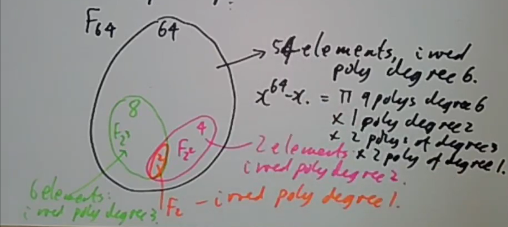
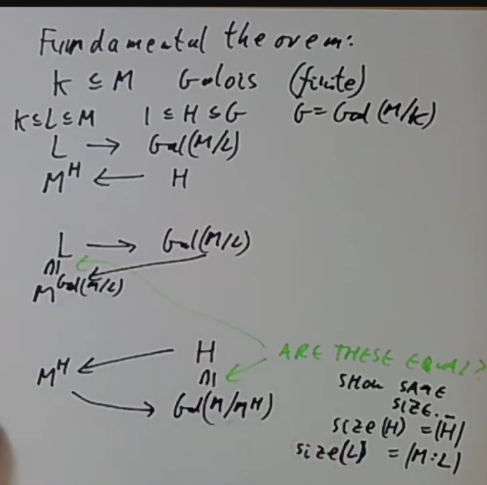
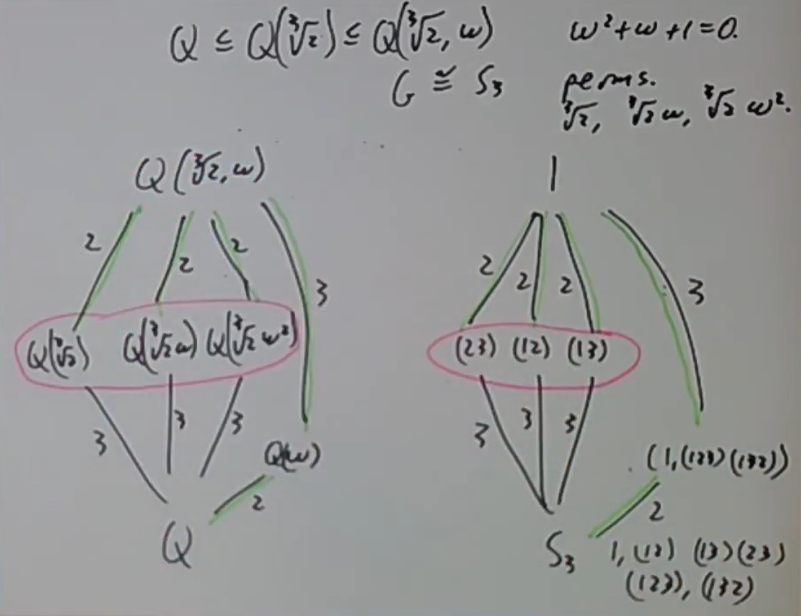
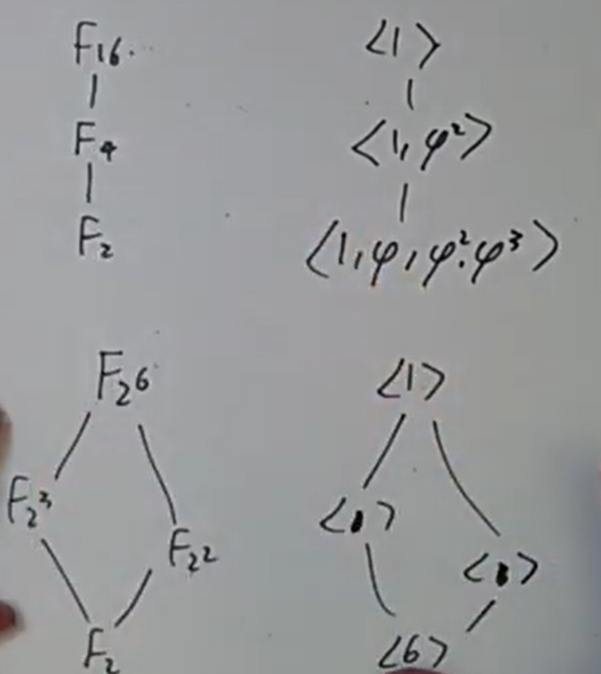
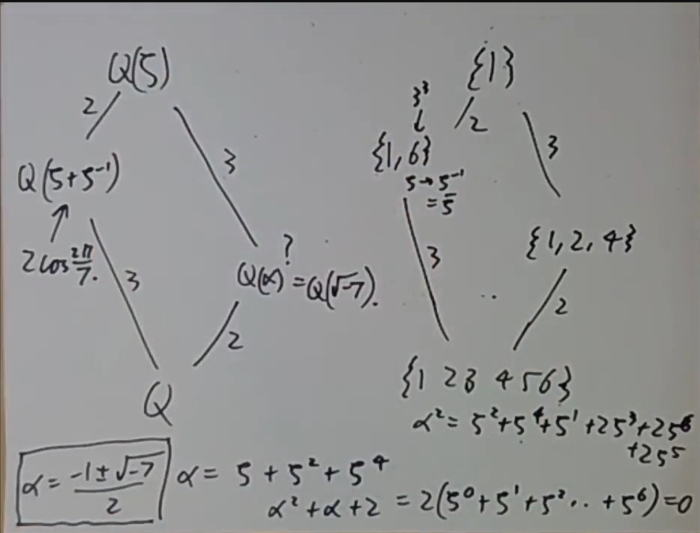
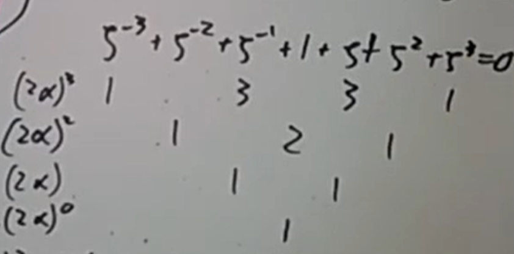
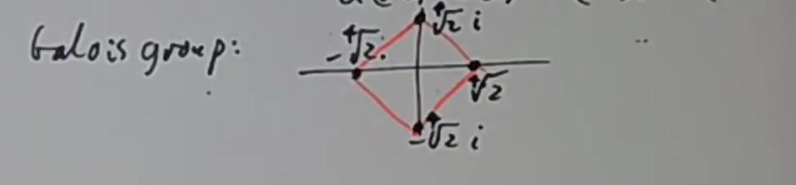
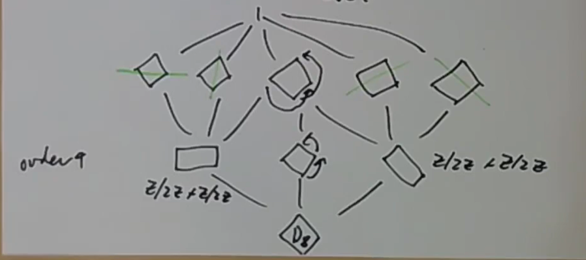
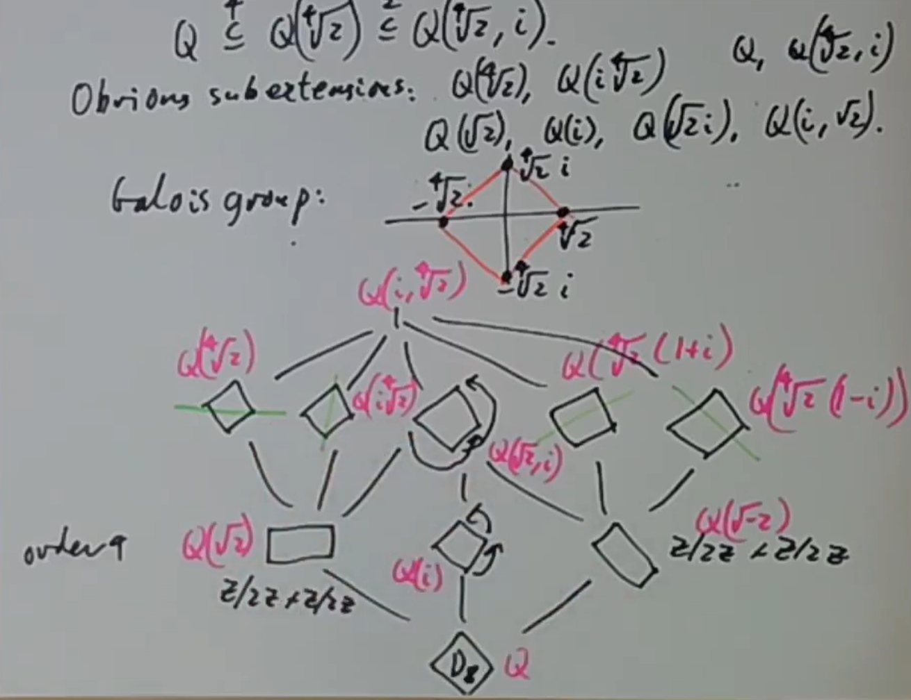

> Emil Artin之Algebra with Galois Theory中Ch5的省流版。以及Borcherds的Galois Theory课的部分内容

## 分裂域与代数闭包

> $\mathrm{5.1.\ Theorem.\ }$ *设 $f\in F[x]$ ，则存在域扩张 $E \supset F$ 使 $f(x)$ 在 $E$ 上分裂*

在 $F[x]$ 中有素因子分解

$$f(x)=c(x-\alpha_1)(x-\alpha_2)\cdots(x-\alpha_r)p_1(x)p_2(x)\cdots p_s(x)$$

扩域 $F[x]/(p_1(x))$ 得到 $p_1$ 的一个根，在其上 $f(x)$ 至少多出一个线性因子，如此重复即可。$\square$

> $\mathrm{5.2.\ Theorem.\ }$ *5.1中得到的扩域是最小的使 $f(x)$ 分裂的扩域*

任何 $f(x)$ 分裂的扩域都包括 $f(x)$ 的根 $\alpha_1,\cdots,\alpha_n$ ，也包括它们生成的 $F$-代数。反过来，$F(\alpha_1)$ 由 $\alpha_1$ 的全体多项式组成，从而 $F(\alpha_1,\alpha_2)$ 由 $\alpha_1,\alpha_2$ 的全体多项式组成，…… $\square$

> $\mathrm{5.3.\ Theorem.\ }$ *假设 $F$ 与 $F'$ 同构，$f$ 对应于 $\bar{f}$ ，假若 $E,E'$ 分别是 $f,\bar{f}$ 分裂域，则 $F$ 和 $F'$ 同构可以延拓至 $E,E'$ 同构，特别的，$f$ 在 $F$ 上分裂域在同构意义下唯一*

素因子分解

$$f(x)=c(x-\alpha_1)(x-\alpha_2)\cdots(x-\alpha_r)p_1(x)p_2(x)\cdots p_s(x)$$

给出

$$\bar{f}(x)=\bar{c}(x-\bar{\alpha}_1)(x-\bar{\alpha}_2)\cdots(x-\bar{\alpha}_r)\bar{p}_1(x)\bar{p}_2(x)\cdots\bar{p}_s(x)$$

对线性因子个数 $r$ 反向归纳（$r+1$ 推 $r$）：$F$ 关于 $p_1$ 和 $F'$ 关于 $\bar{p}_1$ 的单代数扩张同构，所以把基域换成 $F(\alpha_1)$ 和 $F'(\bar{\alpha}_1)$ ，则即可归纳。$\square$

> $\mathrm{Theorem.\ }$ *对域 $F$ ，存在 $F$ 的代数扩域 $\bar{F}$ ，使得 $\bar{F}$ 代数闭，把 $\bar{F}$ 称为 $F$ 的代数闭包*

考虑 $F[x]$ 中全体不可约多项式集合 $\mathcal{P}$ ，考虑环 $F[x_p]_{p\in \mathcal{P}}$ 中诸 $p(x_p)$ 生成的理想，它是真理想（只需证明对有限 $n$ 个不可约多项式这个结论成立，然后对 $n$ 归纳商掉 $p_n(x_n)$ 即可），从而包含于极大理想 $\mathfrak{m}$ 中，令 $\bar{F}=F[x_p]_{p\in \mathcal{P}}/\mathfrak{m}$ ，则 $F$ 可以嵌入 $\bar{F}$ （因为 $F$ 都可逆）且 $ x_p$ 是 $p(x_p)$ 的根，从而 $\bar{F}/F$ 是代数扩域。

现在假设 $\alpha$ 在 $\bar{F}$ 上代数，即有关系

$$\alpha^n+\cdots+a_1\alpha+a_0=0,\quad a_0,a_1,\cdots,a_n\in \bar{F}$$

则因为 $F[a_0,\cdots,a_n]/F$ 有限扩张，$F[a_0,\cdots,a_n,\alpha]/F[a_0,\cdots,a_n]$ 有限扩张，所以 $\alpha$ 在 $F$ 上代数，即 $\alpha\in \bar{F}$。$\square$

注：代数闭包在同构意义下唯一，但并不具有函子性（比如说事实上考虑它的构造依赖选择公理），以及绝对Galois群 $\operatorname{Gal} (\bar{k}/k)$ 也如此，但取定了代数闭包之后的（带基点）绝对Galois群具有函子性。域论的概念和拓扑中有所对应，扩域对应覆叠空间，Galois群对应基本群，而此处和代数闭包的情形类似，道路连通空间的基本群和基点选取无关，但是不同基点之间基本群的同构证明依赖两点间道路选取，所以 $\pi_1(X)$ 不具有函子性，但 $\pi_1(X,x_0)$ 具有函子性。

一种绕过这组问题的手段是考虑Groupoids（态射皆iso的范畴），我们有 $k$ 的absolute Galois groupoid（Object为代数闭包 $\bar{k}/k$ ，态射则是代数闭包间同构），与 $X$ 的fundamental groupoid（Object是 $x_0\in X$，态射是道路的同伦类）类似。

$\mathrm{Example.\ }$ $\mathbb{C}$ 代数闭，这是著名的代数基本定理。我们给出它的一个拓扑证明。考虑不可约多项式

$$p(x)=x^n+a_{n-1}x^{n-1}+\cdots a_0,\quad a_i\in \mathbb{C}$$

则 $a_0$ 非零，于是在异于原点的一处。而对充分大的 $|x|=R$ ，在这个圆上 $p(x)$ 的轨迹近似于大圆，从而随 $x$ 绕大圆一周 $p(x)$ 绕原点 $n$ 周，然而在 $|x|$ 缩小到 $0$ 的过程中winding number由 $n$ 变化到 $0$ ，那么应有一个中间时刻 $p(x)$ 过原点。

$\mathrm{Example.\ }$ Puiseux级数域 $\mathbb{C}[[x^{1/n}]][x^{-1/n}]$ 代数闭。

## 有限域

> $\mathrm{Theorem.\ }$ *有限域 $\mathbb{F}_q$ 是 $x^q-x$ 的分裂域，其中 $q=p^n$ ，$q$ 阶有限域在同构意义下唯一*

找到有限域上不可约多项式的一个有效算法是筛法，和整数情况并无区别，比如说我们可以找到 $\mathbb{F}_2$ 上的不可约多项式是

$$x,x+1,x^2+x+1,x^3+x+1,x^3+x^2+1,x^4+x+1,x^4+x^3+1,x^4+x^3+x^2+x+1,\cdots$$

这多少使我们可以具体计算 $\mathbb{F}_q$ ，譬如说 $\mathbb{F}_4\cong \mathbb{F}_2[x]/(x^2+x+1)$ ，$\mathbb{F}_8\cong \mathbb{F}_2[x]/(x^3+x+1)$ 当然这里还有 $\mathbb{F}_8\cong \mathbb{F}_2[y]/(y^3+y^2+1$ ，我们自然会去好奇这两个不同构造间具体的同构如何。事实上，考虑 $y^3=y^2+1$ ，从而 $(y+1)^3=y^3+y^2+y+1=y$ ，于是 $(y+1)^3+(y+1)+1=0$ ，从而 $x\mapsto y+1$ 给出我们想要的同构。

我们可能很想要一个“标准的”多项式取法，让我们可以比较典范地把 $\mathbb{F}_q$ 写成对应多项式在 $\mathbb{F}_p[x]$ 上的商，不过一般来讲并没有这么一个典范的取法。

> $\mathrm{Proposition.\ }$ *$\mathbb{F}_{p^m}\subset \mathbb{F}_{p^n}$ 当且仅当 $m| n$*

事实上考虑 $\mathbb{F}_{p^n}$ 作为 $\mathbb{F}_{p^m}$-线性空间即知 $m|n$ ，反过来如果 $m|n$ ，那么 $x^{p^n}-x$ 在 $\mathbb{F}_{p^m}$ 上的分裂域就是 $\mathbb{F}_{p^n}$。$\square$

作为一个应用，我们可以计算 $\mathbb{F}_p$ 上某个首一特定次数的不可约多项式数量。比如说对 $\mathbb{F}_2$ 上 $6$ 次不可约多项式，则按极小多项式考虑只需考虑 $\mathbb{F}_{64}/\mathbb{F}_{2}$ 
作为结果我们知道 $x^64-x$ 可以被分解为 $9$ 个 $6$ 次多项式，$2$ 个 $3$ 次多项式，$1$ 个 $2$ 次多项式和 $2$ 个 $1$ 次多项式的乘积。

## 可分扩张

假设 $E$ 是 $f\in F[x]$ 的分裂域，则

$\mathrm{5.4.\ Lemma.\ }$ *假设 $f(x)$ 有不可约因子 $p(x)$ ，$p(x)$ 的根是 $\alpha_1,\cdots,\alpha_n$ ，则 $\alpha_i\leftrightarrow  \alpha_j,\ i\ne j$ 给出 $F(\alpha_i)$ 与 $F(\alpha_j)$ 的同构，从而延拓至 $E$ 的自同构* 

> $\mathrm{5.5.\ Theorem.\ }$ *$f$ 在 $F$ 上有素因子分解

$$f(x)=c(x-\alpha_1)(x-\alpha_2)\cdots(x-\alpha_r)p_1(x)p_2(x)\cdots p_s(x)$$

诸 $p_i$ 非线性，如果 $p_i$ 在 $f(x)$ 分裂域 $E$ 中皆无重根，则 $E$ 中没有 $F$ 以外的元素在 $\mathrm{Gal}(E/F)$ 作用下不动*

事实上只需证明，对代数扩张 $F(\alpha)/F$ ，假若 $\alpha$ 极小多项式 $p$ 在 $F(\alpha)$ 中分裂无重根，则 $\mathrm{Gal}(F(\alpha)/F)$ 作用下，$F(\alpha)$ 中没有 $F$ 以外的元素不动。不妨设 $p$ 的根 $\alpha_1,\cdots,\alpha_n$ ，则 $5.4$ 给出 $\alpha_i\leftrightarrow \alpha_j$ 的自同构，则作用于不动元 $\theta$ 得到

$$\begin{aligned}\theta=c_0+c_1\alpha_{1}+\cdots+c_{n-1}\alpha_{1}^{n-1}&=c_0+c_1\alpha_{2}+\cdots+c_{n-1}\alpha_{2}^{n-1}\\&\begin{array}{c}\vdots\end{array}\\&=c_0+c_1\alpha_{n}+\cdots+c_{n-1}\alpha_{n}^{n-1}\end{aligned}$$

多项式 $\phi(x)=(c_0-\theta)+c_1x+\cdots+c_{t-1}x^{t-1}$ 有 $t$ 个根，因而系数全为 $0$ ，于是 $\theta=c_0\in F$ 。

接着对 $r$ 反向归纳，如果 $r+1$ 情况下命题成立：考虑取 $p_1$ 的根 $\alpha_{r+1}$ ，则在 $F(\alpha _{r+1})$ 中有分解 

$$f(x)=c(x-\alpha_1)\cdots(x-\alpha_r)(x-\alpha_{r+1})(x-\beta_1)\cdots(x-\beta_\mu)q_1(x)\cdots q_\nu(x)$$

其中 $q_i$ 整除某一 $p_j$ 。 $E$ 仍然是 $f(x)$ 在 $F(\alpha_{r+1})$ 上的分裂域，而 $q_i$ 从 $p_j$ 处继承来无重根的性质。$\square$

> $\mathrm{Proposition.\ }$ *特征 $0$ 域上不可约多项式无重根（也就是可分），特征 $p$ 上不可约多项式则会分裂为 $P(x)=\left[\prod_{i=1}^s(x-\alpha_i)\right]^{p^r}$ 形式*

如果不可约多项式 $P$ 有重根 $\alpha$ ，则 $P'(\alpha)=0$ ，这意味着 $P|P'$ ，考虑次数知 $P'=0$ 。特征 $0$ 直接导致矛盾，特征 $p$ 则推出 $P$ 具有

$$P(x)=c_0+c_1x^p+c_2x^{2p}+\cdots+c_mx^{mp}$$

形式，令

$$f(x)=c_0+c_1x+\cdots+c_mx^m$$

则 $P(x)=f(x^p)$ ，如此重复直至 $P(x)=\phi(x^{p^r})$ 不可再使 $r$ 增大。而

$$\phi(x)=g(x)h(x)\Rightarrow\phi(x^{p^r})=g(x^{p^r})h(x^{p^r})=P(x)$$

意味着 $\phi$ 不可约，从而无重根。现在有 $P(x)=\prod_{i=1}^s(x^{p^r}-\beta_i)$ ，取 $\alpha_i$ 为 $\beta_i$ 的根，则

$$P(x)=\left[\prod_{i=1}^s(x-\alpha_i)\right]^{p^r}$$

 $\square$

> $\mathrm{Proposition.\ }$ *有限域的代数扩张皆可分*

只需考虑有限扩张，$\mathbb{F}_{p^m}\subset \mathbb{F}_{p^n}$ ，则因为 $x^{p^n}-x$ 可分（考虑无重根或者导数 $-1$）所以扩张可分。$\square$

$\mathrm{Example.\ }$ 考虑一个不可分扩张的例子。假设域 $K$ 有正特征 $p$ ，$K(t)/K(t^p)$ 是代数扩张，这里 $x^p-t^p\in K(t^p)[x]$ 不可约，但在 $K(t)[x]$ 中 $x^p-t^p=(x-t)^p$ 。

> $\mathrm{Theorem.\ }$ *假设 $L/K$ 是代数扩张，设 $K'$ 是 $K$ 的可分闭包（即所有 $L$ 中可分元组成的域），则 $K'/K$ 是可分扩张，而 $L/K'$ 是纯不可分扩张，也就是 $L$ 中所有元素都是某个 $x^{p^n}-a$ 的根，这里 $a\in K'$*

Galois理论的主要关注点就在于可分扩张的部分。

## 正规扩张

> Artin书中的normal等于现代文献中的Galois

Galois扩张 $E/F$ 定义为, $F$ 是 $E$ 某些自同构的不动域. 一般来说Galois扩张的Galois扩张未必Galois，例如 $\mathbb{Q}\subset \mathbb{Q}(\sqrt{2})\subset \mathbb{Q}(\sqrt[4]{2})$ 。

> $\mathrm{5.12.\ Theorem.\ }$ *群 $G$ 在 $E$ 中的不同特征（即 $\operatorname{Hom}_{\mathsf{Grp}} (G,E)$ 中非零元） $\lambda_1(x),\lambda_2(x),\ldots,\lambda_n(x)$ 线性无关，特别的，$E$ 的不同自同构作为乘法群的特征 $E$-线性无关*

假设诸 $\lambda_i$ 的非平凡线性组合为 $0$ ，则取某个极小线性相关组

$$c_1\lambda_1(x)+c_2\lambda_2(x)+\cdots+c_r\lambda_r(x)=0$$

换 $x$ 为 $ax$ ，给原始式子乘 $\lambda_r(a)$ 后两式相减得到

$$c_1[\lambda_1(a)-\lambda_r(a)]\lambda_1(x)+\cdots+c_{r-1}[\lambda_{r-1}(a)-\lambda_r(a)]\lambda_{r-1}(x)=0$$

取使 $\lambda_1(a)\ne \lambda_r(a)$ 的 $a$ ，则与极小线性相关的条件矛盾。$\square$

> $\mathrm{5.15.\ Theorem.\ }$ *假设 $\sigma_1,\cdots,\sigma_n$ 是由 $E$ 的自同构组成的群 $G$ 中元素，$F$ 是 $G$ 的不动域，则 $[E:F]=n$*

只需证对 $m>n$ ，$E$ 中 $m$ 个元素 $\alpha_1,\alpha_2,\ldots,\alpha_m$ 线性相关。方程

$$\begin{cases}x_1\sigma_1(\alpha_1)+x_2\sigma_1(\alpha_2)+\cdots+x_m\sigma_1(\alpha_m)=0\\\vdots\\x_1\sigma_n(\alpha_1)+x_2\sigma_n(\alpha_2)+\cdots+x_m\sigma_n(\alpha_m)=0&\end{cases}$$

总有在 $E$ 中的非零解 $x$。因为 $G$ 是群，$\mathrm{id}$ 总会出现在 $\sigma_i$ 中，那么如果能从这组解诱导到一个诸 $x_i$ 都在 $F$ 中的非零解，则就得到 $x_1\alpha_1+\cdots+x_m\alpha_m=0$ ，从而线性相关。

现在考虑以上方程被 $\sigma_i$ 作用，也就是

$$\sigma_i(x_1)\sigma_i\sigma_k(\alpha_1)+\sigma_i(x_2)\sigma_i\sigma_k(\alpha_2)+\cdots+\sigma_i(x_m)\sigma_i\sigma_k(\alpha_m)=0,\quad k=1,2,\ldots,n.$$

这无非是以上 $n$ 个方程的置换，所以 $\sigma_i$ 作用于 $x$ 依然是方程的解，从而 $\sigma_1(x)+\sigma_2(x)+\cdots+\sigma_n(x)$ 是方程的解，而这组新解因为对称性被 $G$ 作用不动，从而属于不动域 $F$ 。

现在只需要找到合适的 $x$ 使新解非零。考虑到 $x$ 乘上任意 $E$ 中元素仍然是以上方程的解，所以如果 $x_1\ne 0$ ，可以设 $x_1$ 为任意 $E$ 中元素。现在设 $x_1$ 为使 $\sigma_1(\theta)+\sigma_2(\theta)+\cdots+\sigma_n(\theta)$ 非零的 $\theta$ （按线性无关存在性有保障），那么便证完。$\square$

> $\mathrm{5.16.\ Theorem.\ }$ *$G$ 是 $E$-自同构 $\sigma_1,\cdots,\sigma_n$ 组成的群，$F$ 是 $G$ 的不动域，则 $E/F$ 是Galois扩张*

取 $\alpha\in E$ ，令 $\alpha_i=\sigma_i(\alpha)$ ，将诸 $\alpha_i$ 中不同的取出来 $\alpha_1,\alpha_2,\ldots,\alpha_r$ ，考虑

$$\phi(x)=\prod_{k=1}^r(x-\alpha_k)$$

令 $\sigma_i$ 作用于 $\phi(x)$ 的系数，则无非相当于对 $\alpha_1,\alpha_2,\ldots,\alpha_r$ 做置换，所以 $\phi(x)$ 保持不动，因而系数都属于 $F$ 。诸 $\sigma_i$ 中出现 $\mathrm{id}$ ，所以 $\alpha_i$ 中有 $\alpha$ 。$\square$

事实上 $5.16$ 中的 $\phi$ 是不可约多项式。考虑 $\sigma_i$ 作用于 $f(\alpha)=0$ 知 $\alpha_i$ 都是 $f$ 的根，于是 $\phi$ 是以 $\alpha$ 为根的非零多项式中次数最小的，从而不可约。这给了我们一种求 $\alpha$ 极小多项式的办法。

> $\mathrm{5.17.\ Theorem.\ }$ *有限扩张 $E/F$ 是Galois扩张当且仅当 $E$ 是 $F$ 上某个可分多项式的分裂域* 

$\implies$：定理 ${5.5}$ 。
$\impliedby$：取 $\omega_1,\cdots,\omega_n$ 为 $E/F$ 一组基，由 $5.16$ 给出可分多项式 $p_i(\omega_i)=0$ ，则考虑它们乘积的分裂域即可。$\square$

$\mathrm{5.18.\ Corollary.\ }$ *如果 $E/F$ 正规，$F\subset \Omega\subset  E$ ，则 $E/\Omega$ 正规*

事实上我们有

> $\mathrm{Theorem.\ }$ *设 $E/F$ 是代数扩张，则以下条件等价：(1) $E/F$ 正规 (2)如果 $F[x]$ 中不可约多项式 $p$ 在 $E$ 中有根，则 $p$ 在 $E[x]$ 中分裂 (3) $E$ 是 $F$ 上某个多项式族的分裂域 (4) 取 $F$ 的代数闭包 $\bar{F}$ ，对 $F\subset E\subset \bar{F}$ ，对任意 $\sigma\in \mathrm{Gal}(\bar{F}/F)$ ，$\sigma(E)\subset E$* 

(2)$\implies$(3)：取 $E/F$ 上元素 $\alpha$ 的极小多项式 $p_\alpha$ ，$\{ p_\alpha \}$ 的分裂域是 $E$ 。
(3)$\implies$(4)：$\sigma$ 保持 $p_\alpha$ 不动。
(4)$\implies$(2)：$F[x]$ 中不可约多项式 $p$ 在 $E$ 中有根 $\alpha$ ，在 $\bar{F}$ 中还有其它根 $\beta$ ，则事实上存在 $\bar{F}$ 的 $\alpha\mapsto \beta$ 的 $F$-自同构，于是 $\beta\in E$ 。

## Galois理论基本定理

> $\mathrm{Theorem.\ }$ *设 $M/K$ 是有限扩域，$G=\operatorname{Gal}(M/K)$，以下条件互相等价（满足其一者称为Galois扩张）：(1) $M/K$ 是正规可分扩张 (2) $[M:K]=|G|$ (3) $K=M^G$ (4) $M$ 是某个可分多项式的分裂域* 

(1)$\implies$(2) ：对 $\iota \in\operatorname{Hom} _K(M,\bar{K})$ ，由于 $M/K$ 正规，$\iota(M)\subset M$ ，如果 $M=K(\alpha_1,\alpha_2,\cdots,\alpha_n)$，则 $K(\alpha_1)/K$ 到 $\bar{K}$ 有 $[k(\alpha_1),K]$ 种嵌入，再次基础上 $\alpha_2$ 在 $\bar{K}$ 中有 $[K(\alpha_1,\alpha_2):K(\alpha_1)]$ 种取值…… $M\to \bar{K}$ 有 $[M:K]$ 种嵌入。考虑到 $M$ 是分裂域，所以 $\operatorname{Gal} (M/K)=|\operatorname{Hom} _K(M,\bar{K})|=[M:K]$ 。 
(2)$\implies$(3) ：从前面证明中也可以得出 $[M:K]\geqslant \operatorname{Gal} (M/K)$ 对任意 $M/K$ 成立，从而对扩域 $K\subset M^G\subset M$ 有

$$[M:K]=|G|\leqslant [M:M^G]\leqslant [M:K]$$

于是 $[M:M^G]=[M:K]$ 知 $M^G=K$ 。
(3)$\implies$(4) ：定理 $5.16$ 。
(4)$\implies$(1) ：显然。$\square$

> $\mathrm{Theorem.\ }$ *（Galois Corresponding）有限扩张 $M/K$ Galois当且仅当任何中间域 $K\subset L\subset M$ 和子群 $1\leqslant H\leqslant G$ 有反序的互逆双射

$$\begin{aligned}
L&\to  \operatorname{Gal} (M/L) \\ M^H&\leftarrow H
\end{aligned}$$

*

假设 $M/K$ Galois。从 $L$ 出发到 $\operatorname{Gal} (M|L)$ ，我们知道 $L\subset \operatorname{Gal} (M|L)$ ；从 $H$ 出发到 $M^H$ ，我们已知 $H\subset \operatorname{Gal} (M|M^H)$ ，图解如下现在我们想证明这两个包含关系取到相等，只需证明它们具有相同大小（对域指index，而群指阶数）。

我们将证明命题中的两个映射都保持“大小”，从而我们想证明的两个包含关系两端大小相同。具体来说，我们将证明 $[M:M^H]=|H|$ 和 $[M:L]=|\operatorname{Gal} (M|L)|$ 总成立。上面已经证明了 $M/M^H$ Galois，从而 $[M:M^H]=|H|$ 。到现在为止还没有用上 $M/K$ Galois的条件。

现证 $[M:L]=|\operatorname{Gal} (M|L)|$ 。$M/L$ 正规所以 $\sigma(L)=L$ ，从而 $\operatorname{Gal} (M|K)$ 中自同构构造可以分解为两步，取出 $\operatorname{Hom} _K(L,M)$ 中映射和从 $L\to \operatorname{Im} (L)$ 到 $M\to M$ 的延拓。取定 $\phi\in \operatorname{Hom} _K(L,M)$ ，$\phi$ 到 $M$ 自同构的延拓（也就是满足 $\sigma|_{\operatorname{Im} L}=\phi \}$ 的自同构 $\sigma\in \operatorname{Gal} (M|K)$ ）数量不超过 $[M:L]$ ，$\phi$ 的取法不超过 $[L:K]$ ，于是

$$|\operatorname{Gal} (M|K)|\leqslant [M:L][L:K]=[M:K]$$

而 $M/K$ Galois，从而 $[M:K]=\operatorname{Gal} (M|K)$ ，因而上面的两个 $\leqslant [M:L]$ 和 $\leqslant [M:K]$ 的不等式都严格取等。特别地，$\phi$ 到 $M$ 自同构的延拓数量严格等于 $[M:L]$ ，而这些延拓的数量等于 $\operatorname{Gal} (M|L)$ ，于是我们证明了 $\operatorname{Gal} (M|L)=[M:L]$ 。$\square$

注：如果没有 $M/K$ Galois的条件，令 $G=\operatorname{Gal} (M|K)$，我们将得到 $G$ 子群和 $M/M^G$ 子扩张的一一对应（事实上 $M/M^G$ Galois……）

$\mathrm{Example.\ }$ 考虑 $x^3-2$ 在 $\mathbb{Q}$ 上的分裂域，Galois群同构于 $\mathsf{S}_3$ ，具体来说就是 $\sqrt[3]2,\sqrt[3]2\omega,\sqrt[3]2\omega^2$ 的置换，它Galois群的子群格和子扩张格如图，标绿线的是正规扩张/正规子群，画圈的是共轭类

$\mathrm{Example.\ }$ 考虑域扩张 $\mathbb{F}_{p^n}/\mathbb{F}_p$ ，首先注意到Frobenius自同构 $\varphi:a\mapsto a^p$ 的order是 $n$ （$\varphi^k(a)=a^{p^k}$），而 $[\mathbb{F}_{p^n}:\mathbb{F}_p]=n$ ，于是 $\operatorname{Gal} (\mathbb{F}_{p^n}/\mathbb{F}_p)=\left<\varphi \right>$ 一些子群格和子扩张格如下

$\mathrm{Example.\ }$ 考虑 $\mathbb{Q}(\zeta)/\mathbb{Q}$ ，其中 $\zeta$ 是七次单位根，则易见 $\operatorname{Gal} (\mathbb{Q}(\zeta)/\mathbb{Q})$ 是 $\mathbb{Z}/7\mathbb{Z}$ 的乘法群，它的子群格如下由此我们可以反求出它对应的子域。对三次的子扩张，它在 $\mathrm{id}$ 和 $\zeta\mapsto \zeta^6$ （也就是复共轭）下不动，于是其中包含 $\zeta+\zeta^{-1}=\cos \frac{2\pi}{7}$ ，令 $\alpha=(\zeta+\zeta^{-1})/2$ 考虑则立即知

$$(2\alpha)^3+(2\alpha)^2-2(2\alpha)-1=\zeta^{-3}+\zeta^{-2}+\zeta^{-1}+1+\zeta+\zeta^2+\zeta^3=0$$

遂求出 $\alpha=\cos \frac{2\pi}{7}$ 的多项式 $8\alpha^3+3\alpha^2-4\alpha-1=0$ 。对另一个二次的子扩张，考虑 $\alpha=\zeta+\zeta^2+\zeta^4$ ，则 $\alpha$ 自然在对应子群作用下不动。现在考虑 $\alpha^2=\zeta^2+\zeta^4+\zeta^1+2\zeta^3+2\zeta^6+2\zeta^5$ ，于是 $\alpha^2+\alpha+2=0$ ，从而 $\mathbb{Q}(\alpha)=\mathbb{Q}(\sqrt{-7})$ 。

$\mathrm{Example.\ }$ $[\mathbb{Q}(\sqrt[4]{2},i):\mathbb{Q}]=8$ ，具体来说 $\mathrm{Gal}(\mathbb{Q}(\sqrt[4]{2},i)/\mathbb{Q})$ 形如

$$\begin{array}{c|c|c} & \sqrt[4]{2} & i \\ \hline 1 & \sqrt[4]{2} & i \\ \sigma & i\sqrt[4]{2} & i \\ \sigma^2 & -\sqrt[4]{2} & i \\ \sigma^3 & -i\sqrt[4]{2} & i \\ \hline \tau & \sqrt[4]{2} & -i \\ \sigma\tau & i\sqrt[4]{2} & -i \\ \sigma^2\tau & -\sqrt[4]{2} & -i \\ \sigma^3\tau & -i\sqrt[4]{2} & -i \\\end{array}$$

具有二面体群的乘法规则 $\sigma^4=1,\tau^2=1,\tau\sigma=\sigma^{-1}\tau$ 。事实上我们可以把 $2$ 的四个四次根画出来由于 $-1$ 被保持，所以 $\mathrm{Gal}(\mathbb{Q}(\sqrt[4]{2},i)|\mathbb{Q})$ 中元素都是正方形的对称。它的 $4$ 阶子群有 $1,\sigma,\sigma^2,\sigma^3$ 、$1,\sigma^2,\tau,\sigma^2\tau$ 和 $1,\sigma^2,\sigma\tau,\sigma^3\tau$，二阶子群则有五个，子群格形如
```tikz
\usepackage{tikz-cd}
\begin{document}
\Large\begin{tikzcd}
& & D_8 \arrow[dl] \arrow[d] \arrow[dr] & & \\
& \langle\sigma^2,\tau\rangle \arrow[dl] \arrow[d] \arrow[dr] & \langle\sigma\rangle \arrow[d] & \langle\sigma^2,\sigma\tau\rangle \arrow[dl] \arrow[d] \arrow[dr] & \\
\langle\tau\rangle \arrow[drr] & \langle\sigma^2\tau\rangle \arrow[dr] & \langle\sigma^2\rangle \arrow[d] & \langle\sigma\tau\rangle \arrow[dl] & \langle\sigma^3\tau\rangle \arrow[dll] \\
& & 1 & &
\end{tikzcd}
\end{document}
``` 
也可以可视化如图，上面五个二阶群中绿线是对称，中间的是旋转180度，下面的则是矩形的对称群和正方形的旋转群通过这些Galois群可以很容易地计算出对应的不动域具体来说，由于 $i\mapsto -i$ 是翻转，所以正方形旋转群的不动域是 $\mathbb{Q}(i)$ ；两个扁矩形的对称中，如果不是180度旋转（也就是改变这些四次根的平方的情况）则需要带一个 $i\to -i$ 的翻转，所以对应不动域分别是 $\mathbb{Q}(\sqrt 2)$ 和 $\mathbb{Q}(\sqrt {-2})$ ；显然水平竖直对称分别对应 $\mathbb{Q}(\sqrt[4]2)$ 和 $\mathbb{Q}(i\sqrt[4]2)$ ，180度旋转是它下面三个子扩张之和，所以是 $\mathbb{Q}(\sqrt 2,i)$ ，而对两个斜向的对称，考虑比如说把 $\sqrt[4]2$ 和 $\sqrt[4]2 i$ 加起来，则得到一个不动元 $\sqrt[4]2(1+i)$ ，所以可以算出两个不动域分别是 $\mathbb{Q}(\sqrt[4]2(1+i))$ 和 $\mathbb{Q}(\sqrt[4]2(1-i))$ 。

这里左边的两个对称和右边的两个对称分别互相共轭（从而不动域也共轭），除了这四个子扩张，剩下的子扩张皆正规。

